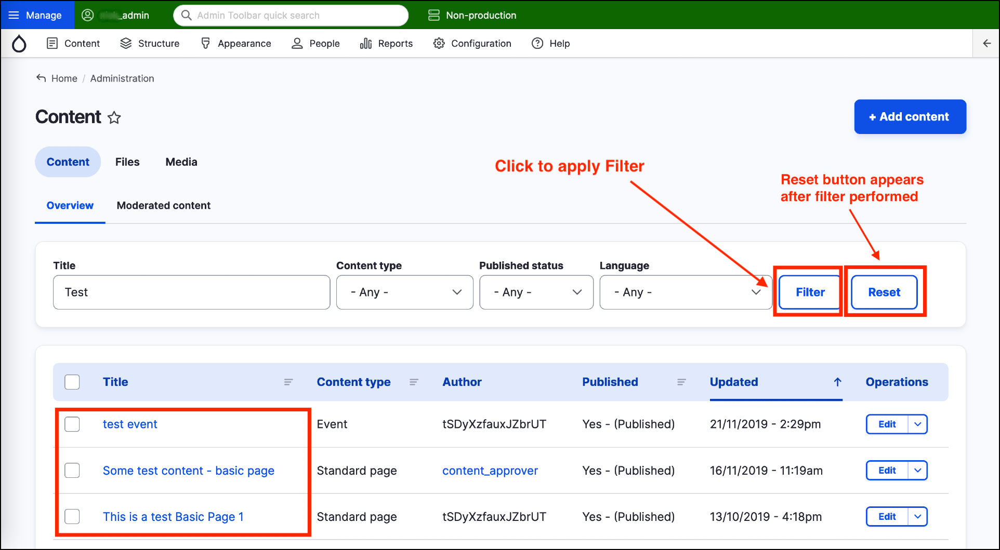

# Exercise 1.3: Filtering content

In this exercise you’ll learn how to find a piece of content using filters.

1. Type ‘Test’ into the _Title_ area of the filter.
2. Click the **Filter** button.

Now, only the content with the word ‘test’ in the title is displayed.

Also notice the Reset button appears after a filter is performed. Click **Reset** to go back to the full content list.
