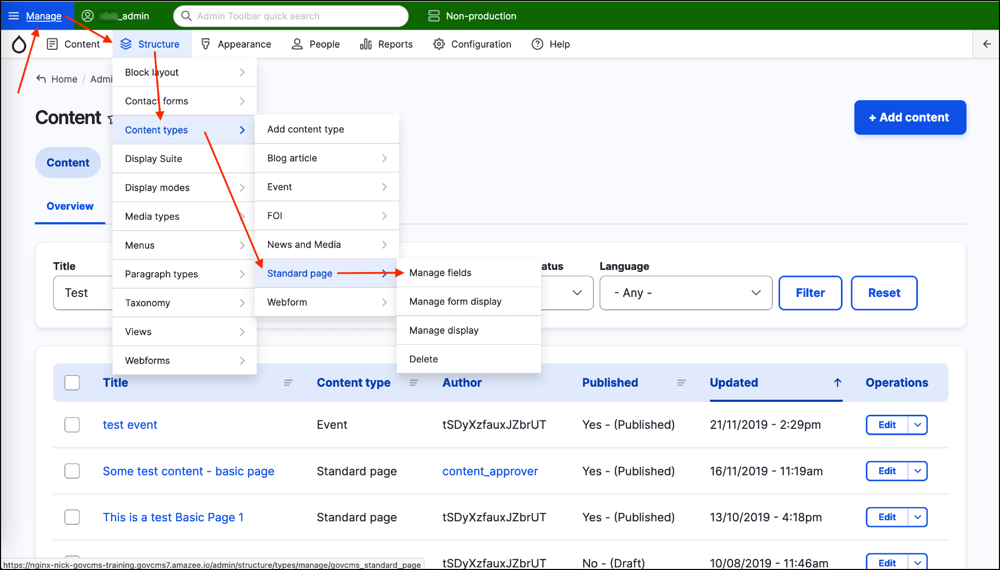
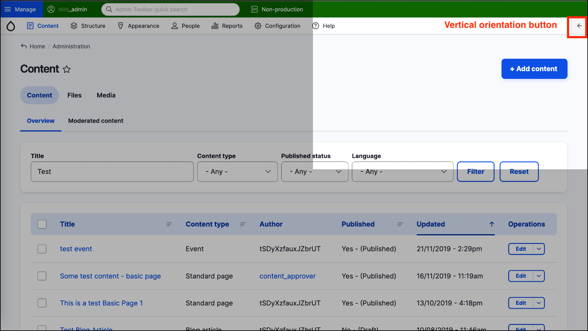
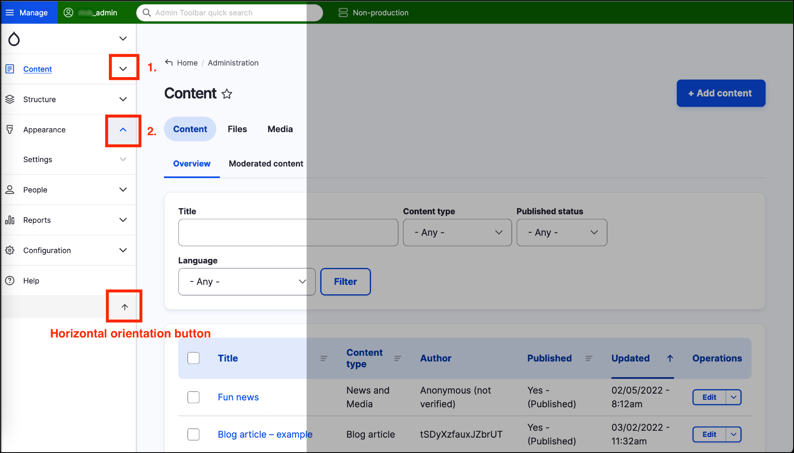

# Administration menu overview



## Hover over menu items to expand menus

The Admin menu gives you access to a variety of functions. When you hover your mouse over the various menus in the Admin bar \(without actually clicking on any of these menus\), most of them expand to reveal more options. 

Try one that has multiple levels: Click on the **Manage** menu item at the top left of the page to ensure the menu is expanded, then hover over _Structure → Content types → Standard page →_, then finally click on _Manage fields_.

**Tip:** Depending on your account’s level of permissions, you may see some menu items missing from the Admin menu. This is by design; it’s not a flaw. This is in line with the user roles and permissions discussed at the beginning of this manual.

## Navigate back/forward between pages

You can use the back/forward buttons in your browser to navigate back and forth between the two previous admin pages you have visited \(Content and Manage fields\). 

Alternatively, open these pages in two separate browser tabs.

## Admin area location on page

While logged in and switching between the various pages in the admin interface, you will find that the administration area stays quite consistent across the entire site.

## Admin area location - Horizontal and Vertical alignment

### Horizontal alignment

The Admin menu is by default placed horizontally across the top of the page in the standard desktop view. However, when on mobile view it automatically switches to a vertical display across the left-hand side of the screen. 

Although the switch to this mobile mode happens automatically on smaller screen sizes, you can also manually trigger it on a non-mobile device such as your laptop. Simply click the **vertical orientation** button, on the far right of the page.

### Vertical alignment

The screenshot below demonstrates how the Admin menu looks when placed vertically.

In “mobile” or vertical mode, the menus in the Admin bar do not expand automatically when you hover your mouse over them \(because on mobile devices there is no mouse\). To expand a menu item, click on the downwards-pointing arrow that is found to the right of the menu item you want to expand \(1\). When expanded, the arrow icon changes to an upwards-pointing arrow \(2\). Click the arrow to collapse any expanded menu.

To switch the Admin menu back to its default position, click the **horizontal orientation** button, located at the bottom right of the Admin bar).

## The Manage menu items

The “Manage” menu in the Admin bar contains the following items, with those most commonly used by Content Administrators highlighted in **bold**:

* **Content** - This is where content managers manage the site’s content pages and files \(video, audio documents, etc.\). **This training course focuses on this area.**
* Structure - This admin feature allows structural configuration of the site such as content types, types of blocks and how breadcrumbs are displayed.
* Appearance - This is where developers can manage the site’s theme, which controls how the site looks visually.
* Extend - Enable and disable extra modules that come with the GovCMS distribution to provide extra functionality for your site.
* Configuration - This area is usually only available to site admins. Custom modules and core configuration is controlled here.
* People - Manage users, roles and permissions for GovCMS users.
* **Reports** - Provides access to a range of site reports, such as available fields, user actions and Google Analytics.
* Help - Access to some basic GovCMS help files.
