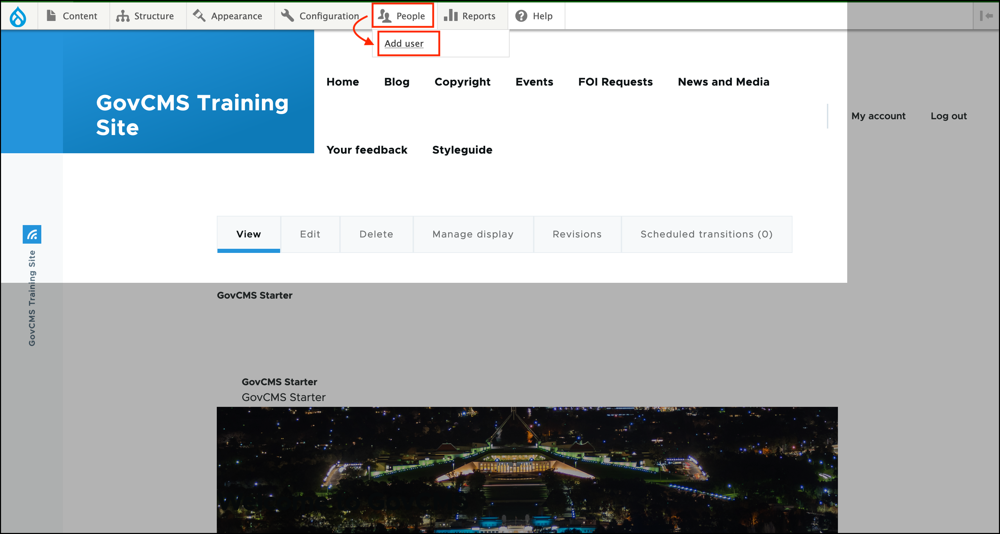
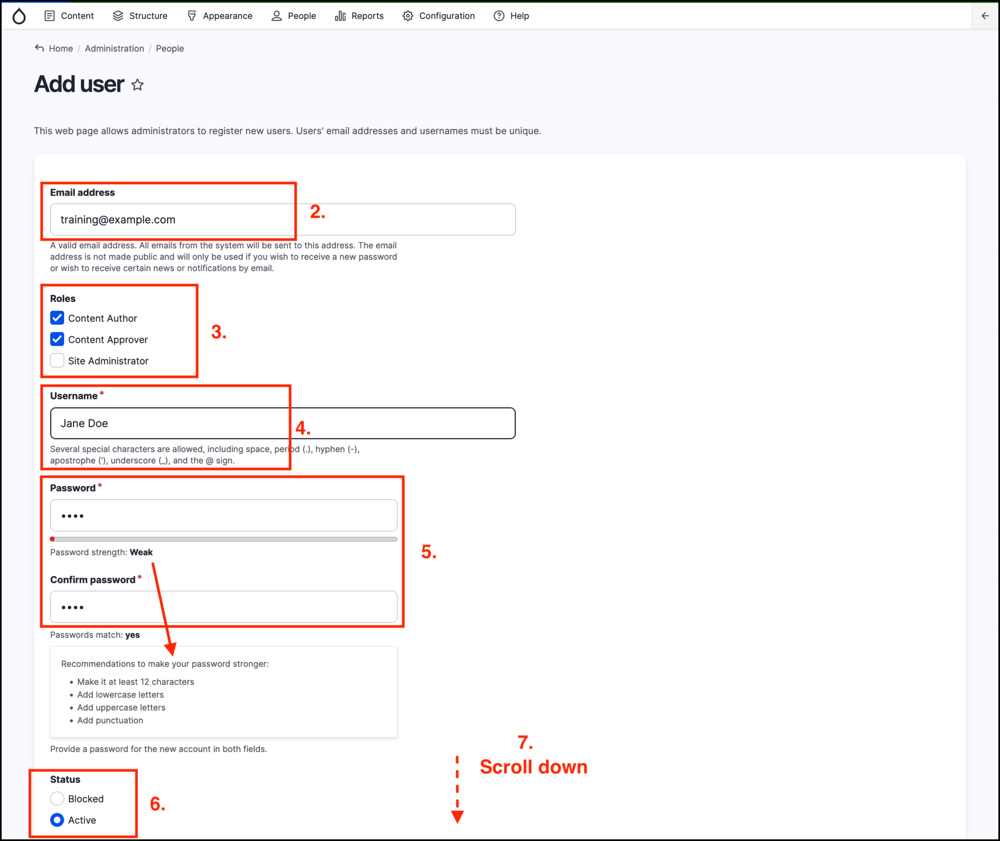
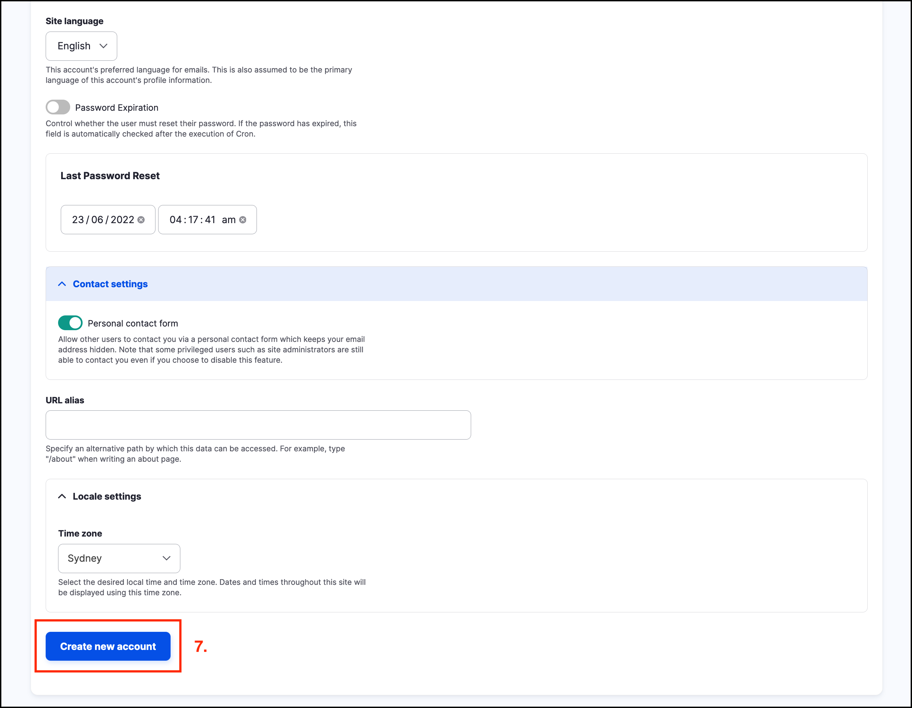
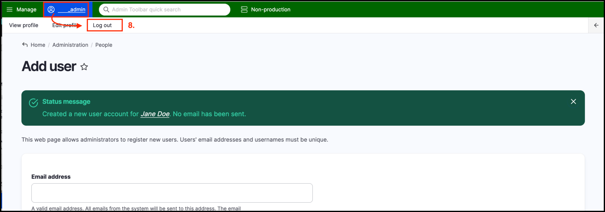

# Exercise 1.3 - Add a non-admin user

In this exercise you will create a new user account.

1.  Click on _People_ on the _Admin menu_, then click _Add user_.

    
2. Add an email address. Use training@example.com as the address (we don’t need a working email address for the purpose of this training session).
3. Check the “Content Author” and "Content Approver" checkboxes in the Roles area.
4. Enter your first and last name in the _**Username**_ field.
5. Enter a password in the _Password_ field (notice what happens if it isn’t complex enough). Adjust until your password, then re-enter in the _Confirm password_ field. **Make a note of your password!**.
6.  Make sure the _Status_ toggle is set to “Active”.

    
7.  Scroll to the bottom of the page and click the **Create new account** button.

    
8.  Click on the **admin** username at the top left of the Admin menu, then from the menu that appears, click **Log out**.

    
9. Log back in as the newly created user using the _**Username**_ from step 4 and the **Password** you noted down in step 5. **Note: You need to log in using the** _**Username**_**\*\*\*\*, not the** _**Email address**_.

What do you notice is different about the site? Discuss with your trainer.

**Tip**: The administrator user, sometimes called the admin user or user 1 is the "super user" of the site. This user is more privileged than a user with the role of "site administrator". Best practice dictates that no one should use the admin user for day-to-day tasks.&#x20;

Users on the GovCMS SaaS platform do not have access to this user account at all, while on the GovCMS PaaS platform this user account is reserved for those managing your site (such as people in your IT department and/or your developer team).
