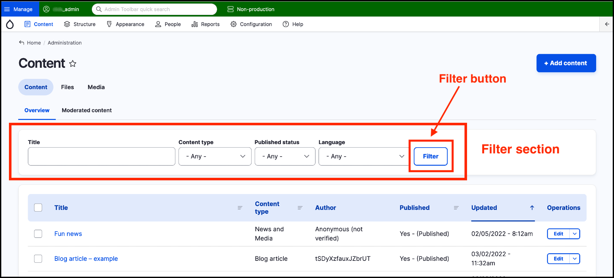

# Content management - filters overview



## Using the filters area of the content management page

You can use the filter section of the content management area to search and display specific content.

Use the filters to display a customised list of content:

* **Title:** Type in search words here to display content with a title that matches your search.
* **Content type:** Select a content type to only display that type of content.
* **Published status:** Select the publishing status to show only published or only unpublished content.
* **Language:** Select from the dropdown list to display only content in a specific language.

Once you’ve made your selections \(you can use one or all of the filters above\) click the **Filter** button to filter content based on the criteria entered and/or selected.

