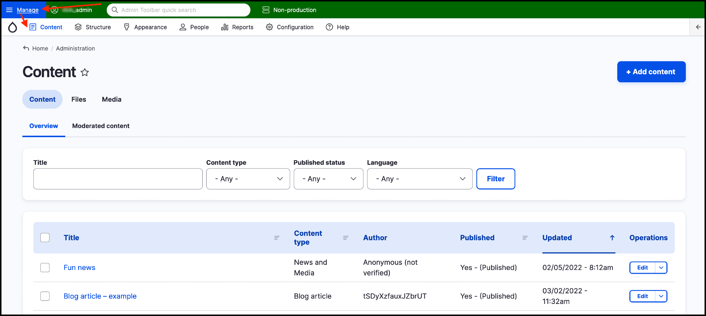

# How to access the content management area



## Accessing the content management area

You can access the content management area through the top _Admin bar_.

Using the _Admin bar_ at the very top, click on **Manage** then click **Content**.

Notice how the style of the main area of the site has now changed. You are still logged in, but rather than seeing the content of your site as a site visitor would see, you are now viewing what is called the _Admin interface_. 

This is where you will be performing most of your day-to-day tasks as a content administrator.
