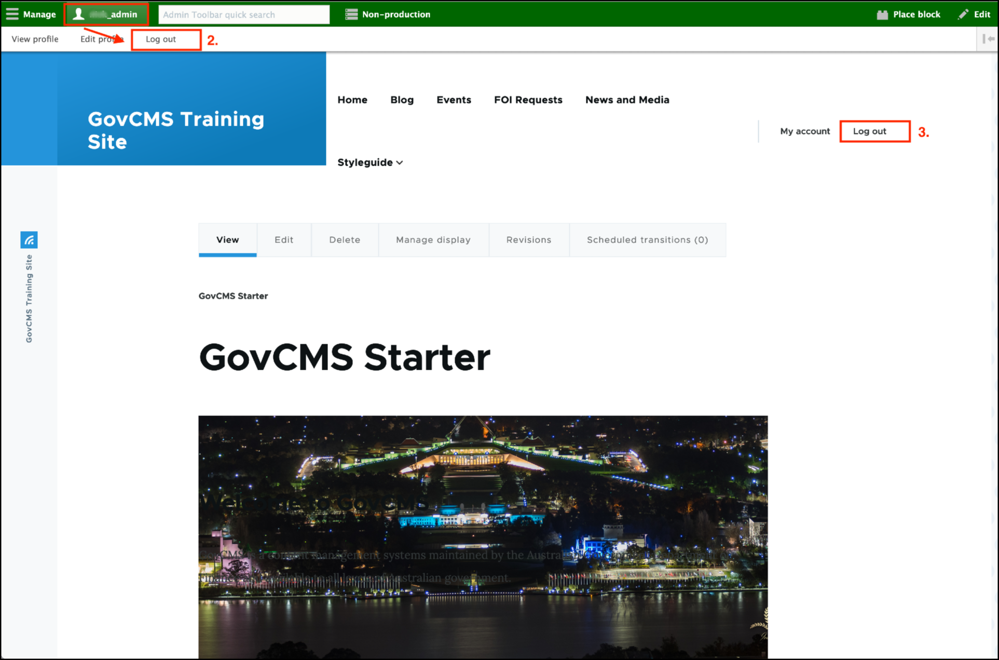

# How to log out from your site



You can log out from your site in several ways:

1. Navigate to your site's URL **/user/logout** URL
2. Click on your username at the top left of the page in the **top nav bar** and then click **Log out**
3. Click on **Logout** at the right of the page

