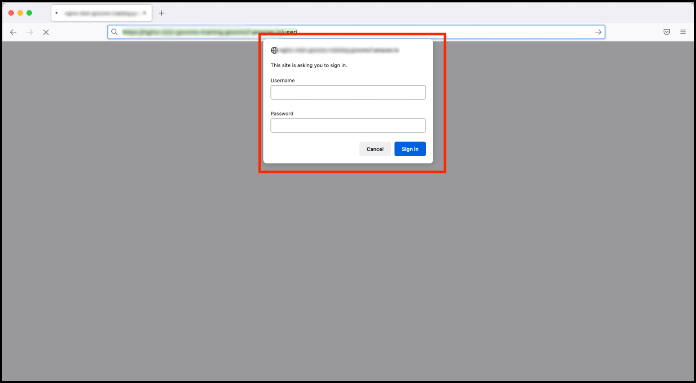

# How to log in to a GovCMS environment



## Navigate to Login screen

To get to the **Login screen** of most GovCMS sites, type the site’s URL and add **/user** on the end. \(For many government sites this won't work unless you’re on the internal network.\) For example:

* [https://www.salsadigital.com.au/](https://www.salsadigital.com.au/user)[**user**](https://www.salsadigital.com.au/user)

## Shield protection
Your environment may be protected by _Shield_ authentication, which means you’ll see a popup window with the _Username_ and _Password_ fields. You need to enter the Shield **username** and **password** to get to the **Login screen**. 

**Note** The Shield username and password are distinct from your own individual username and password. If you do not know the Shield login details, contact your site administrator or IT department.

## Training Environment Details

In preparation for a training course, you should have received a number of emails providing you with information required throughout the course course. These include:

1. The url for your own personal training environment. This will be similar to **https://nginx-yourname-govcms-training.govcms7.amazee.io/user/**.
2. The Shield **username** and **password**.
3. Three usernames for your environment \(One for an 'Admin' account, one for a 'Content Author' account and one for a 'Content Approver' account

You should also have created and saved **passwords** for each of the above accounts. 

If you have not received this information or set and saved your passwords, please notify your trainer.

