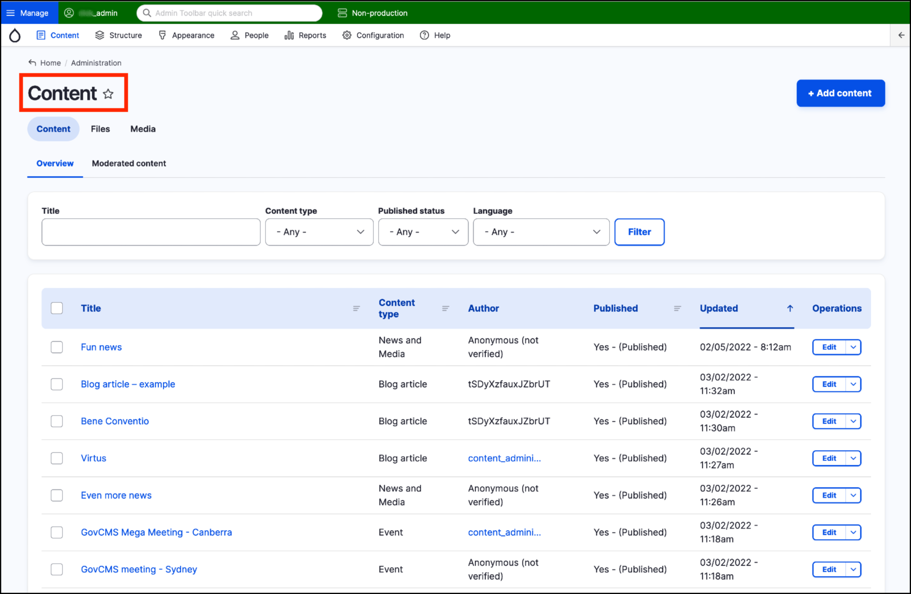
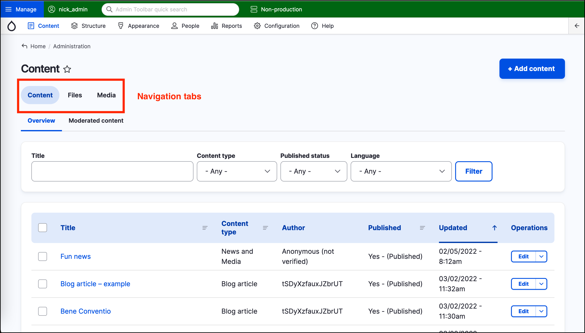
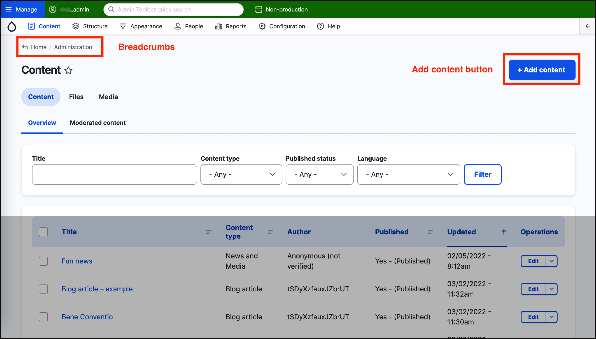
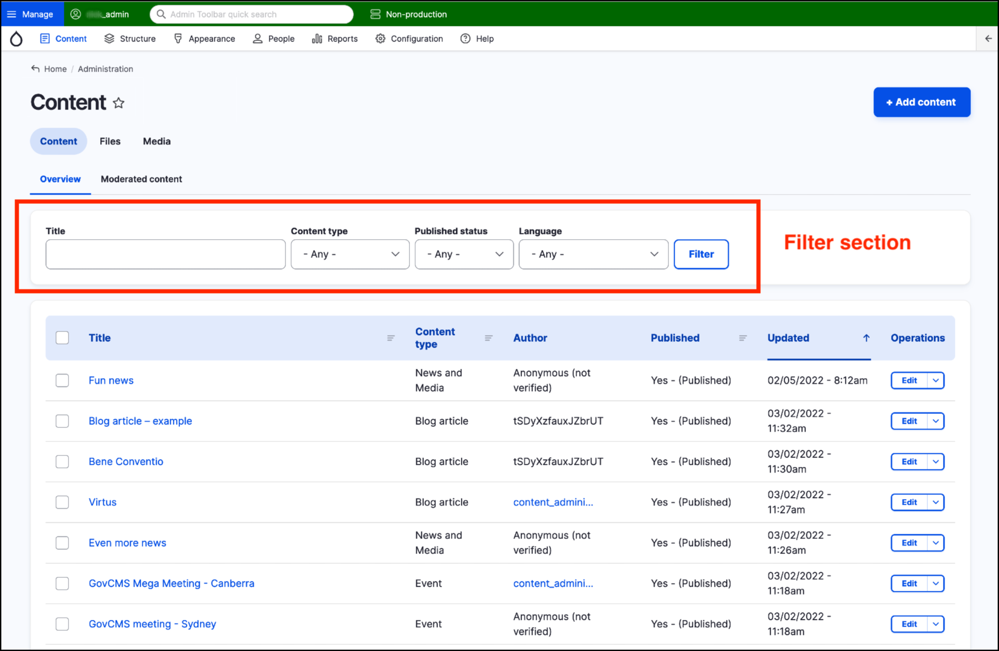
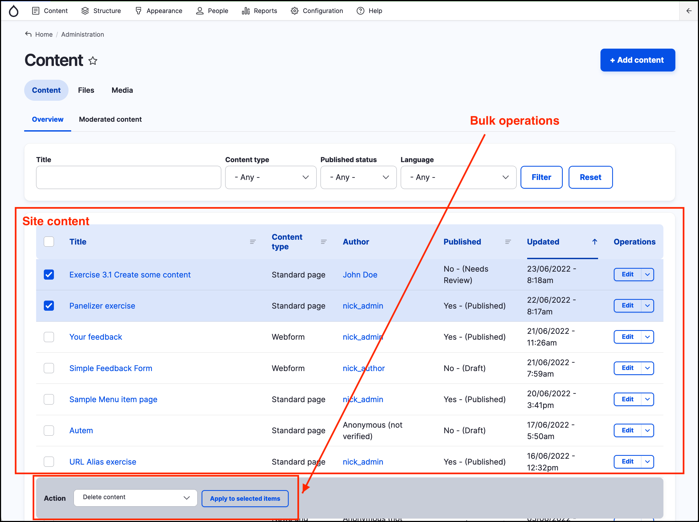

# Overview of content management area



## Content page title

Below the Admin menu, the _page title_ shows that you are in the _Content_ area of the _Admin interface_.

## Main navigation options

Underneath the page title there are three navigation options in the form of tabs:

1. Content
2. Files
3. Media

Click on the Files tab to see the list of files on your site. Click on the Media tab to view a list of the media you’ve uploaded into your GovCMS site. **[Unit 6: Files and Media Assets](../unit-6-files-media-assets)** looks at managing media files and assets in GovCMS in more detail.

## Breadcrumbs and Add content button

Above the _Navigation options_ tab is a breadcrumb link that shows you’re in the Home/Administration section of the site. 

At the top right of the page is the **Add content** button.

**Tip:** The breadcrumb provides a handy “Home” link, which takes you to the homepage of your site. It’s a fast way to switch from the admin _backend_ to the _frontend_.

## Filter options

Below the Navigation tab is the _Filter section_. This allows you to filter the list of content displayed. Filtering is covered in the next lesson - **[Content management - filters overview](content-management-filters-overview.md)**.

## Site content and bulk operations

Below the _filter section_ is the list of actual site content, displayed by default in date order, with the most recent content at the top. 

If one or more items in the _content_ list is selected, the bulk operations area appears at the bottom of the page. Bulk operations are covered in **[Unit 12 - Advanced - content bulk operations](../unit-12-advanced-content-editing/bulk-operations.md)**

