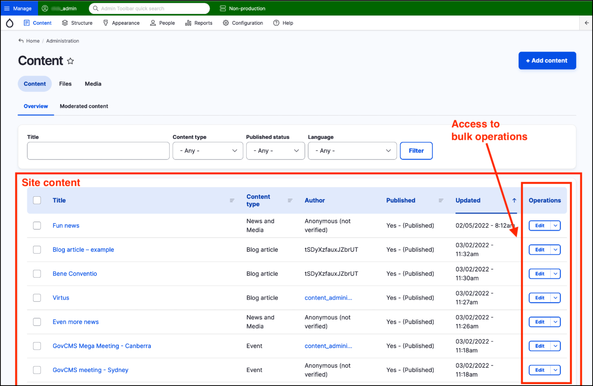

# Overview of content management area



## Content page title

Below the Admin menu, the page title shows that you are in the Content area of the admin interface.

## Main navigation options

Underneath the page title there are three navigation options in the form of tabs:

1. Content
2. Files
3. Media

Click on the Files tab to see the list of files on your site. Click on the Media tab to view a list of the media you’ve uploaded into your GovCMS site. Unit 6 looks at managing media files and assets in GovCMS in more detail.

## Breadcrumbs and Add content button

Above the Navigation tab is a breadcrumb link that shows you’re in the Home//Administration section of the site. 

To the right of the page is the **Add content** button.

**Tip:** The breadcrumb provides a handy “Home” link, which takes you to the homepage of your site. It’s a fast way to switch from the admin _backend_ to the _frontend_.

## Filter options

Below the Navigation tab is the Filter section. This allows you to filter the list of content displayed. Filtering is covered in the **[next lesson - Content management - filters overview](https://salsa-digital.gitbook.io/govcms-content-administration/unit-1-intro-to-the-admin-backend/content-management-filters-overview)**.

## Site content and bulk operations

Below the filter section is the list of actual site content, displayed by default in date order, with the most recent content at the top. 

Access to bulk operations is provided inline with the content. Bulk operations are covered in **[Unit 12 - Advanced - content bulk operations](https://salsa-digital.gitbook.io/govcms-content-administration/unit-12-advanced-content-editing/advanced-content-bulk-operations)**

