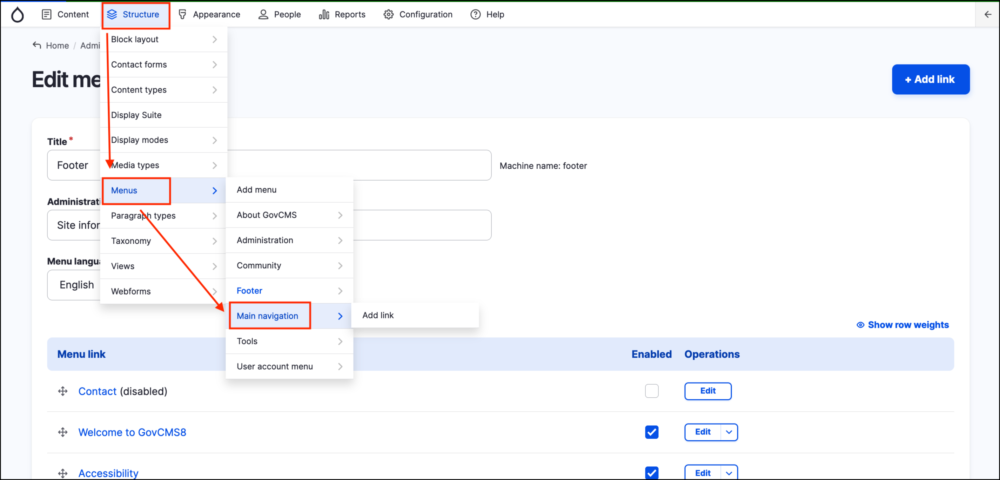
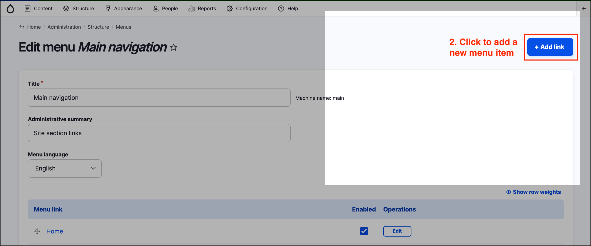
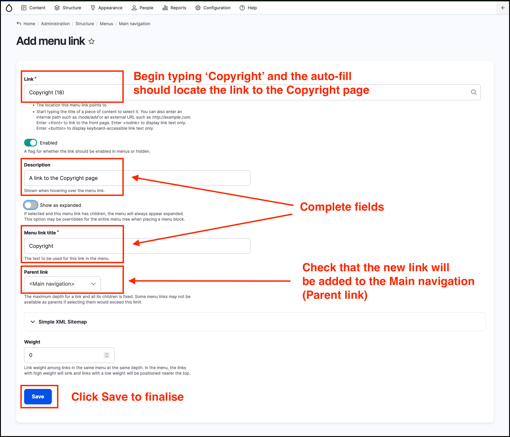

# Exercise 10.1: Add an item to a menu

In this exercise you’ll learn the two methods used to add menu items.

## Two ways to manage site navigation

There are two methods you can use to add menu items. The exercise below takes you through the two methods, using the example of adding a menu item to the Footer submenu.

### Method 1:

This method requires privileged site access \(e.g. an Administrator user\).

1. Hover over _Structure_, then → _Menus_ and click **Main navigation** on the _Admin menu_.

    

2. Click on ther **Add Link** button at the top right of the page.

    

3. Begin typing the word 'Copyright' in the _Link_ field. It is an auto-complete field and you should see the link to the 'Copyright' page in the field.
4. Add a _Description_ and a _Menu link title_ as shown on the screenshot below.
4. Click **Save** once complete.

    

5. Click on the **Home** item in the breadcrumbs at the top left of the page.
6. Review the change to the menu in the _Main navigation_. You should see the new menu item 'Copyright' in the menu.

### Method 2:

1. Navigate to a Standard Page by clicking on _Content_ in the _Admin menu_ and clicking on a page in the list of type _Standard page_.
2. Click on the **Edit** menu item.
3. In the RHS click **Menu settings** item to expand the item.
4. Click **Provide a menu link**
5. Type in a _Menu link title_. For example add the text 'Example menu item'
6. Select Main navigation_ in the _Parent Item_ dropdown
7. Set _Published_
8. Click **Save**

    

9. Click on the **Home** item in the breadcrumbs at the top left of the page.
10. Review the change to the menu in the _Main navigation_. You should see the new menu item 'Example menu item' in the menu.

