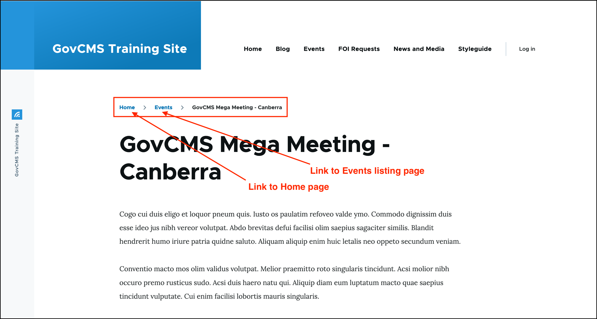

# About breadcrumbs



## What are breadcrumbs

Breadcrumbs show the **hierarchy path** of a website and are a quick and easy way for site visitors to navigate back to certain pages from the page they are currently on.

In the example shown in the screenshot below, a site visitor is on the page 'GovCMS Mega Meeting - Canberra'. The breadrumb shows:

- Home &gt; Events &gt; GovCMS Mega Meeting - Canberra

## Navigating using breadcrumbs

A site visitor can click on **Home** to return to the Homepage of the site, or on **Events** to navigate to go to a listing of events.

## Breadcrumbs and site structure / hierarchy

The exact breadcrumb will depend on your site’s structure and the number of levels in the hierarchy of the page. A breadcrumb is particularly useful for larger sites. 

Take this example:

- Home &gt; Publications &gt; Media releases &gt; 2019 &gt; July &gt; Media release title

Using this breadcrumb, site visitors can navigate quickly to Home, to the top level Publications page, to Media releases or even specifically to all 2020 media releases or all July 2022 media releases.
