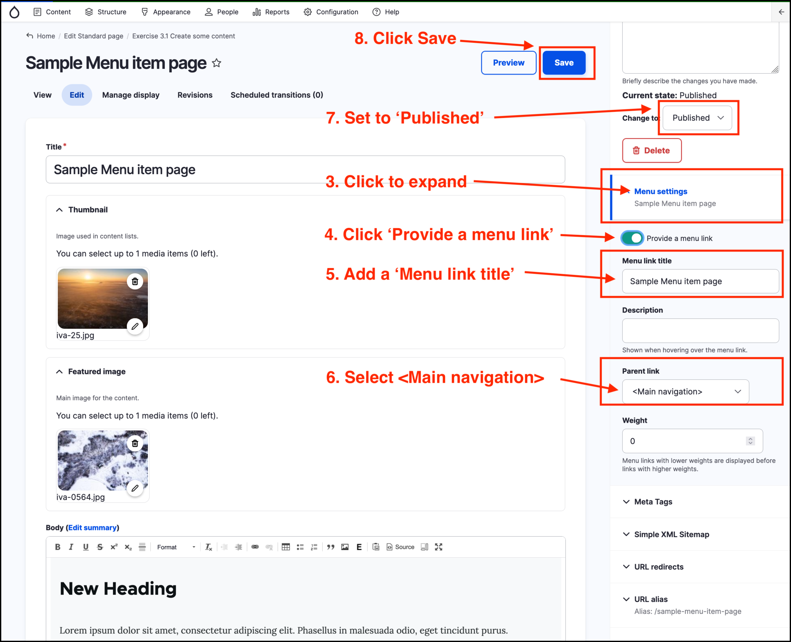

# Exercise 10.2: Add a Menu item from a _Standard page_

In this exercise you will learn how to add a menu item from a _Standard page_.

1. Navigate to a Standard Page by clicking on _Content_ in the _Admin menu_ and clicking on a page in the list of type _Standard page_.
2. Click on the **Edit** menu item.
3. In the RHS click **Menu settings** item to expand the item.
4. Click **Provide a menu link**
5. Type in a _Menu link title_. For example add the text 'Example menu item'
6. Select Main navigation_ in the _Parent Item_ dropdown
7. Set _Published_
8. Click **Save**

    

9. Click on the **Home** item in the breadcrumbs at the top left of the page.
10. Review the change to the menu in the _Main navigation_. You should see the new menu item 'Example menu item' in the menu.
