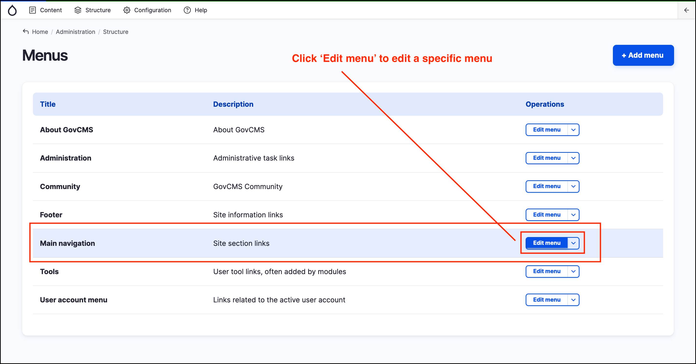
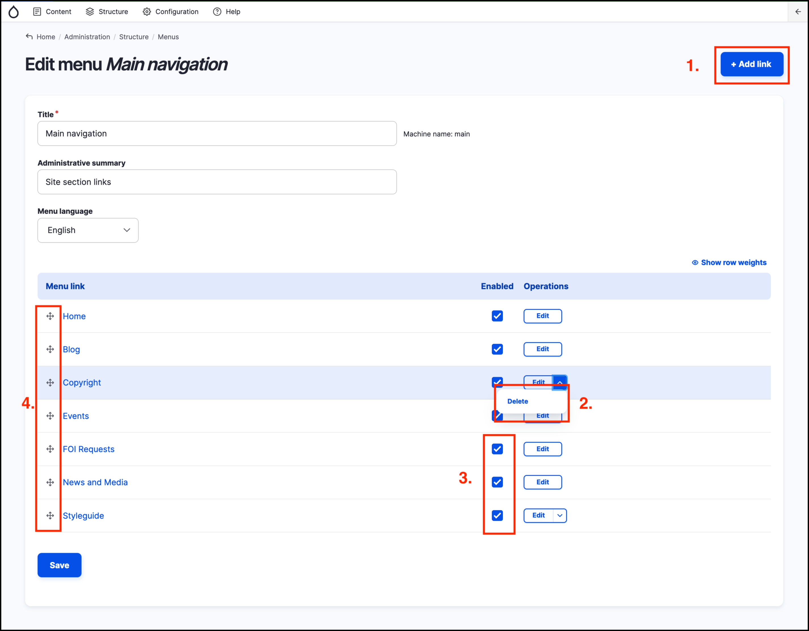
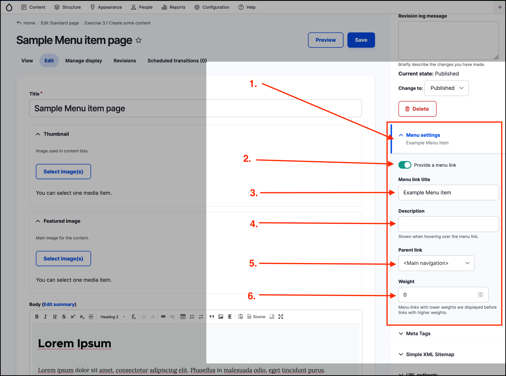
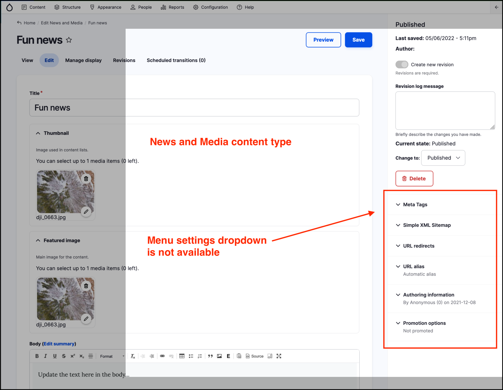

# Managing Menu items



Menu items can be added to the _Main navigation_ and _Footer menu_ in two main ways.

## Managing from the Structure - Menus page

To add menu items, view and edit existing menus, hover over _Structure_ in the _Admin menu_ then click on _Menus_. This will take you to a page displaying all the _Menus_ that exist on a site.

Depending on your level of access, you can delete an entire menu from this page. Clicking on the _Edit menu_ button for any menu listed will take you to a page where menu items can be:

1. Added - by clicking the **+Add link** button at the top right.
2. Deleted - by clicking the dropdown next to a menu item's _Edit_ button.
3. Enabled/Disabled - using the checkboxes.
4. Reordered - by dragging and dropping using the cross handles to the left of each menu item.

Adding a menu item via this method is covered in **[Exercise 10.1](Exercise-10-1-Add-an-item-to-a-menu.md)**.

**Note** The _Home_, _Blog_, _Events_, _FOI Requests_ and _News and Media_ menu items can not be deleted on GovCMS sites. They are created by the _Views_ module for all GovCMS sites. They can however be disabled \(using the checkboxes\), or renamed.

**Note** Disabling a menu item does not delete the page. You can still access the page by going directly to the URL of the menu.

## Adding a menu item from the _Content_ edit form

Menu items can be generated while creating or editing _content_. For example, while creating a new _Standard page_. This provides a quick way to generate a new menu item. In the example below, a new menu item will be added to the _Main navigation_ menu. 

To add a menu item from the _Menu settings_ area on a _content_ page:

1. Click to expand the _Menu settings_ area on the right hand side of the page.
2. Click on _Provide a menu link_.
3. Add a _Menu title link_.
4. Optionally add a _Description_.
5. Select the _Parent link_ - which menu to add the link to.
6. Optionally choose a _Weight_.

The _Weight_ number determines the ordering of the new menu item in the chosen menu. Managing ordering is easier to manage from the _Menu_ page. As such, you may wish to leave the _Weight_ value at the default value of 0 while creating the page, then manage the ordering in the _Structure_ - _Menu_ page.

## Restrictions for adding content to the site navigation

When creating or managing content you will notice that some _content types_ have an option to be added to a _Menu_, while others do not. 

As shown above, a menu item can be created while creating or editing a _Standard page_. The _Menu settings_ area is not available in the _News and Media_ content editing form as shown in the screenshot below. 

The site builder usually only activates the Menu Settings option for content **that is not listed on the site in any way and can only be found via a navigation menu**. The Standard Page content type is a good example of content that has to be manually added to the main navigation or another menu.

**Dynamic content** such as **Events**, **News** or **Blog articles** do not usually need a link in the main navigation menu, as this content is displayed in the corresponding listing pages. 

In some cases, the relevancy of content may expire over time \(e.g. Event content types\), so having a link from a menu brings an extra content management burden to remove the link after the content expires.
