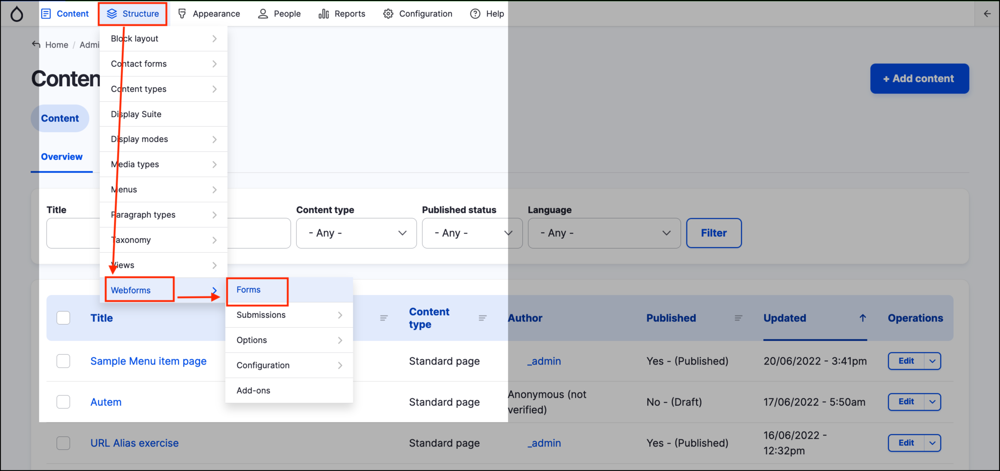
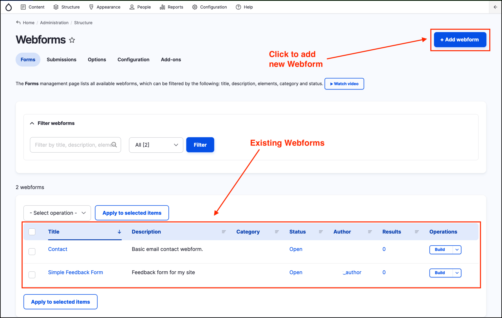

# Capturing data with forms

Online forms \(HTML forms\) allow users to fill out information on a website and can be used to capture a variety of data/information. In GovCMS, forms can be created in the following ways:

* Creation of **custom forms** \(this requires development expertise and would be done by a development partner or in-house development team\).
* Creation of a new **Webform** using the "Webform Module". This is the recommended option for content authors and the focus of this topic.

**Note** Forms can also be created by creating a new _Content type_. However, this method is not recommended as it can lead to mixing public form submissions with site content. The GovCMS **Contact Module** can also be used to create a form, however functionality is limited using this method.

## Webform module/Content type

Webforms can be used to:

* Setup a complex **Contact us** form.
* Add a **survey** to your website.
* Include a **feedback form** on your site.
* Add an **order form** to your site.

Webforms can be configured to send emails to selected recipients when the form is submitted by a site visitor. Completed form submissions can also downloaded in bulk from the site.

The _Webform_ template is accessible from the content management area of GovCMS. To create a new _Webform_, click on _Structure_ in the _Admin menu_, then hover over _Webforms_ and click on **Forms**. 

On this page you will see a list of all previously created _Webforms_. Click on the **+ Add webform** button at the top right to create a new _Webform_. See exercises **[11.1](exercise-11-1-create-a-basic-webform.md), [11.2](exercise-11-2-attach-a-form-to-a-webform-page.md)** and **[11.3](exercise-11-3-create-an-event-registration-form.md)** for the steps required to build a _Webform_ and use it on a site page.

**Note:** In GovCMS, each _Webform_ is an independent _entity_; to attach metadata to a _Webform_, it must be referenced from a _Webform_ _**content type**_. This approach allows for broader use-cases of webforms as independent entities and means they can be reused in multiple places.

## Webform results

You can view the webform results from the _Webform_ page \(if your account has the correct permissions\) by clicking on the **Results** tab. Results can be viewed and downloaded in many different formats.
