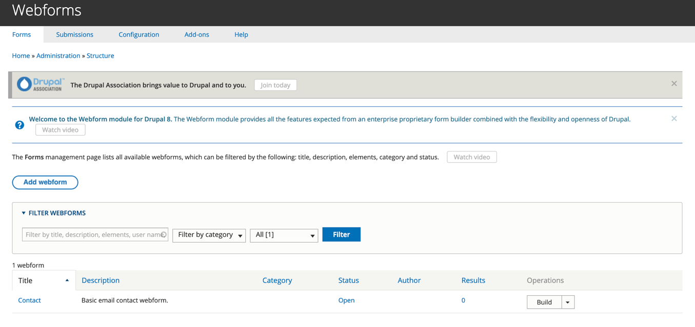

# Capturing data with forms

An online form \(HTML form\) allows users to fill out information on your website and can be used to capture a variety of data/information. In GovCMS, forms can be created in the following ways:

* Creation of a custom form \(this requires expertise and would be done by a developer\)
* Creation of a new Content Type that’s made available to all users \(this isn’t a good method because you don’t want public submissions mixed with your other site content\)
* Configuration of GovCMS’s "Contact Module" to create your online form \(easy to do but functionality is limited\)
* **Creation of a new webform using the "Webform Module" \(recommended option\)**

### Webform module/content type

The webform template is accessible from the content management area of GovCMS. Completed forms can be sent to a specific email address or downloaded in bulk.

Webforms are good if you want to:

* Setup a complex ‘contact us’ form
* Add a survey to your website
* Include a feedback form on your site
* Add an order form to your site

**Note:** In GovCMS 8, each _Webform_ is an independent _entity_; to attach metadata to _Webforms_ it has to be referenced from a _Webform_ _**content type**_. This approach allows for broader use-cases of webforms as independent entities and means they can be reused in multiple places.

#### Exercise 11.1: Create a basic webform

In this exercise we'll create a simple website feedback form.

1. In the NavBar go to _Content._
2. Click **Add Content.**
3. Click **Webform.**
4. Note the message at the top of the page:

   

   Before we can create a Webform page and attach a webform entity to it, the entity must exist. Let’s create our first webform entity. Click the **created** link in the warning message to create the webform.

5. From the Webform page click the **Add webform** button.

   

6. Give your _Webform_ a title like "Simple Feedback Form", then enter an optional _Administrative description_ and add a _Category_ \(if required\). Open your webform for submissions by selecting its _Status_ as Open:

   

7. Click **Save.**
8. You’ll be redirected to the webform building interface \(the _Build_ tab is active\), so you can add elements \(fields\) to your webform, configure various conditions and much more.

   

9. Click the **Add element** button and add a simple "text field" element for the Feedback field.

   

10. Fill out the _Title_ field.

    

11. Note the other tabs that allow you to configure the field - _Conditions_, _Advanced_ properties and _Access_. Explore those tabs but do not modify anything yet. Save your field when you’re ready.
12. Do not move away from your Elements page without pressing the **Save elements** button.

    

13. Have a look at your Webform by clicking the **View** tab. To return to the Webform _Build_ interface, click the **Build** tab at any time. If you moved away from your webform, use the top navigation to return to the form via _Structure_ → _Webforms_ → \[select the webform from the list\].  
    

    Note that the Feedback field label is displayed inline with the field. Let’s move it above the field.

14. Return to the webform build interface and place the Feedback field label above the field.

    

    Make your _Title_ _display_ selection match the screenshot.

    Navigate to the _Advanced_ tab, expand the Label attributes pane and add Label CSS Style to match the screenshot:

    

15. Return to the General section and make the Feedback field _Required_  
16.  Press **Save** and review the form you created.
17. Submit your new form \(a few times if you like\)

#### Exercise 11.2: Attach a feedback form to a Webform

In this exercise we attach the webform created in Exercise 11.1 to a webform page, so that it’s accessible by the public and can have other attributes available to content types \(for example, we could place it on a custom URL, attach to a site navigation menu, add metadata and use moderation workflow\).

1. Create Webform content \(Content → Create Content → Webform\). Give it a title and fill in some information with the form submission guidelines in the Body field.
2. In the Webform field, select the webform created in the previous exercise.
3. Explore the Webform _Settings_ field, but do not modify anything there.
4. Attach the Webform to the main navigation - see the screenshot:
5. Under the _URL alias_ field, create a custom URL for your feedback webform 
6. Publish the Webform and review it. Ask your trainer if you have any questions. 

### 

