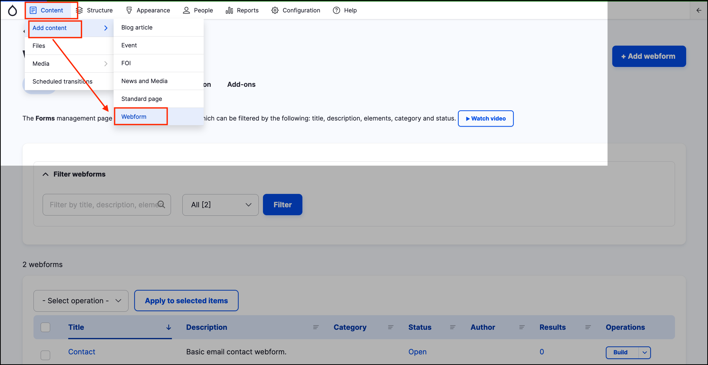
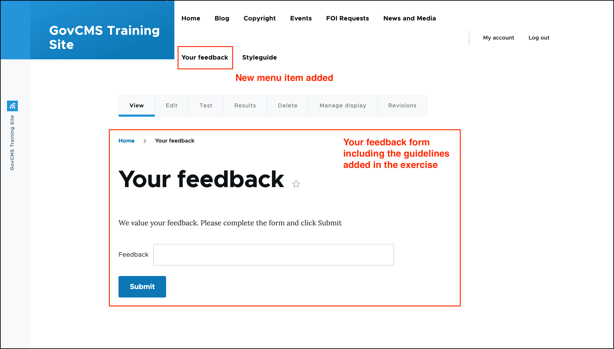

# Exercise 11.2: Attach a form to a _Webform_ page

In this exercise we attach the webform created in Exercise 11.1 to a **webform page**, so that it’s accessible by the public and can have other attributes available to content types \(for example, we could place it on a custom URL, attach to a site navigation menu, add metadata and use moderation workflow\).

1. Create a new _Webform_ content page by clicking on **Content** in the _Admin menu_ then hover over _Add content_ then click on **Webform**.

    

2. Add a _Title_ and some text in the _Body_ field, with guidelines about the form.
3. In the Webform field, select the webform created in the previous exercise \(you may have named your form 'Simple Feedback Form' as in the screenshot below\).
4. Explore the Webform _Settings_ field, but do not modify anything there.
5. Attach the Webform to the main navigation.
6. Set the _Save as_ dropdown to 'Published'.
7. Click the **Save** button to complete.

    
    
8. Note that 'Your feedback' is now a menu item on the _Main navigation_ menu. Click on the link. The page containing your form should look similar to the screenshot below.

    

