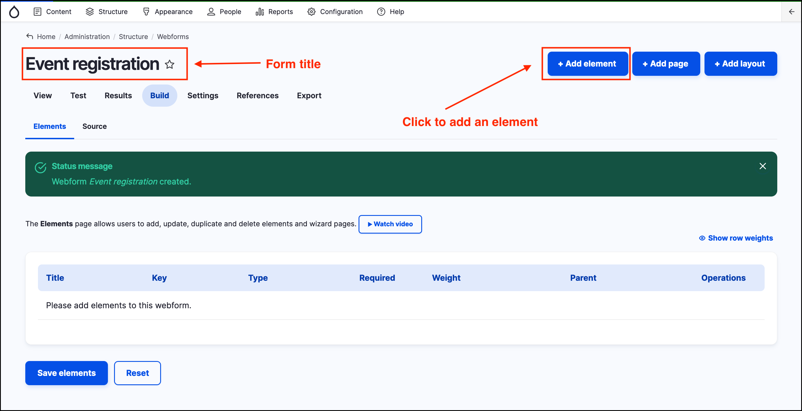
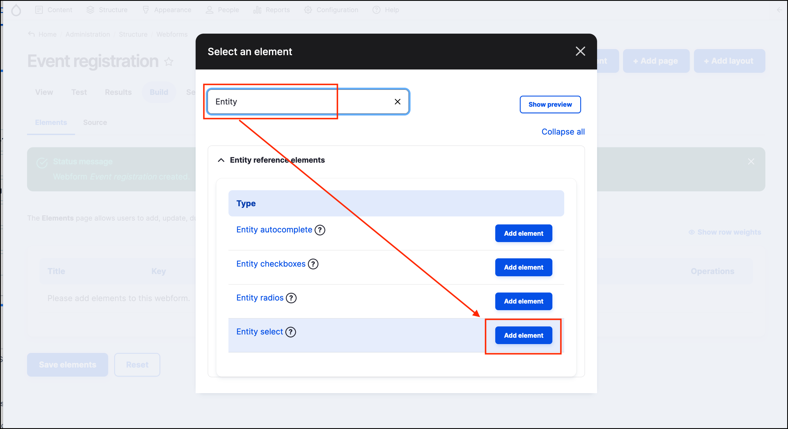
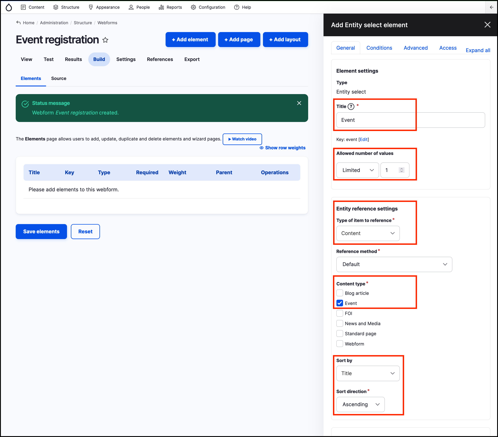
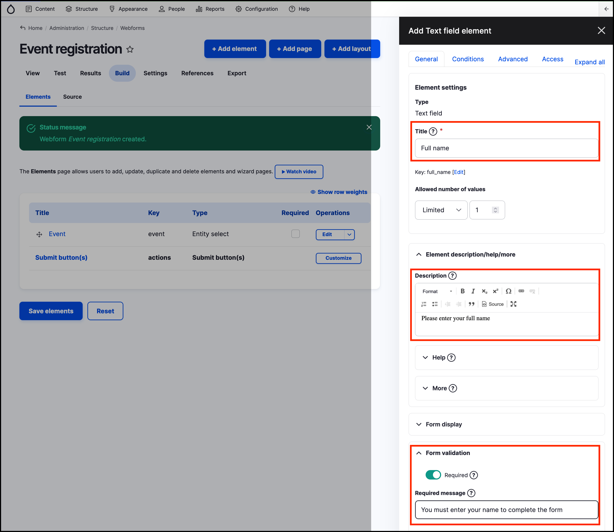
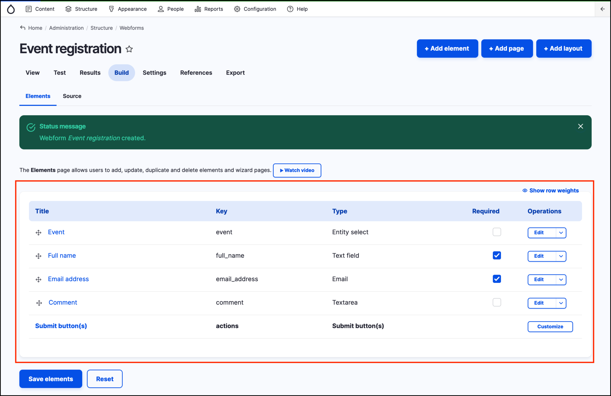
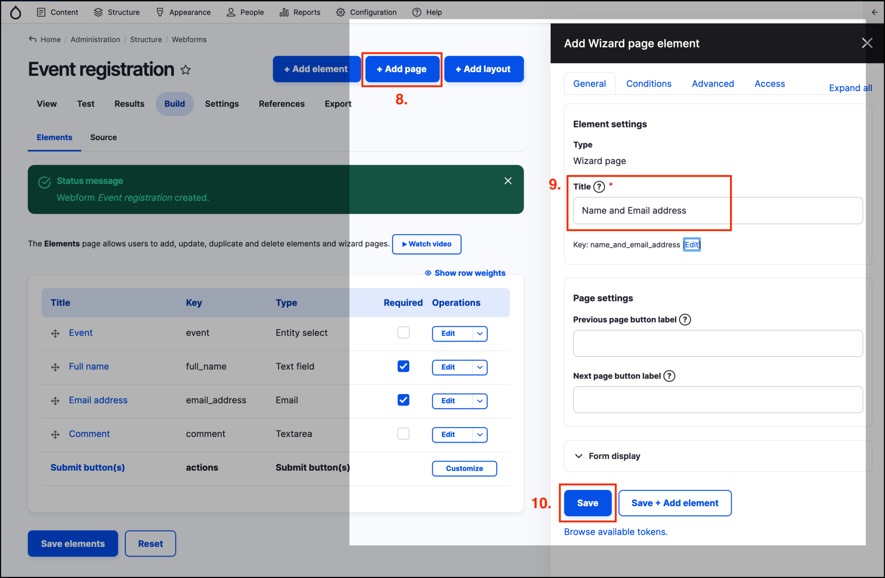
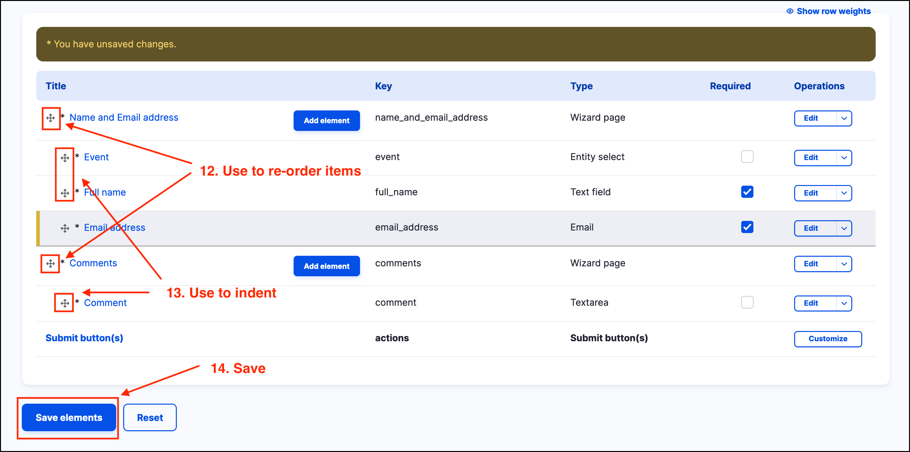
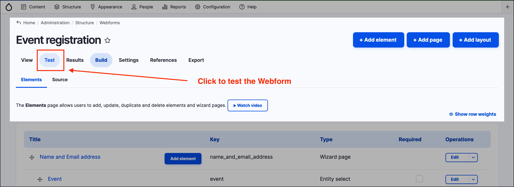

# Exercise 11.3 - Create an event registration form

In this exercise you will create an _Event registration form_.

1.  Add a new Webform (see previous Steps 1 to 3 of [**Exercise 11.1**](https://salsa-digital.gitbook.io/govcms-content-administration/unit-11-capturing-data-with-forms/exercise-11-1-create-a-basic-webform) how to create a webform). Set the title to be _Event registration._

    
2. Click the **+ Add element** button.
3.  Search for the _Element_ type of _Entity select_ by typing in the search field as shown in the screenshot below. Click the **Add element** button next to _Entity select_.

    
4.  Configure the options on the right hand side to match the screenshot below.

    
5.  Add a another element using the **+ Add element** button, choose a _Text field_ element and label it “Full name”, making it a _required_ field. You may add the description “Please enter your full name” in the _Element description/help/more_ fieldset. You can also add a _Required message_. This text will be displayed to a user if they submit the form without completing the _Full name_ field.

    
6. Add an _Email_ element following the steps above, labelled “Email address” and make it a _required_ field.
7.  Add a Textarea element labelled “Comment” and make it optional. At this stage your "Event registration" _Webform_ page should look similar to the screenshot below.

    
8. Click on the **+ Add page** button at the top right of the page.
9. Add a title to the page on the right hand side. For example, you can name the page 'Name and Email address'.
10. Click on the **Save** button at the bottom left of the _Add Wizard page element_ area.

    
11. Add another page using following steps 8 to 10. Name the page 'Comments'.
12. Using the small cross icons to the left of the Pages and Elements, drag-and-drop to position the 'Name and Email address' and 'Comments'.
13. Indent the form elements to the right, nesting them within the pages 1 and 2, as shown in the screenshot below.
14. Press the **Save elements** button.

    
15. Optional - Add an email handler so that webform responses are automatically emailed to a specified email.

<figure><figcaption>
Create email handler
</figcaption></figure>

In the Email handler pop up window, set the custom email address and click on Save. You can separate multiple email addresses with a comma.

<figure><figcaption>
Add custom email addresses separated by a comma
</figcaption></figure>

Test your form

**Hint:** The Test tab allows you to easily test your form with auto-filled dummy data and without the need to assign your _Webform_ to a _Webform page_.

