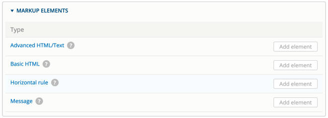

# Webform components

Webform components can be used to collect different types of data. There are many useful components available, as shown in the screenshots below.

<table>
  <thead>
    <tr>
      <th style="text-align:left">
        
      </th>
      <th style="text-align:left">
        
      </th>
    </tr>
  </thead>
  <tbody>
    <tr>
      <td style="text-align:left">
        
      </td>
      <td style="text-align:left"></td>
    </tr>
    <tr>
      <td style="text-align:left">
        
      </td>
      <td style="text-align:left">
        
      </td>
    </tr>
    <tr>
      <td style="text-align:left">
        
      </td>
      <td style="text-align:left">
        

          
        

        

          
        

      </td>
    </tr>
    <tr>
      <td style="text-align:left">
        
      </td>
      <td style="text-align:left"></td>
    </tr>
    <tr>
      <td style="text-align:left">
        
      </td>
      <td style="text-align:left">
        
      </td>
    </tr>
    <tr>
      <td style="text-align:left">
        
      </td>
      <td style="text-align:left"></td>
    </tr>
  </tbody>
</table>

### 

### Webform options

The _Settings_ tab contains some useful advanced options.

<table>
  <thead>
    <tr>
      <th style="text-align:left"><b>Option</b>
      </th>
      <th style="text-align:left"><b>Description</b>
      </th>
    </tr>
  </thead>
  <tbody>
    <tr>
      <td style="text-align:left">Confirmation message</td>
      <td style="text-align:left">Displays a custom message to the user, such as &#x201C;Thank you for filling
        out our feedback form. Someone will be in contact with you within the next
        48 hours.&#x201D;</td>
    </tr>
    <tr>
      <td style="text-align:left">Redirection location</td>
      <td style="text-align:left">
        
You may redirect users to another page using this advanced setting. For
          example, you could create a &quot;Thank you&quot; page that&#x2019;s used
          for all your form submissions.

        
<b>Tip</b>: Be careful creating a &quot;Thank you&quot; page as it may
          appear on other pages, such as search results.

      </td>
    </tr>
    <tr>
      <td style="text-align:left">Submission limits</td>
      <td style="text-align:left">
        
You can control how often a form can be submitted using the two &quot;submission
          limit&quot; fields.

        
<b>Tip</b>: Submission limits can be tricky. For example, if you&#x2019;re
          collecting anonymous information the system has limited ways of knowing
          if a site visitor has already submitted the form and it&#x2019;s also possible
          to trick the webform into accepting multiple submissions.

      </td>
    </tr>
    <tr>
      <td style="text-align:left">And many more...</td>
      <td style="text-align:left">The GovCMS Webform provides great flexibility. Have a look through the
        other options to familiarise yourself with the form.</td>
    </tr>
  </tbody>
</table>

### Webform results

You can view the webform results from the _Webform_ page \(if your account has the correct permissions\) by clicking on the **Results** tab. Results can be viewed and downloaded in many different formats.

#### Exercise 11.3: Create an event registration form

In this exercise we’re going to create an event registration form.

1. Add a new Webform \(see previous Exercise 11.1 how to create a webform\) and set its title as _Event Registration._
2. Add a component field type _Entity select_ \(see the _Entity reference elements_ section\), titled "Event" \(make it required - see the Form Validation fieldset at the bottom\). Configure the rest of the options to match these screenshots:

   

3. Add a _Text field_ element labelled “Full name”, make it required. You may add the description “Please enter your full name” in the _Element description/help/more_ fieldset.
4. Add an _Email_ element, labelled “Email address” and make it required.
5. Add a Textarea element labelled “Comment” and make it optional.
6. Add some “Basic HTML” markup that says: "You are about to submit a form on the internet, are you sure?"

   

7. Split your form into two-page form by adding two pages. Name them “Step 1. Form” and “Step 2. Confirmation”

   

8. Using the little cross drag-and-drop to position Pages 1 and 2 as displayed. Then, indent form elements to the right, nesting them within pages 1 and 2, as below:

   

9. Press the **Save elements** button and test your form 

**Hint:** The Test tab allows you to easily test your form with auto-filled dummy data.

### 

