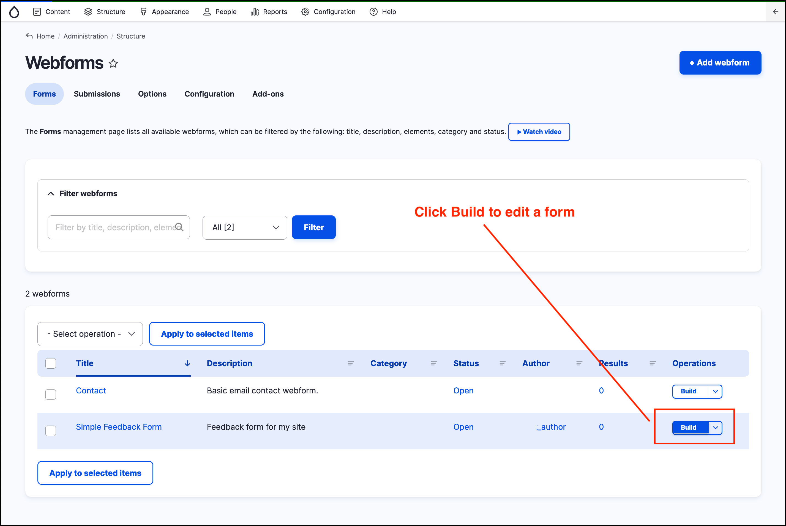
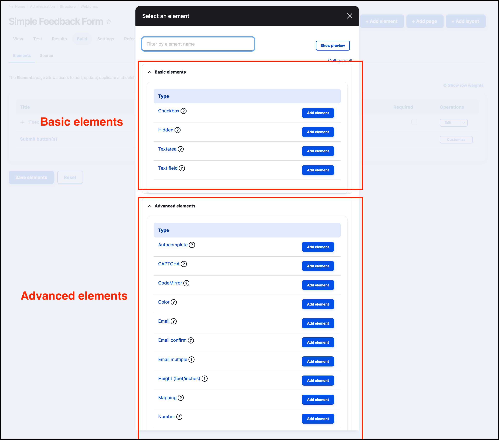
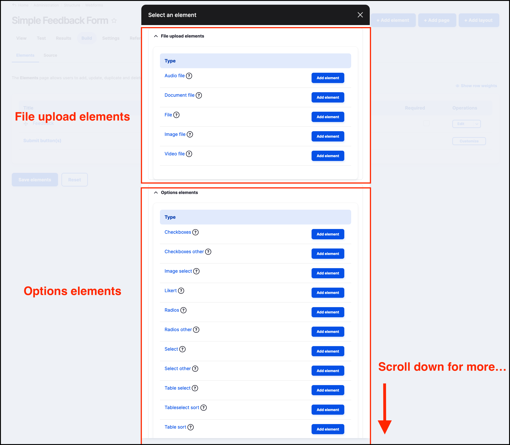
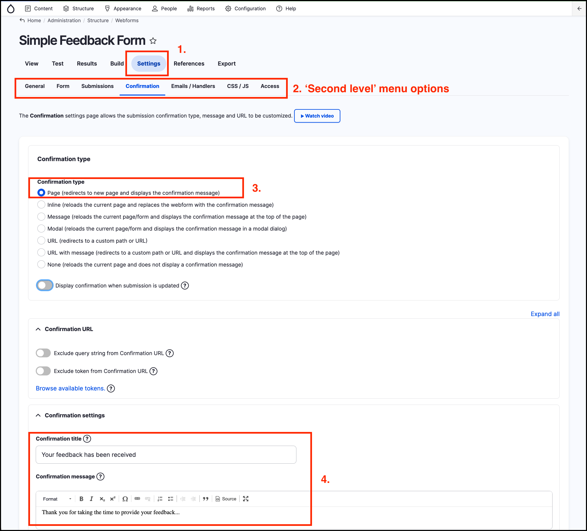

# Webform components

Webform components can be used to collect different types of data. Different elements can be added to a _Form_ using similar steps to the way a _Text field_ was added in **[Exercise 11.1](https://salsa-digital.gitbook.io/govcms-content-administration/unit-11-capturing-data-with-forms/exercise-11-1-create-a-basic-webform)**.

To see all the elements available when creating or editing a form, click on _Structure_ on the _Admin menu_ then hover over _Webforms_ then click on _Forms_. 

Click on the **Build** button to the right hand side of a selected form, as shown in the screenshot below. 

Click on the **+Add element** button to the top right of the screen.

You will see a long list of available components. Scroll down to see them all. The screenshots below show some examples from _Basic elements_, _Advanced elements_, _File upload elements_ and _Options elements_.

## Webform options

The _Settings_ tab contains some useful advanced options. 

1. To access these options, click on the _Settings_ menu.
2. Click on the various 'second level' menu items \(_General, Form, Submissions, Confirmation, Emails/Handlers, CSS/JS, Access_\) to view the options available.

In the sceenshot below, the form is configured to direct a site visitor to a Confirmation Page \(3\). The _Confirmation title_ and _Confirmation message_ \(4\) can be customised as shown in the screenshot.

Some of the more important and commonly used _options_ are outlined in the table below.

<table>
  <thead>
    <tr>
      <th style="text-align:left"><b>Option</b>
      </th>
      <th style="text-align:left"><b>Description</b>
      </th>
    </tr>
  </thead>
  <tbody>
    <tr>
      <td style="text-align:left">Confirmation message</td>
      <td style="text-align:left">Displays a custom message to the user, such as &#x201C;Thank you for filling
        out our feedback form. Someone will be in contact with you within the next
        48 hours.&#x201D;</td>
    </tr>
    <tr>
      <td style="text-align:left">Redirection location</td>
      <td style="text-align:left">
        
You may redirect users to another page using this advanced setting. For
          example, you could create a &quot;Thank you&quot; page that&#x2019;s used
          for all your form submissions.

        
<b>Tip</b>: Be careful creating a &quot;Thank you&quot; page as it may
          appear on other pages, such as search results.

      </td>
    </tr>
    <tr>
      <td style="text-align:left">Submission limits</td>
      <td style="text-align:left">
        
You can control how often a form can be submitted using the two &quot;submission
          limit&quot; fields.

        
<b>Tip</b>: Submission limits can be tricky. For example, if you&#x2019;re
          collecting anonymous information the system has limited ways of knowing
          if a site visitor has already submitted the form and it&#x2019;s also possible
          to trick the webform into accepting multiple submissions.

      </td>
    </tr>
    <tr>
      <td style="text-align:left">And many more...</td>
      <td style="text-align:left">The GovCMS Webform provides great flexibility. Have a look through the
        other options to familiarise yourself with the form.</td>
    </tr>
  </tbody>
</table>

###
