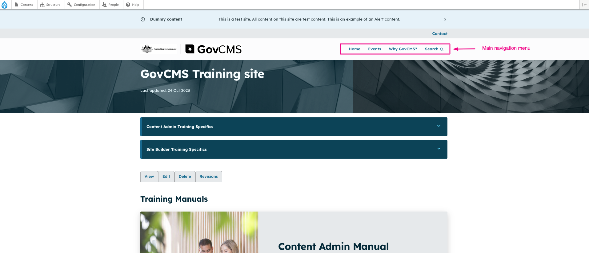

# Advanced content editing

Page layout in GovCMS is determined by your theme.

In the training site, we are using [CivicTheme](https://www.civictheme.io/) and the default components are shown in the screenshot below.

<figure><figcaption>
Showing default CivicTheme components
</figcaption></figure>

You can visualise these components by viewing the [CivicTheme Storybook](https://www.civictheme.io/themes/custom/civicthemeio/storybook-static/index.html?path=/story/base-menu--menu).

Here are some examples of CivicTheme components as seen in the frontend.

**Event Card**

<figure><figcaption>
CivicTheme Event Card
</figcaption></figure>

**Publication Card**

<figure><figcaption>
CivicTheme Publication Card
</figcaption></figure>

**Accordions**

<figure><figcaption>
CivicTheme Accordions
</figcaption></figure>

**Slider**

<figure><figcaption>
CivicTheme Slider
</figcaption></figure>

[You can view more CivicTheme components here](https://www.civictheme.io/themes/custom/civicthemeio/storybook-static/index.html?path=/story/base-menu--menu).
