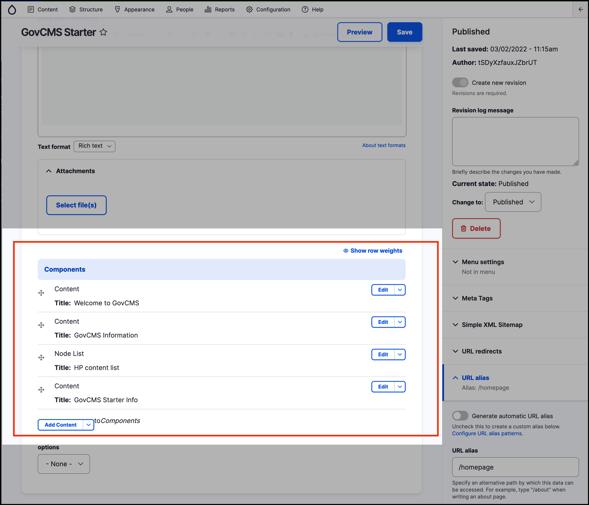

# Advanced content editing

Page layout in GovCMS is limited to **predefined** and **preconfigured** _regions_. Layouts cannot be easily changed without some **theme** development work. However, the **Panelizer** module in GovCMS does allow more complex layouts to be created and managed by content editors.

The _Panelizer_ module allows a content administrator to create **custom layouts** which can be reused on multiple pages. At its core, _Panelizer_ is a drag and drop content manager that lets you visually design a layout and place content within that layout.‌

The sceeenshot below shows an example of how **components** are arranged using _Panelizer_ in the construction of a Homepage.

