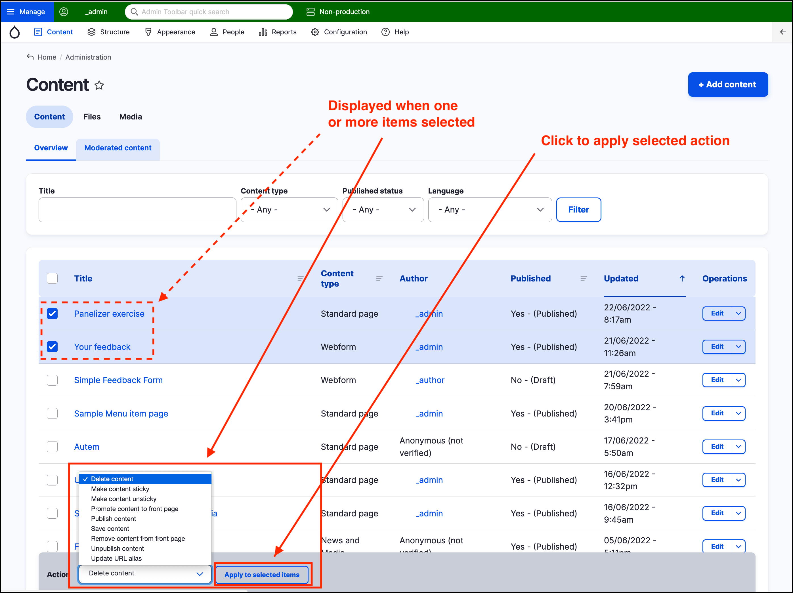

# Bulk operations

There are many content operations that can be performed in bulk. In GovCMS the standard content operations that can be performed in bulk are:

* Delete content
* Make content sticky
* Promote content to front page
* Publish content
* Save content
* Remove content from front page
* Unpublish content
* Update URL alias

These bulk operations allow you to quickly and easily make the above changes to multiple pages. The _Bulk operations_ dropdown and button are displayed when **one or more items** is selected on the _Content listing_ page. Click on _Content_ on the _Admin menu_ then select the checkboxes for one or more items in the content list. Click on the **Apply to selected items** button to perform the selected action.

