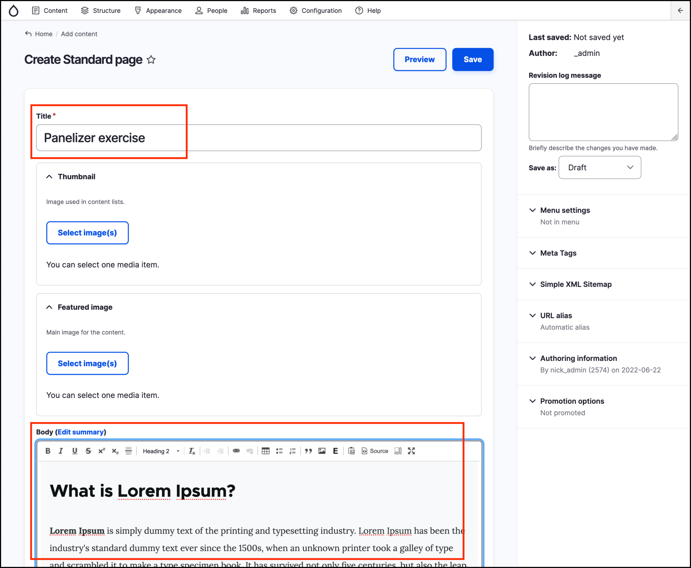
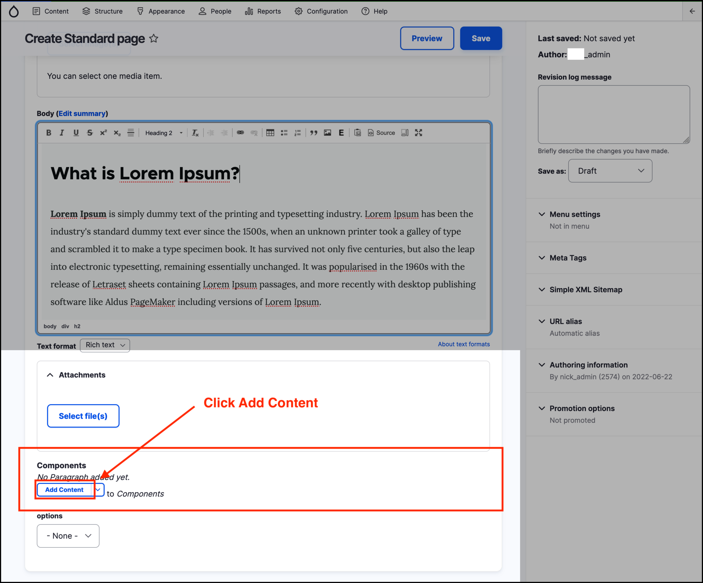
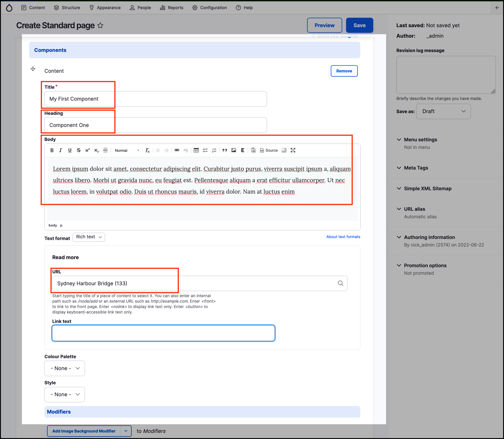
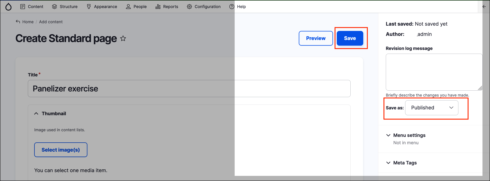
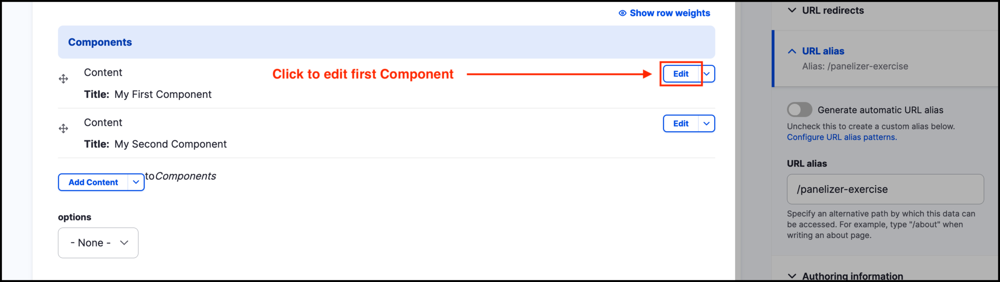
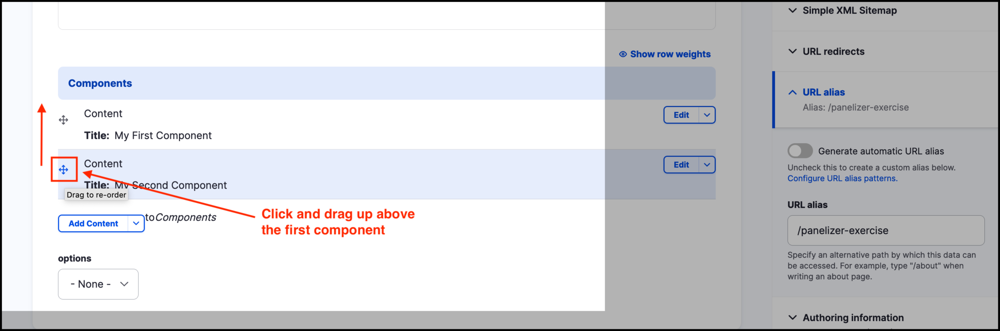
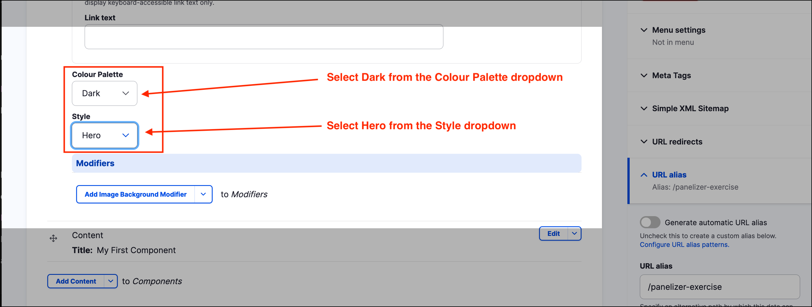
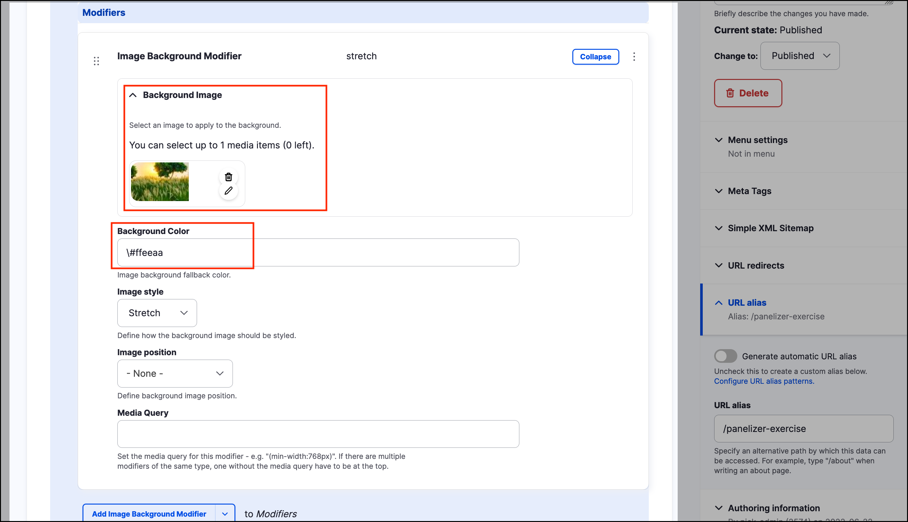

# Exercise 12.1 - Add content using components

In this exercise you will use **components** to add and styled content to a _Standard page_.

1. Create a new _Standard page_ by clicking on **Content** on the _Admin menu_, then hover over _Add content_ then click **Standard page**.
2.  Add a _Title_ and some some content to the _Body field_.

    
3.  Scroll to the bottom of the page and locate the _Components_ section. Click on the **Add content** button.

    
4.  Fill in the _Title_, _Heading_, _Body_, and _URL_ fields. Do not add _Colour Palette_ and _Style_ yet.

    
5. Create another component by clicking the **Add content** button at the bottom of the page. Fill in the same fields as the previous step, but use different text.
6.  Set the _Change to_ dropdown to _Published_ and click on the **Save** button to save your work.

    
7. Review the look of the page, locate the two content Components you created.
8.  Return to editing the page you created in steps 1-5 (from the page, click the **Edit** button). This will expand the component area.

    
9.  Edit the first component only and select “Alt” from the _Colour Palette_ dropdown.

    
10. Click the **Save** button at the top right of the page. Review the change in the frontend.
11. Return to editing the page.
12. Using the drag and drop elements, rearrange the two components so that the second component is moved to the top.

    
13. Click the **Save** button at the top right of the page. Review the change in the frontend.
14. Return to editing the page. Edit the top _component_.
15. Set the _Full content_ field to “Edge to edge”.
16. Click the **Save** button at the top right of the page. Review the change in the frontend.
17. Return to editing the page. Edit the top _component_.
18. Apply “Dark” _Colour Palette_ and set the Style to “Hero”.

    
19. Click the **Save** button at the top right of the page. Review the change in the frontend.
20. Return to editing the page. Edit the top _component_.
21. In the Modifiers section, click on the **Add Image Background Modifier** button. Choose an image by clicking on the **Select image(s)** button. Set the Background Colour to #ffeeaa.

    
22. Click the **Save** button at the top right of the page. Review the change in the frontend.

## Challenge Exercise 12.2: Replicate homepage layout

Using the content created in the previous exercise, try to replicate the layout of the homepage.
