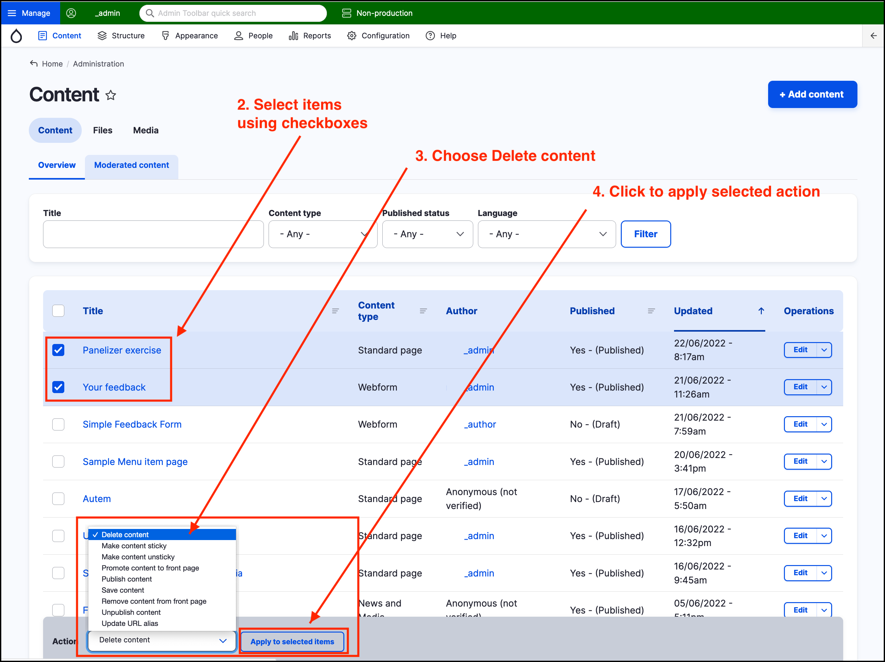
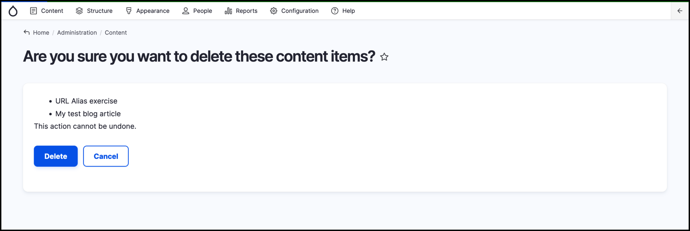

# Exercise 12.2 - Bulk operations - delete test content

In this exercise you will perform a bulk action to delete content.

1. Click on **Content** on the _Admin menu_.
2. Select a few pages that you created during the training by clicking the checkboxes to the left of the page.
3.  Click on the _Action_ dropdown at the bottom of the page and select _Delete content_.

    
4. Click the **Apply to selected items** button.
5.  You will be redirected to a conrfirmation page listing the content to be deleted. Click on **Delete** to confirm your action.

    
6. Review Content page - all content that you selected has been removed
