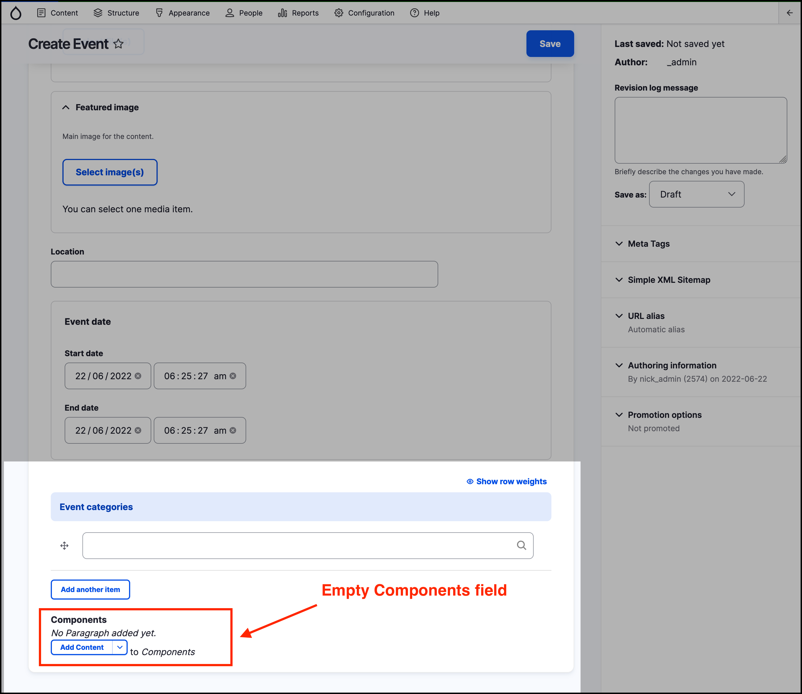

# Using Components for rich layout options

_Panelizer components_ can be used in the creation of all the GovCMS _content types_.

The Components field can be used in the Create/Edit _content form_ of any _content type_ to create and manage rich content layout features, specifically the visual blocks of content on a page.

As you add or edit content, look for the _Components_ field in the form. It is usually at the bottom of the page, as shown in the screenshot below of a new _Event_ page.

_Note that the_ _**Components**_ _field may be labelled differently in your GovCMS website._

This feature can be used to create anything from a simple text block or image to a complex, configurable slideshow.

Components may look different in every website implementation. The ‘vanilla’ GovCMS site used during the training has some preconfigured components available for most content types.
