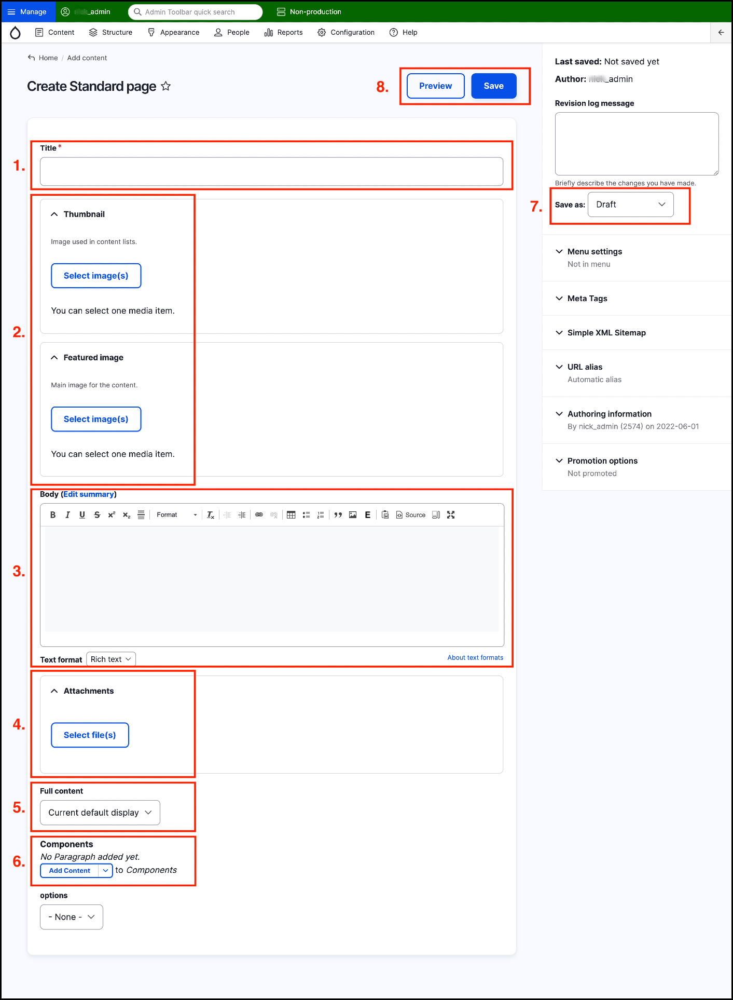

# Overview of content create/edit form



## The Content form

When creating or editing any content in GovCMS, you’ll use the **Content form**.

Each of the different **content types** mentioned in the previous page can have different custom areas depending on how a site is configured. 

At the same time, there are many areas common to _all_ content creation forms. 

An overview of the **Standard page form** is shown below to highlight these common areas.

## Form elements description

The areas highlighted are:

1. **Title:** Type in your content’s title.
2. **Thumbnail and featured image:** Select images for thumbnail view or to be displayed in the page.
3. **Body:** Type \(or copy and paste\) the text for the body content.
4. **Attachments:** Select any files you’d like to attach to the page.
5. **Full content:** Type of content display required.
6. **Components:** Add Components to the page \(Components are discussed in **[unit 12](https://salsa-digital.gitbook.io/govcms-content-administration/unit-12-advanced-content-editing/using-components-for-rich-layout-options)** of this manual\)
7. **Save as:** Save as Draft, Needs review, or Published.
8. **Save and Preview** buttons.

Notice that on the right-hand side there are also other fields - we’ll discuss these in different sections of this manual.

