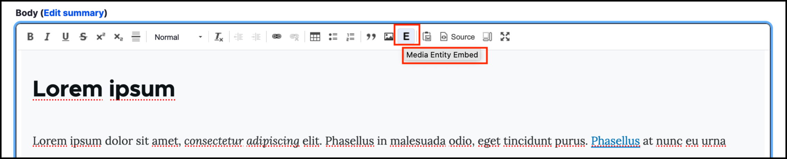
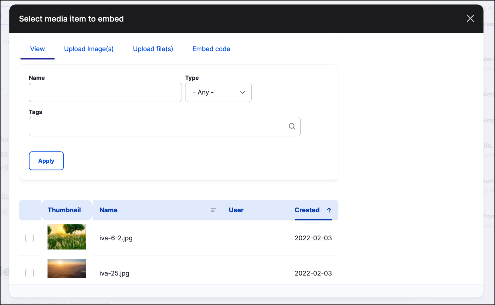
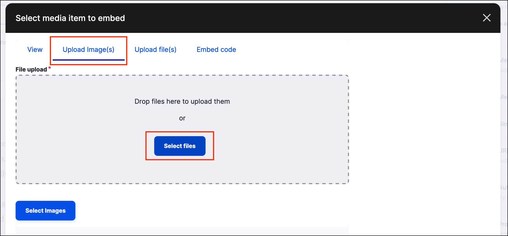
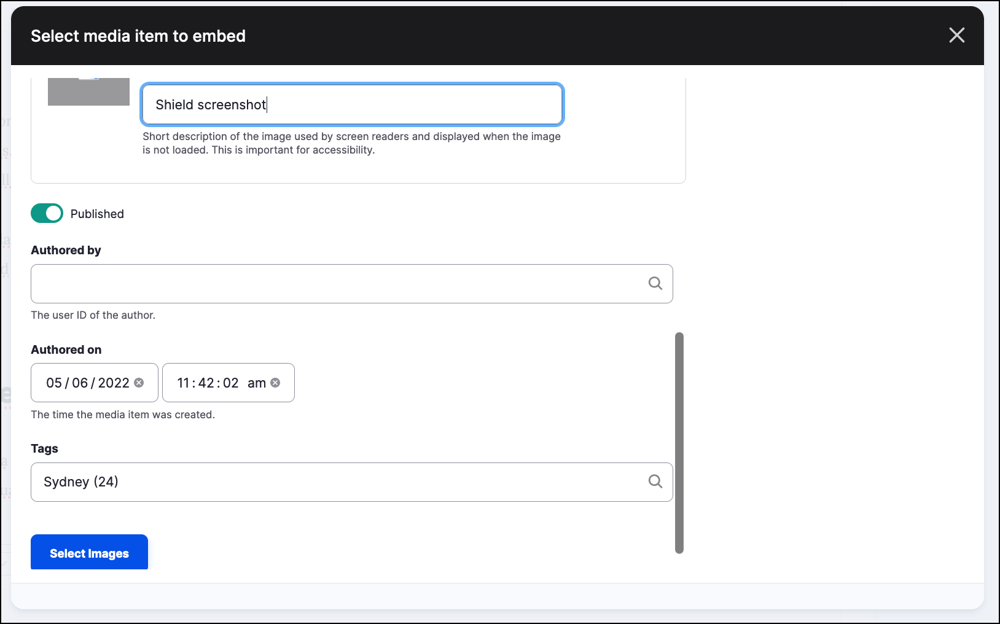
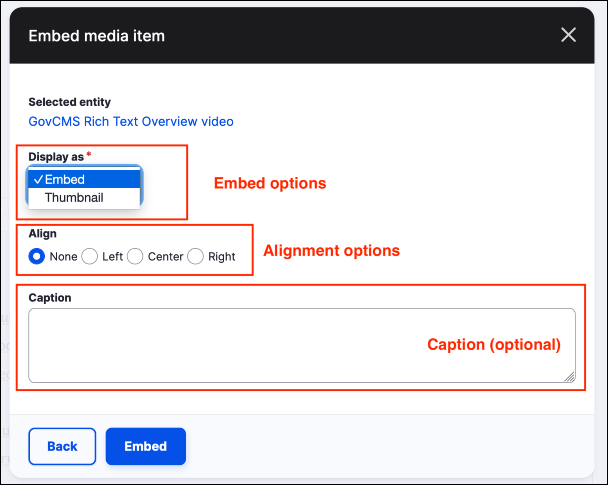
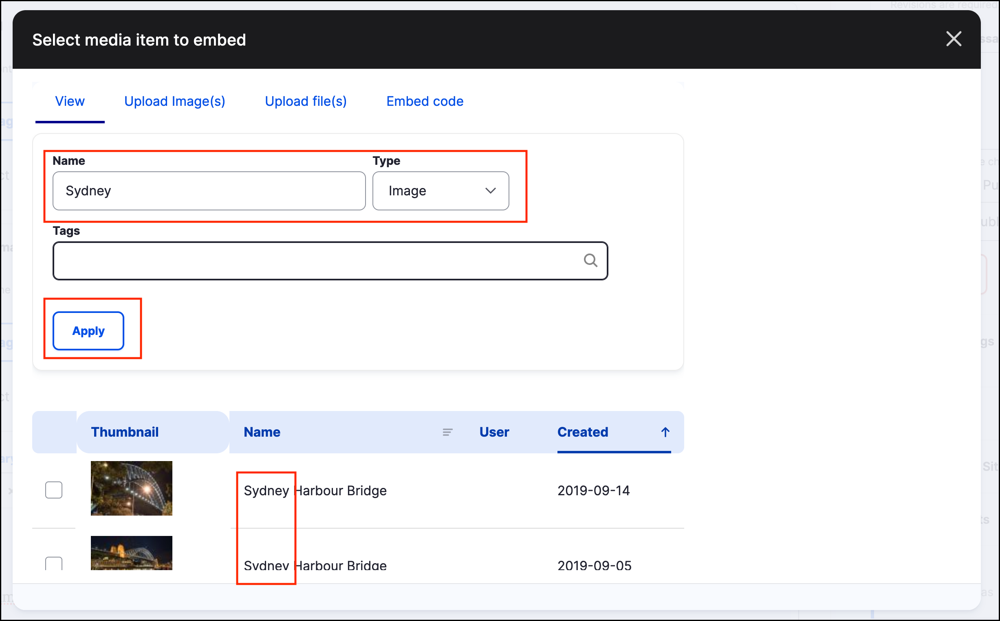
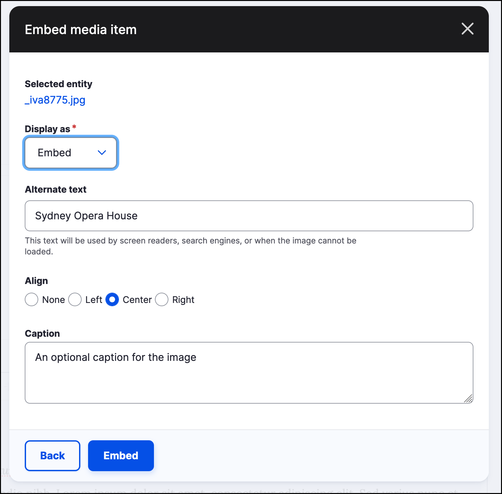

# Embedding media files



## Inserting Media into body - The Media Widget

You can insert images and video directly into the _body field_ of a _Content form_ via the Media widget. Click on the _Media Entity Embed_ button on the _Body_ content section. 

This will open the **Media widget**.

You can upload _images_ or _files_  from your computer using the Upload tab. 

Click on the **Upload Image\(s\)** tab, then the **Select files** button.

Browse for and select a file on your local machine, then click **Open**. 

Metadata can be added for the file uploaded. For more information on the metadata, see **[Unit 6: Managing files and media assets in GovCMS](../unit-6-files-media-assets/managing-files-and-media-assets-in-govcms.md)**.

## Embedding code - videos and URLs

Using the Media widget you can also use the _Embed code_ form to embed videos in content \(e.g. YouTube or Vimeo videos\).

Click on the _Media Entity Embed_ button on the _Body_ content section. Click on the **Embed code** button, then enter the following information:

- A name for the video.
- A url for the video you wish to embed.
- Optional tags.

Scroll down and click on the **Place** button. The following options will be presented:

- Display as /(Embed or Thumbnail/).
- Align \(None, Left, Center, Right\).
- Caption \(Optional\).

## Media Library

All files uploaded to a website \(or already included\) are found in the **Media Library**. Media assets are displayed with the most recently added first.

When embedding media, select the **View** button to embed media from the site's _Media Library_. Use the following to refine the media presented:

- Enter text in the _Name_ field.
- Select from the dropdown to narrow the search to media items of type:
	- Audio
	- File
	- Image
	- Remote video
	- Video
- Enter text in the _Tags_ field.

Click the **Apply** button to perform the search.

In the screenshot below, the search word 'Sydney' has been entered into the _Name_ field.  The images listed now are only those with the word 'Sydney' in the filename. 

Once a media file from the Media Library has been selected, click the **Place** button at the bottom of the popup dialog to add the media.

You will be presented with options for _Display as_, _Alternate text_, _Align_ and _caption_ as shown in the screenshot below

When an image is added into a _Rich text_ field, the image will be added at its original dimensions. You can change the image size within the CMS/Rich text editor by double-clicking on the image in the Rich text editor and selecting **Thumbnail** from the **Display as** dropdown. You can then choose a predefined _Image Style_ that will be applied to the image to adjust its size.

**Note:** _When you use a file from the Media Library or Files area, you are linking to a copy of the file, including its metadata. If you make changes to the file or its metadata, these changes will take effect for every use of the file on the site._
