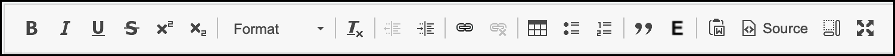
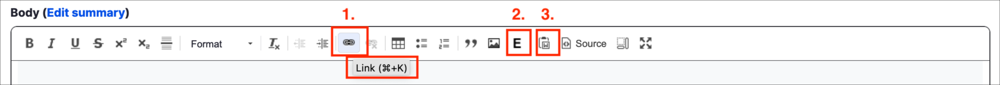
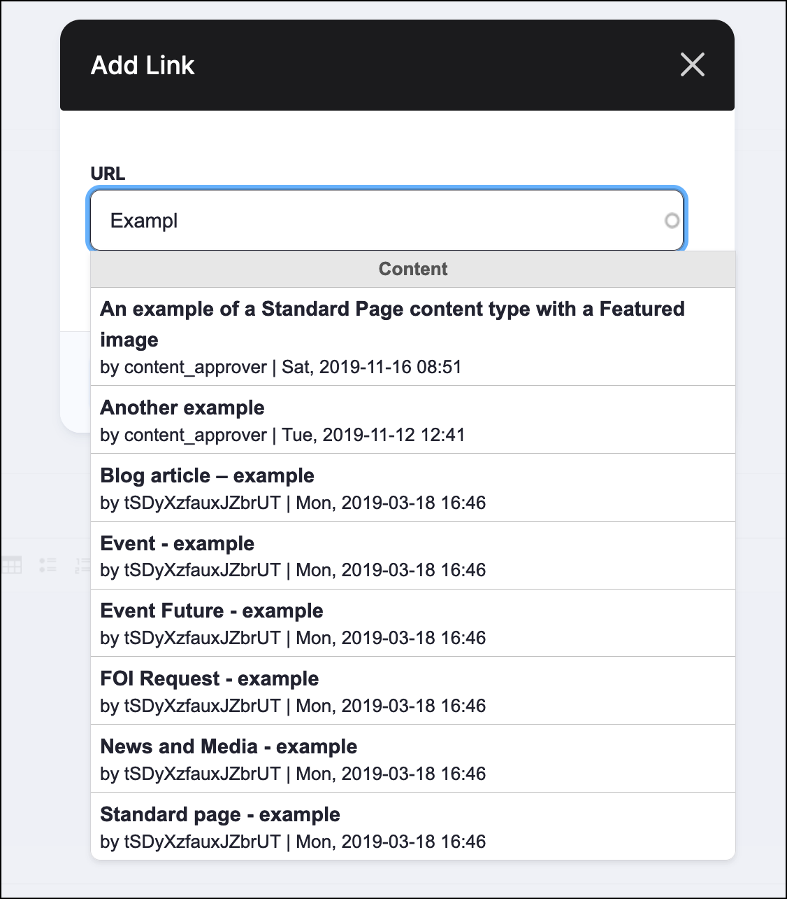
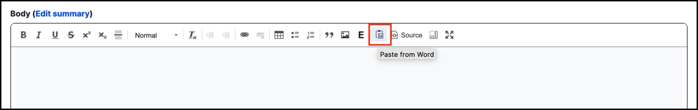
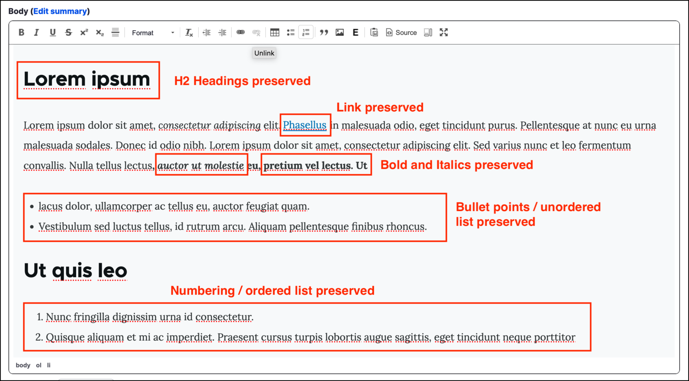

# Overview of Rich text editor



The _Rich text editor_ provides a number of buttons/tools that are similar to those used in word-processing software like Microsoft Word. The screenshot below shows the top menu of the Rich Text Editor.

Hovering over any of the buttons reveals the name and function of the button. For example, the _Link_ button \(discussed further below\).

Many of the buttons such as **bold**, _italic_, Format and Table are self-explanatory. Three specific functions are discussed in this manual:

1. Links
2. Embedding media files (covered in the [next page](inserting-media-files.md)\)
3. Pasting from MS Word

## Links

The link button is used to link to a page outside your website or to an internal page. For external links, simply copy and paste the URL into the URL field \(e.g. [www.govcms.gov.au](http://www.govcms.gov.au/)\). 

For internal links \(i.e. to link to another page within your website\) start typing the title of the page into the URL field. As you type, a list of suggested pages will drop down. Click on the page you would like from the list, then click **Save**.

## Pasting from MS Word

When copying text from Microsoft Word, the Rich Text widget will attempt to replicate the formatting of the original text. This can lead to inconsistent fonts, text size and other formatting issues. 

You can avoid this problem by clicking the **Paste from Word** button, shown in the screenshot below. 

On older browsers \(such as MS IE &lt; 11\) this will open a small pop-up window. When you paste text into this pop-up window the formatting will be removed, so the text will match your site’s text formatting requirements. 

Modern browsers paste the cleared text and preserve the heading formats, links and lists for you. 

**Note**: When typing the text directly into the Rich Text Editor, the text will automatically be formatted in the style setup by the designers and developers who created the site.

**Tip:** Many modern browsers are aware of the problem and support text cleaning function out-of-the-box. For this reason, browsers like Chrome or Firefox will not show the pop-up box and paste the text with all unnecessary styling removed - yet preserving headers.
