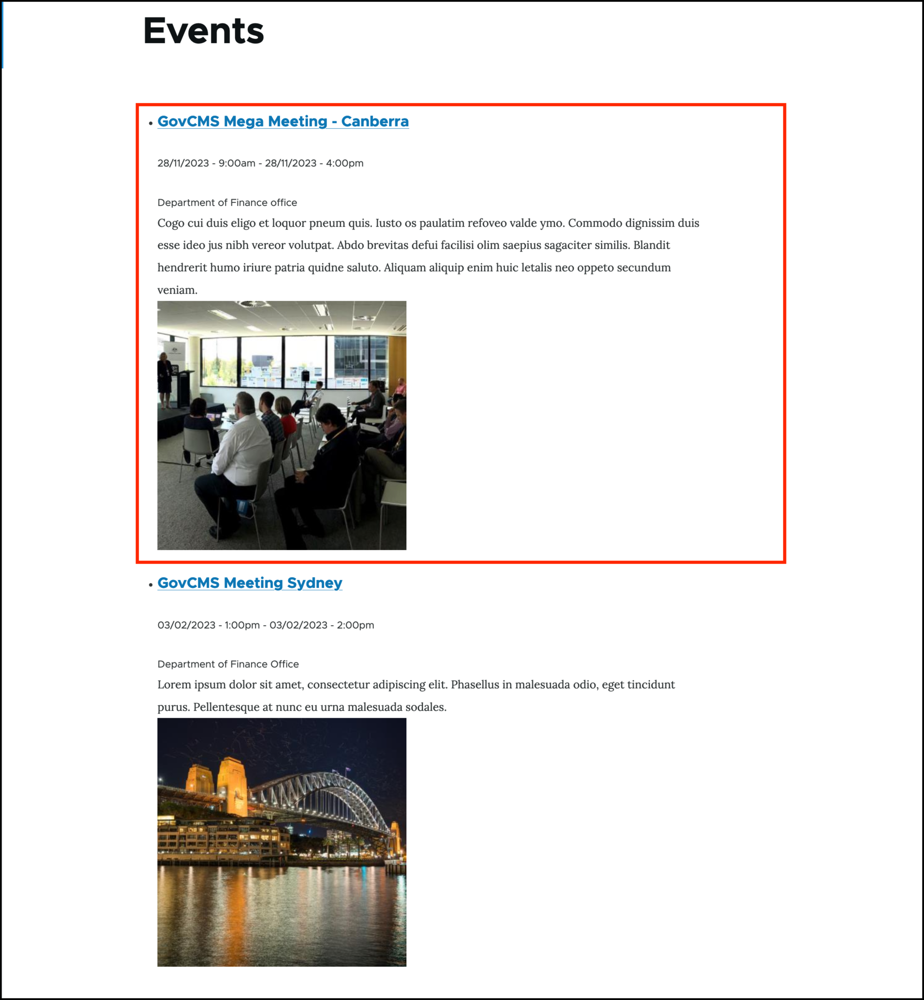
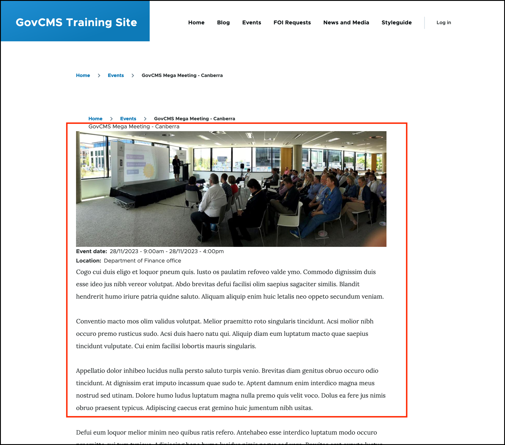
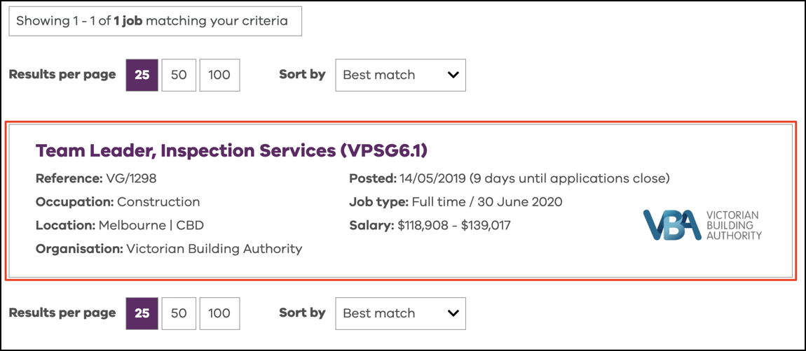
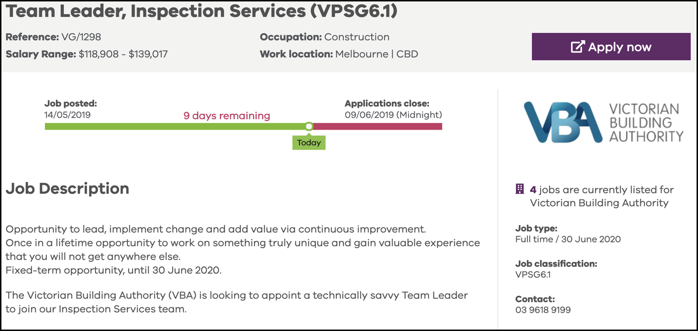

# Structured content in GovCMS

## What is structured content

For the purposes of this course, _structured content_ can be thought of as the information, data or content that is entered into and stored in a GovCMS site.

A number of _content types_ and their assoicated fields have been defined in GovCMS. See [**Unit 2 - Content types overview**](content-types.md).

## Fields and structured content

Using fields in GovCMS allows content authors to add content once, and display the information across the site in a variety of different ways. Using fields to capture and display data (structured content), removes the burden of managing the same content in multiple areas of the website.

In the example below, the website is configured to display the “GovCMS Information session”, (which is an _Event_ content type) in two different displays:

1.  A **Teaser display** (used in listings)

    
2.  The **Full Page display**. It shows the same event, but the information presented to the public differs based on the website configuration.

    

Similarly, a Job listing search may reveal summary information about the advertised job, as displayed below:

Clicking the job title brings the viewer to the full page with more details about the particular job listing.

## Reuse of content

This is the same _**content**_, displayed by the CMS in a different layout to the end user.

The information is captured via the _content editing form_, and GovCMS will display it in the way preconfigured by the site builder (the web development partner or in-house team that built your website).

Content Editors do not usually have much flexibility in changing the layout of the page (or a display, such as the search page display). However, the use of advanced tools - like _Panelizer_ and _Paragraphs_ - allows some advanced control to the page layout and provides additional display options depending on your GovCMS website configuration.

## Resuse of media assets

Media assets (such as images or PDF files) are also reused and presented to the viewer in a variety of ways. For example, an image that was uploaded as part of content creation gets stored in the central _Media library_. That image can be referenced from other pages, and GovCMS will create a copy of the image in line with the preconfigured image dimensions.

This image may be displayed at its full dimensions, as a thumbnail or other dimensions depending on the site configuration and where the image is displayed.
