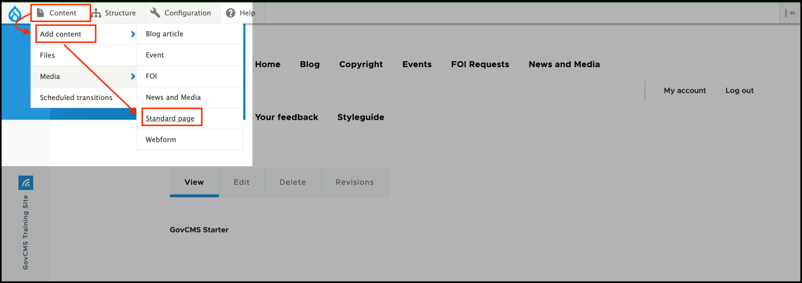
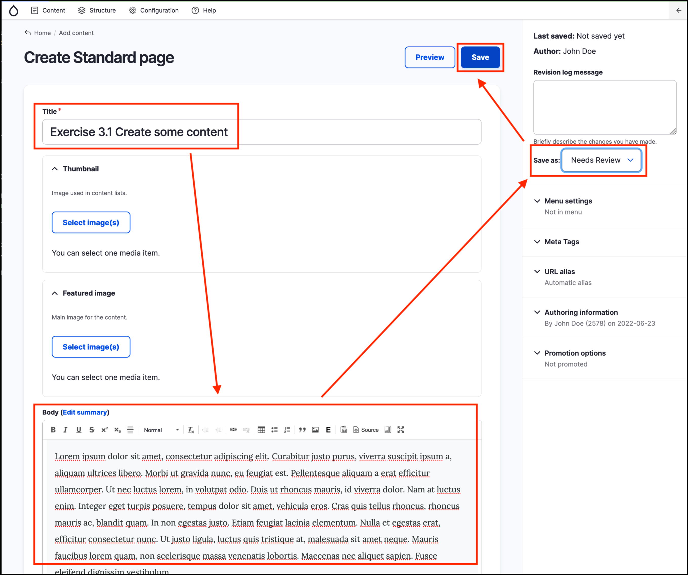
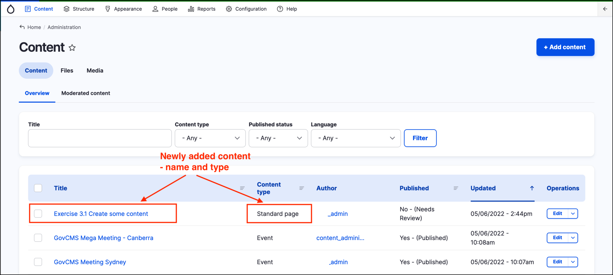

# Exercise 3.1: Create some content

In this exercise you will learn how to create content, specifically a new _Standard Page_. 

1. To begin, you may wish to click on the **Home** menu item to return to the homepage of your training site.
2. On the _Admin menu_ hover over _Content_, then hover over _Add content_  and click **Standard page**. 

    
    
    The _Standard page_ is one of the simplest types of content. You should see a page similar to the screenshot below:

    
    
3. Add some text to the _Title_ and _Body_ fields \(for the moment, ignore the other fields such as Thumbnail, Attachments, etc.\).
5. At the top-right of the form, select _Save as:_ “Needs review”.
6. Click on the **Save.** button at the top right of the page. You’ll automatically be taken to the page as it will appear on the frontend of your website.
    
    

7. Make a note of the URL.

Once you have saved the new content, you will notice the following GovCMS features:

1. The title of the new page is part of the page’s URL. We look at this feature more in **[Unit 7: URL Aliases and Redirects](../unit-7-managing-url-aliases-and-redirects/url-aliases-and-redirects.md)**.
2. You can see a status message, which is only visible to you. This message disappears if you refresh the page.
3. You can see the additional tools of Edit, Manage display, and Delete. These are only visible because you’re logged in \(they cannot be seen by the public\).
4. The new content is not live/published and will not be until it goes through a publishing workflow /(because we saved it as "Needs review"/). This means that if you log out you won’t be able to see the content. Nor would a site visitor see this new content.

If you go back to the _Content_ administration area by clicking on the _Content_ button in the _Admin menu_, you will see your new content in the content listing. In the _Content Type_ column, the content you just added will be listed as a **_Standard page_**.

