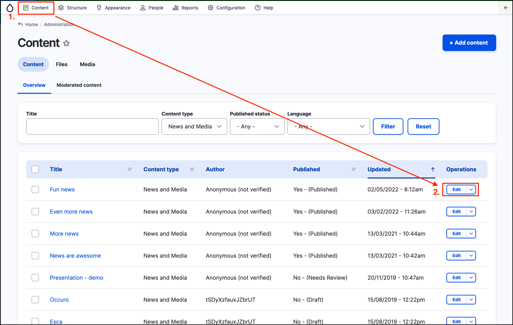
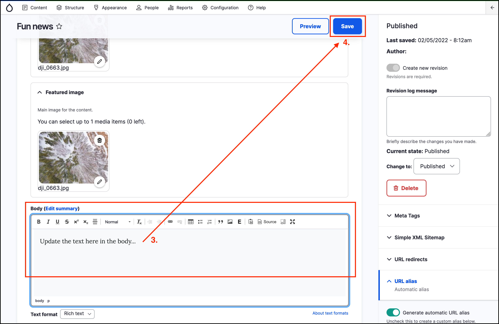
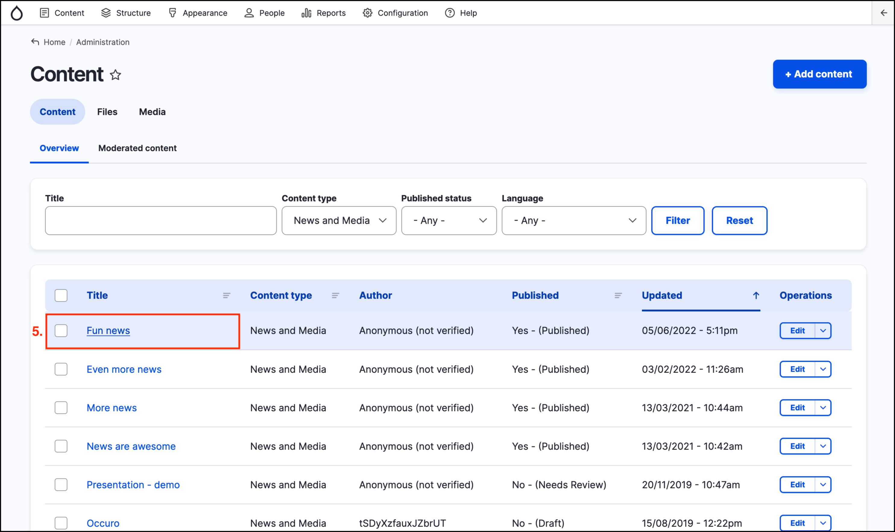

# Exercise 3.3: Edit a piece of content

In this exercise, you’ll practice editing some content.

1. Click on **Content** in the _Admin bar_ to go to the Content listing page.
2. Click on the **Edit** button to the right of a piece of content.

    

3. Make some changes to one of the fields \(for example, update the text in the _Body_ field.
4. Click on the **Save** button at the top right of the page.

    

5. From the _Content_ page, click on the page you just updated to see the content as site visitors would see it. Note how your changes are reflected in the updated page.
 
    
