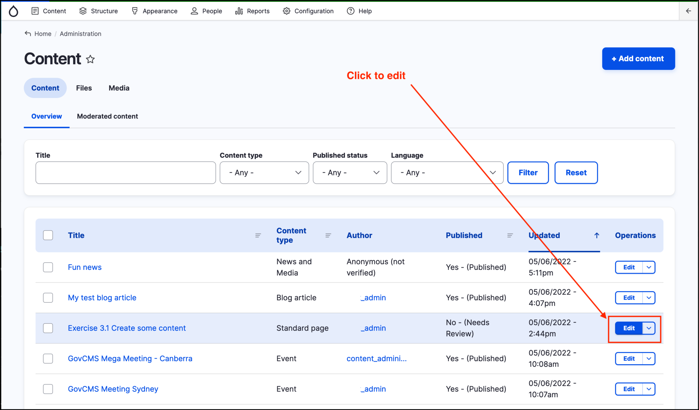
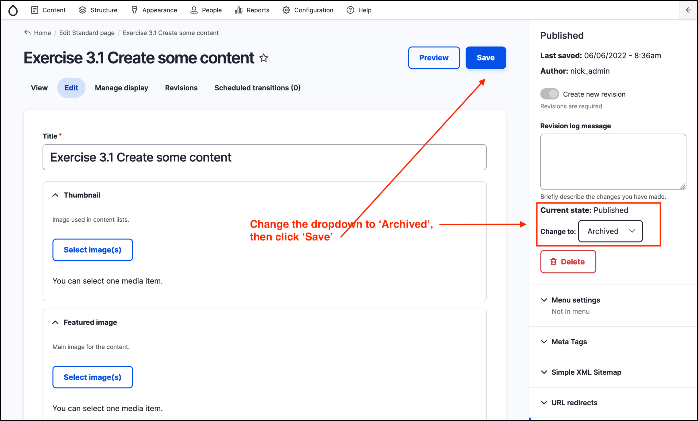
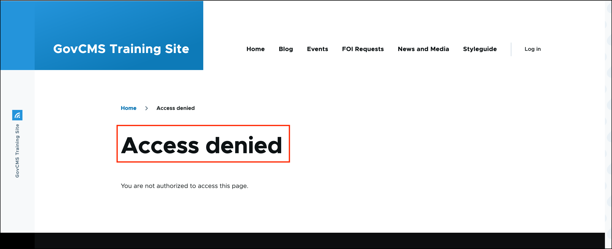

# Exercise 3.4 Archiving content

In this exercise you’ll learn how to archive or unpublish content.

1. Navigate to the _Content_ page by clicking on _Content_ in the _Admin menu_ and locate the Standard page you created in [Exercise 3.1](https://salsa-digital.gitbook.io/govcms-content-administration/unit-3-managing-content-in-govcms/Exercise-3-1-Create-some-content).
2. Edit the page by clicking on the _Edit_ button to the right of the page you created. 

    

3. Select the “Archived” option from the _Change to_ dropdown menu.
4. Click the _Save_ button at the top right of the page.
    
    

5. Test the page in another browser as an anonymous user. To do this, copy the url from your browser after you click _Save_. The url should be similar in pattern to: https://nginx-yourname-govcms-training.govcms7.amazee.io/your-page-name
6. Open a new 'private' or 'incognito' window. Paste the url into the new window. You should see an **'Access denied'** message similar to the below screenshot. The page still exists in the CMS and can be edited or restored by content administrators, but is no longer accessible to the public.
    
    
