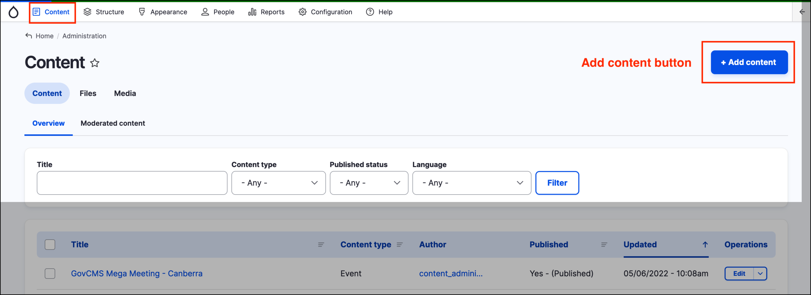
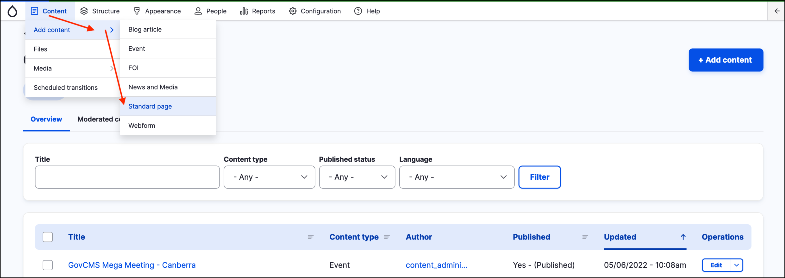
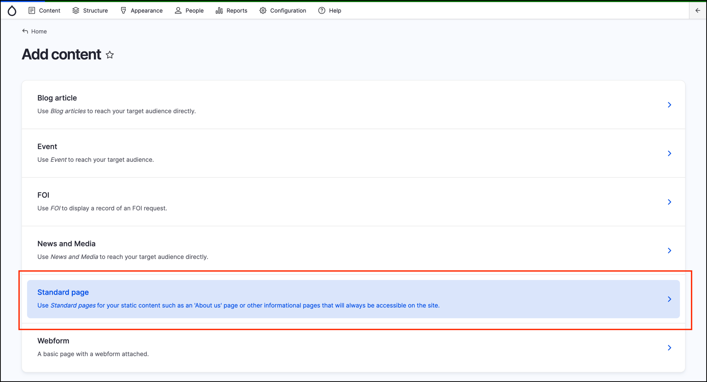

# Creating Content



## Methods of creating Content

You can create content in several different ways:

- Click on **Content** from the _Admin menu_ and then click on the **Add content** button at the top right of the page.

- Hover your mouse over _Content_ in the _Admin menu_, then hover over **Add content**, then click on the type of content you’d like to create. In the screenshot below we can click on **Standard page**.

- Hover your mouse over **Content** in the _Admin menu_, then click on **Add content**. You can then click on the type of content you’d like to create. 

