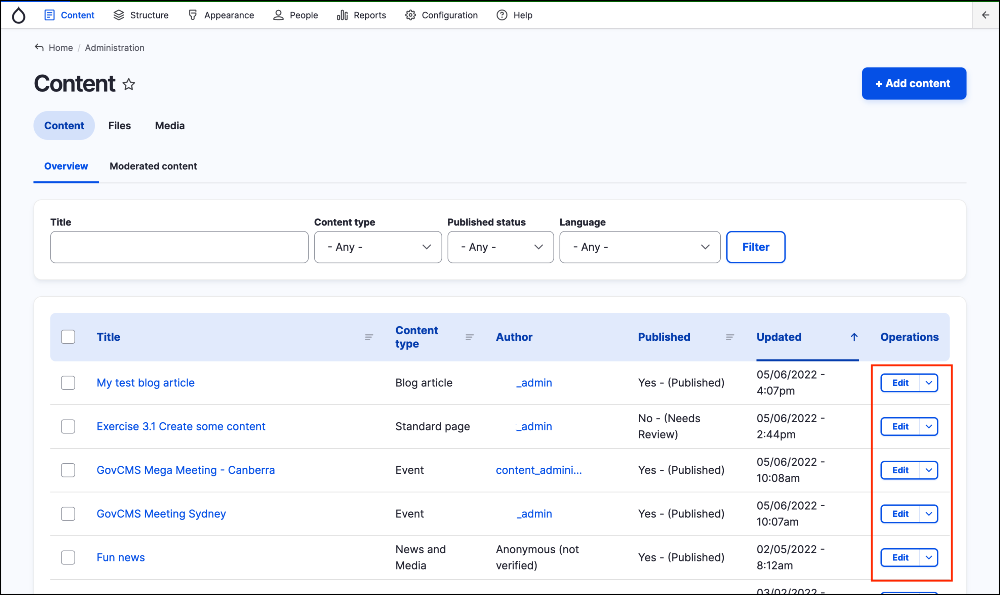
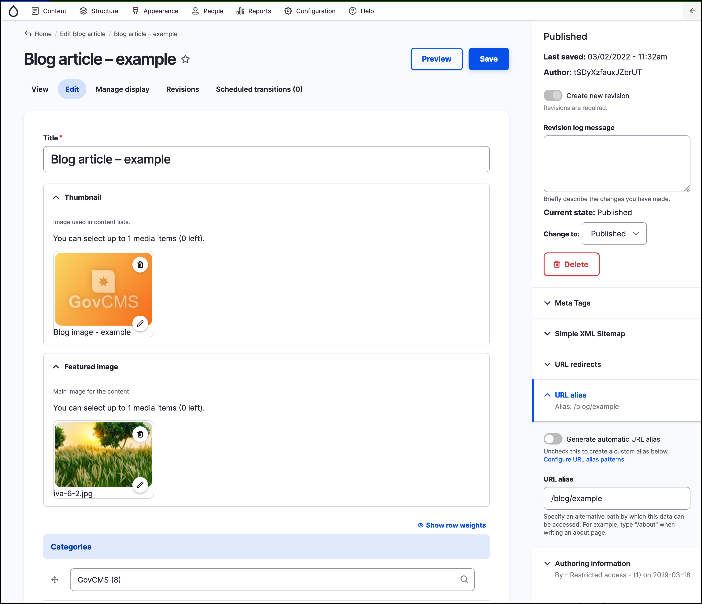

# Editing content



## How to edit content

You can edit content in one of two ways:

1.  Via the page itself: Simply click on the **Edit** button at the top when on the page itself (see the screenshot below).

    
2.  Via the Content management area of the admin interface. Click **Edit** in the corresponding row.

    

Either of these options will take you to the page in _Edit_ mode. For example if you edit the "Blog article – example" _Blog article_ you will see a page similar to the screenshot below:

