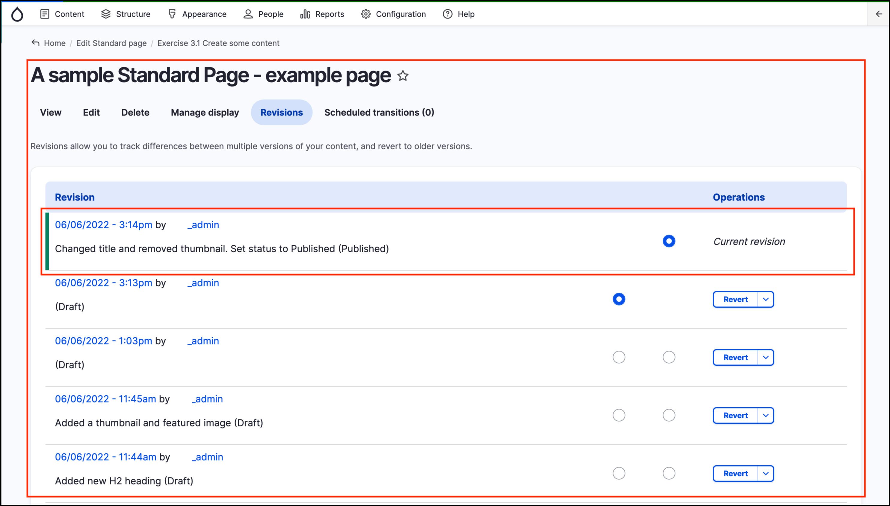

# Exercise 4.1: View Revisions History

In this exercise you will learn how to view your revision history for a piece of content. 

Follow these steps to find the change history for the test Standard Page you worked on in **[Exercise 3.1 - Create some content](../unit-3-managing-content-in-govcms/Exercise-3-1-Create-some-content.md)**:

1. Navigate to the _Content Administration_ page by clicking on _Content_ at the top left of the page, and find the page you edited in exercise 3.1.
2. Click the _Title_ link to access the page.
3. Click the **Revisions** tab \(see screenshot below for an example\).

**Tip:** When saving content changes it’s a good idea to leave a short but descriptive _Revision log message_. This can help you and other _Content Editors_ understand what changes were made in each revision \(which is particularly handy if you need to revert to an older version\).
