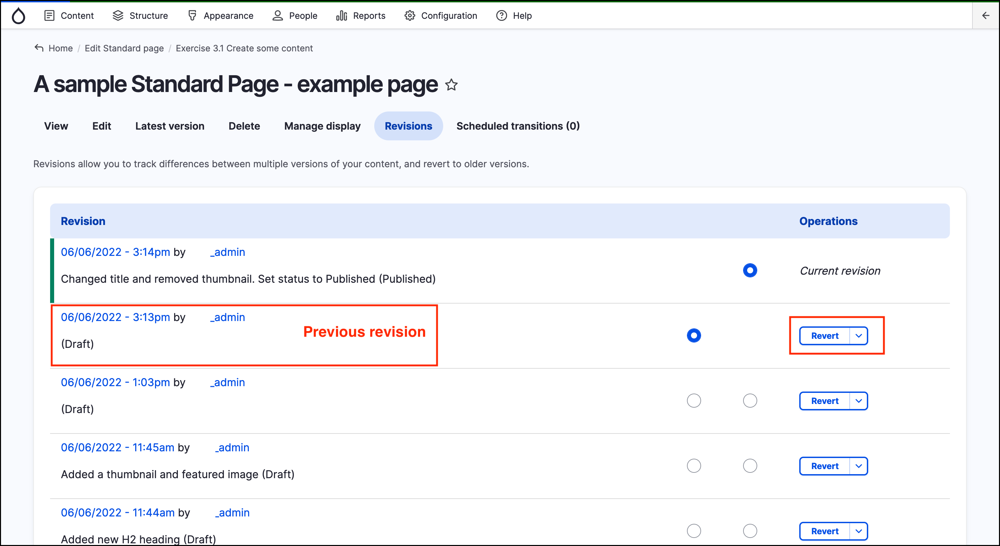
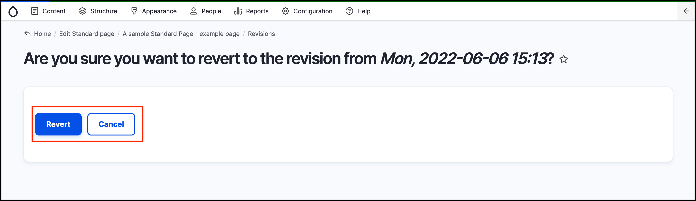
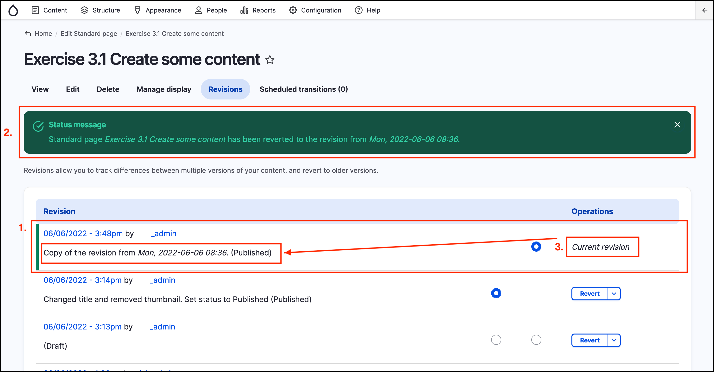
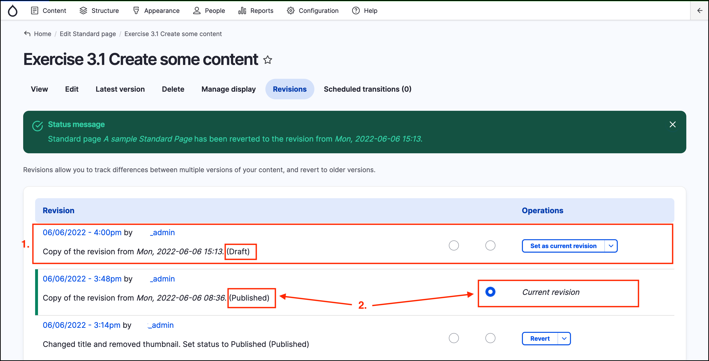

# Exercise 4.2 - Revert a content revision

In this exercise you will learn how to revert to a previous _revision_ (or version) of your content.

1. Go to the _Content Administration_ page by clicking on _Content_ at the top left of the page and find the page you were editing in the previous exercises (3.1 and 4.1).
2. Click the _Title_ link to get to the page.
3.  Click the **Revisions** tab.

    You should see a list of revisions similar to the screenshot below:

    
4.  Locate the version before the current one and click on the **Revert** button on the right hand side

    You will receive a prompt asking you to confirm whether you wish to revert to the selected revision, similar to the screenshot below. Click on **Revert** to complete the process.

    
5.  You will be returned to the _Revisions_ page. Note the following in this page:

    1. The new _revision_ has been created, showing the date, time and the author.
    2. You are also be presented with a _Status message_ indicating what has been performed.
    3. The _Current revision_ is the new _revision_ you just created. Text on the left hand side indicates which _revision_ this _**new revision**_ is based on.

    
6. Navigate to the public view of the page (using an Incognito/Private window in your browser) and confirm if the content has been reverted.

**Note**: Only a previously **Published** revision can become the **Current revision**. A draft revision will create a new draft revision and the current published revision will remain as the _Current revision_.

Try reverting a _revision_ in the status _Draft_. In the _Revisions_ page you should see something similar to the screenshot below:

Note the following:

1. A new revision has been created, however;
2. The previous **Published** revision remains as the _**Current revision**_
