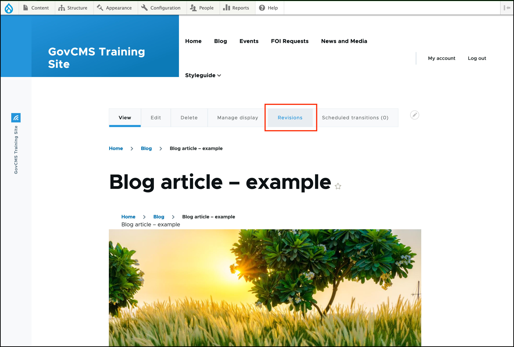
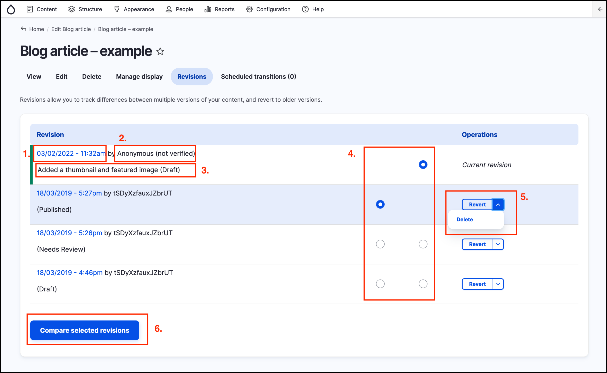
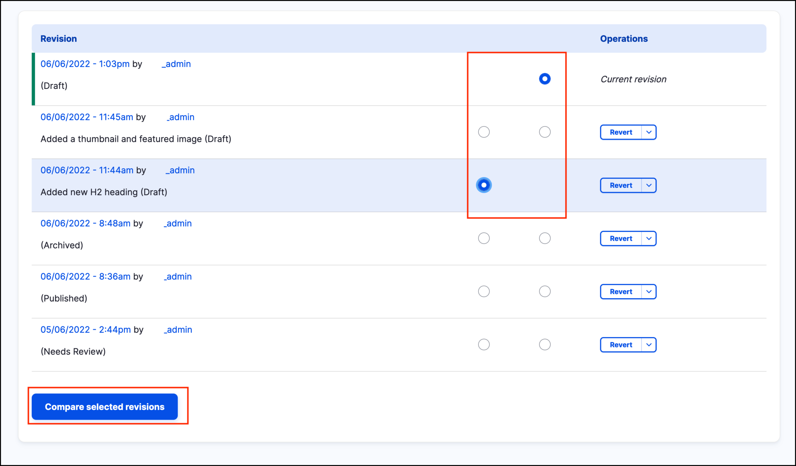
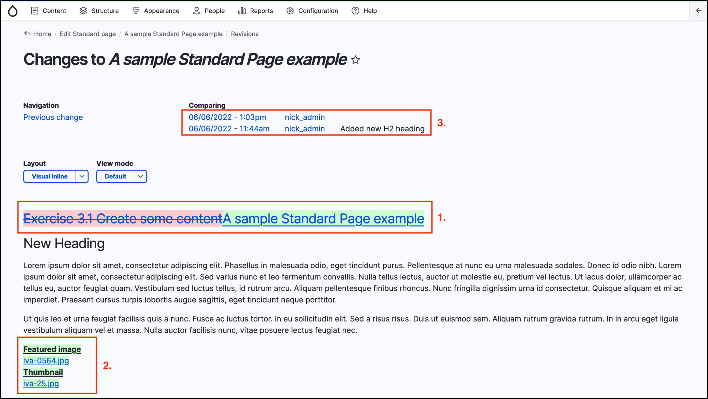
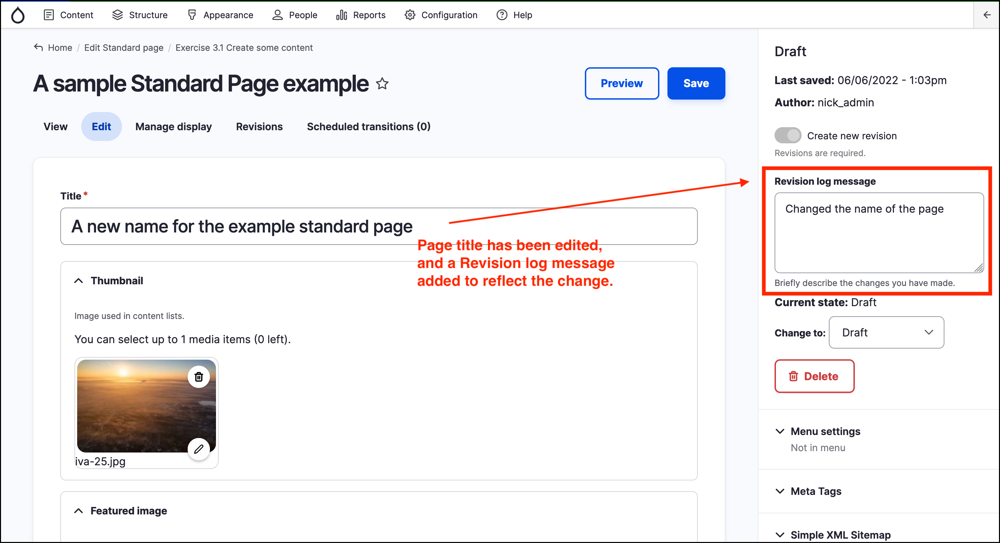

# Managing content revisions



## Revisions overview

GovCMS creates a new **revision** every time a _content page_ is updated. This allows you to track how the content has changed over time on your site.

## View revisions

To view and manage revisions, use the **Revisions tab**. To access this, navigate to the _Content_ page, then click on a piece of _content_. Then click on the **Revisions** button \(highlighted in the screenshot below\):

From the Revisions tab, you can view the individual revisions, revert to an earlier revision, and delete revisions.

Information about each revision of the content is displayed, including :

1. Date and time of the revision.
2. Who updated the content \(creating the revision\).
3. The revision log message, if entered and the status of the revision at the time it was created \(in brackets\).
4. Radio buttons used to select revisions to **Compare** \(see below\).
5. Operations dropdown, which allows a user to _Revert_ the content to the selected revision, or _Delete_ the selected revision.
6. The **Compare selected revisions** button \(see below for information on this feature\).

These items are highlighted and numbered in the following screenshot:

**Note**: Depending on your website configuration, not every user role can access the Revisions tab.

## View differences between revisions

There are two main ways to view the differences between revisions.

Firstly, clicking on the date and time link of a given revision will take you to that revision or version of the file \(see 1. in the screenshot above\).

Secondly, to see the differences between two different revisions select the radio buttons in the rows of the revisions you wish to compare, then click on the **Compare selected revisions** button.

The screenshot below shows what was changed between the versions, namely:

1. Renaming the page.
2. Addition of a _Featured image_ and a _Thumbnail_ image.

It also shows which revisions of the page are being compared \(3.\)

## Revert revisions

GovCMS also creates a new revision when a user **reverts** to a previous revision. 

If you have four revision versions \(eg, 1, 2, 3 and current, when you revert to \#2, then a copy of \#2 is made and the copy is set as the current revision. 

After the reversion, there are five versions/revisions \(1, 2, 3, 4 and current\), where current is a clone of \#2.

## Revision log message

Another useful feature of the revision system is the _Revision log message_ field, which appears near the _Create a new revision_ checkbox at the top right of the content editing form. 

If a message is added to this field when creating a revision, the message will appear on the _Revisions tab_ along with the revision. 

While the _Revision log message_ is an **optional** field, it is recommended to add a meaningful message whenever a revision is created. This is so that others \(or you, months later\) can see why the content was changedand what the changes were, without having to actually view previous revisions.
