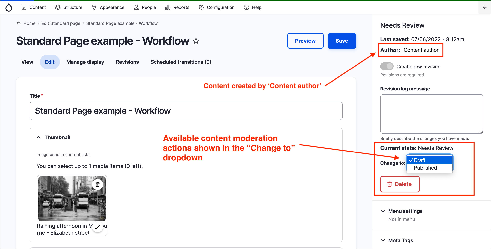
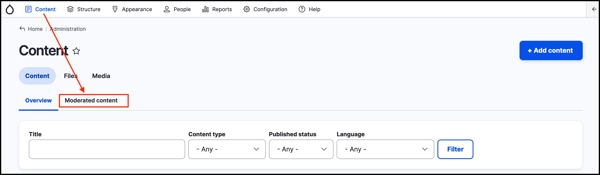
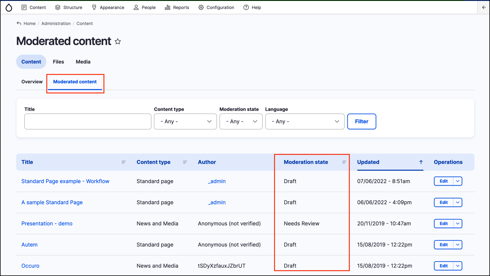

# Content moderation in GovCMS



## Content moderation summary

A content moderation workflow allows content to go through an approval process before it’s posted live on a website. This means that content can be authored by one person and reviewed by another before it is approved. Only once approved is the content made visible to the public \(site visitors\).

## GovCMS content moderation workflow

Content moderation is a GovCMS tool \(module\) that provides a default workflow process. In this model:

* Content has four "states":
	1. Draft
	2. Needs Review
	3. Published
	4. Archived
* Content **transitions** as it moves from one state to another.
* Different people or different **roles** have different permissions regarding what actions they can perform in the content workflow. For example, in the default setting, **Content Editors** **_cannot publish content_**. Only a  **Content Approver** can approve content.

The screenshot below summarises the default GovCMS workflow:

This default workflow can also be extended by a site builder/developer.

## Changing the content moderation state

You can publish content using the _content editing_ form. To see the states availale for a piece of content \(and for your given **role**\) navigate to _Content_ by clicking on the _Content_ button in the _Admin menu_. Then click on a piece of content to edit it.

The workflow "states" available will depend on:

1. The **current content state**.
2. The transitions you’re permitted to use within your official content **role**.

In the example below, the content was authored by a _Content author_. The current user is a _Content Approver_ and the _Standard page content_ is in the state of **Needs Review**. The _Content Approver_ can select from two options in the _Change to_ dropdown: 

1. **Published**. This would make the content visible to site visitors.
2. **Draft**. Usually this would then require the _Content author_ to make further changes to the page before again submitting it for review by changing the state to **Needs Review**.

**Note** While the _Content approver_ is reviewing the page, they are in _Edit_ mode, and so may make their own changes to the page before publishing.

## The Content moderation dashboard

The GovCMS content moderation module also provides a customisable **dashboard**. To access the **Content moderation dashboard** click on the **Content** button in the _Admin menu_ to navigate to the main _Content Administration page_. Then click on the **Moderated content** tab highlighted in the screenshot below.

Once in the _Content moderation dashboard_ you will see a list of content that is in different **states**. In the example below we see there are 4 items in **Draft** and one item in **Needs Review**. A _Content Approver_ could use this list to see what items are ready for them to review.

