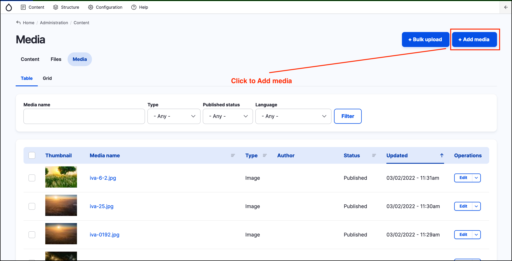
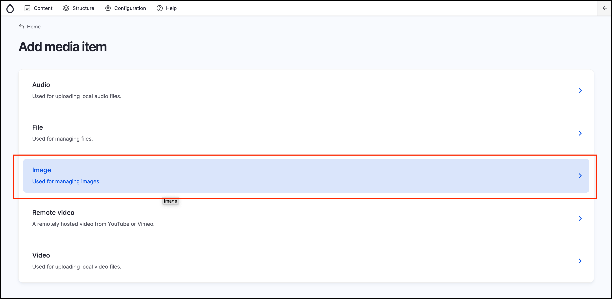
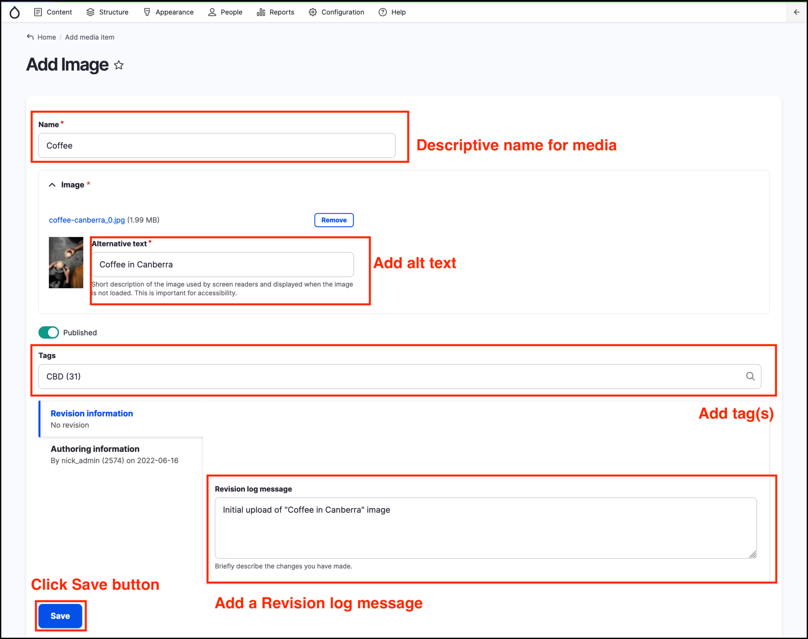
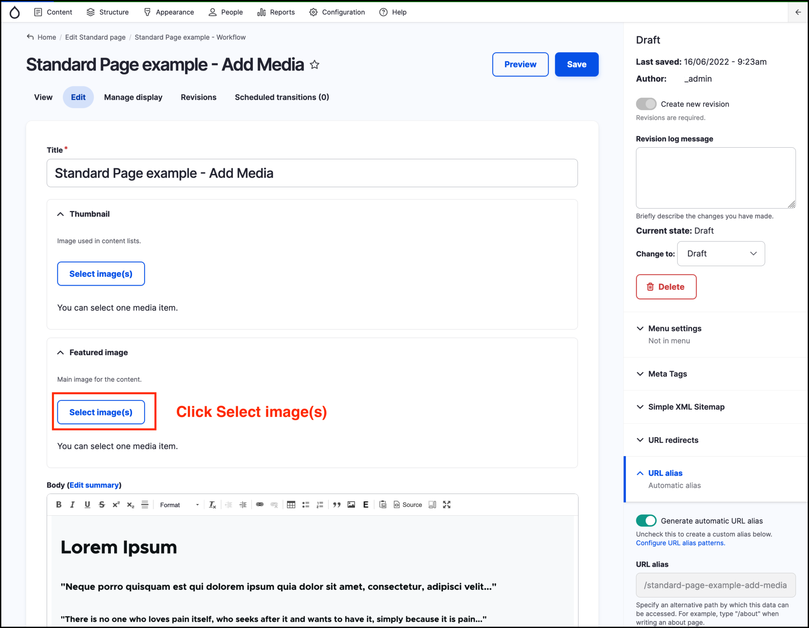
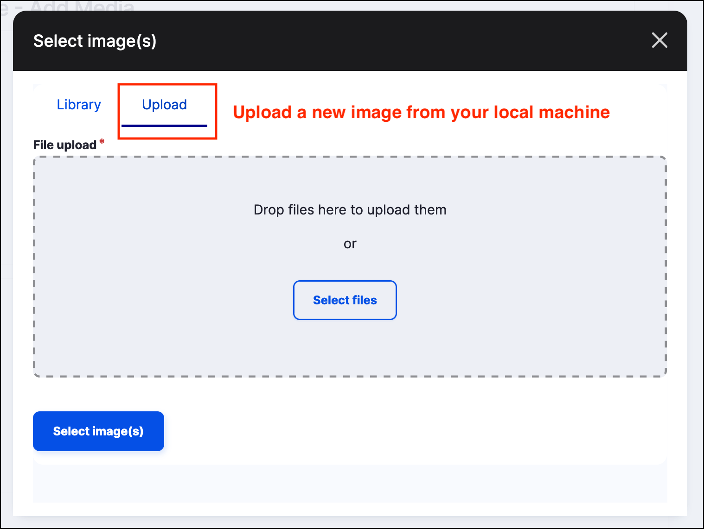
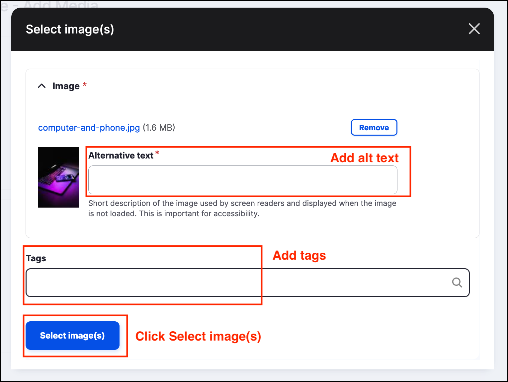
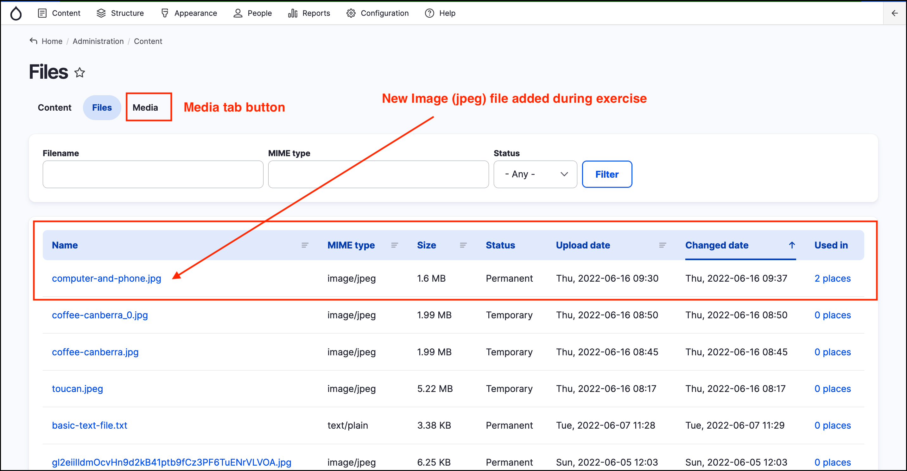
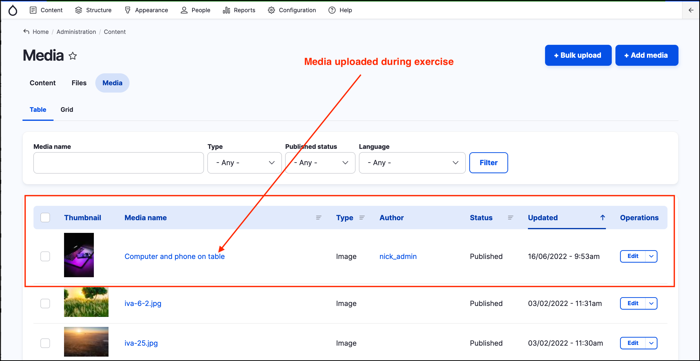

# Exercise 6.1 - Uploading and using media

In this exercise you will upload an image directly to the media library (part 1) and then use that image when creating content (part 2).

## Part 1: Upload media file

1. Navigate to the _Media_ page by clicking on **Content** then **Media** on the _Admin menu_.
2.  Click the **Add Media** button at the top right of the page.

    
3.  Click **Image** to upload an image file.

    
4. Upload an image file:
   1. Give it a short, descriptive name.
   2. Choose a file from your computer, using the **Browse** button.
   3. Click **Open** to upload the file.
5.  Add _Alt text_.

    **Note** Image alt text is required to enable screen readers and facilitate vision-impaired people.
6. Add Tags, which will help filter (search) this image in the Media Library.
7.  Click **Save**

    

## Part 2: Add media to a Standard page

1. Create a new Standard Page following the instructions in [**Exercise 3.1**](../unit-3-managing-content-in-govcms/Exercise-3-1-Create-some-content.md)
2.  Use the **Select image(s)** button to add a _Featured Image_.

    
3.  Click **Upload** to upload a new _Featured image_.

    
4.  Once the image uploads, a set of fields will display below. Add alternative text and tags.

    
5. Click the **Select image(s)** blue button when complete. This will close the Media Library popup window and bring you back to the page form.
6.  Fill out any required fields for your _Standard page_. Set the _Change to_ dropdown to 'Published' (if it is not already set) and click the **Save** button at the top right

    
7.  Navigate to **Content** → **Files** from the _Admin menu_ and locate the image file you uploaded. It should be at the top of the list as it is the most recently added file. Note the name of the file.

    
8.  Next, click on the **Media** tab button and locate the Media entity that that points to the file you uploaded.

    
9. Discuss with the trainer, why the _Name_ of the file (from the _Files_ tab) is different to the _Media name_ (from the _Media_ tab).

**Tip**: The _Media_ entity allows you to enter a more user-friendly _Name_ (and other metadata) rather than using the name of the file.
