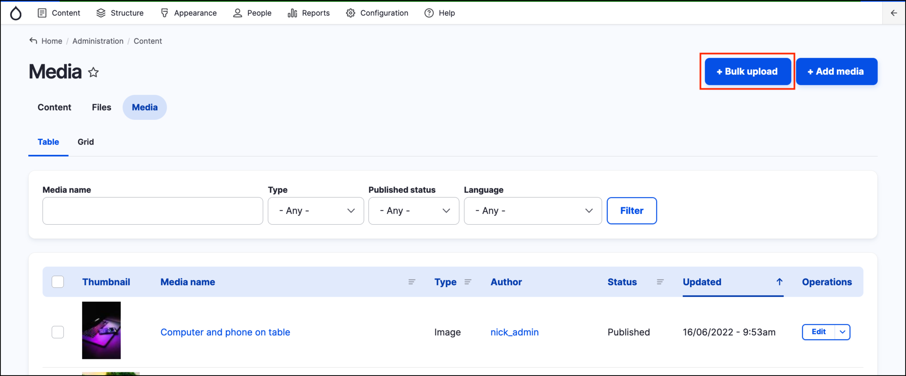
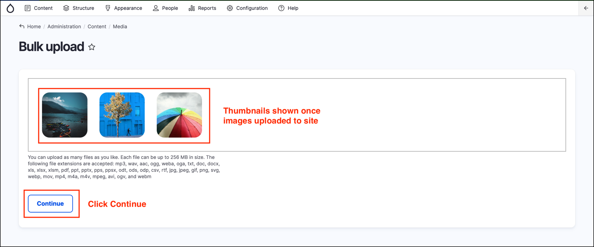
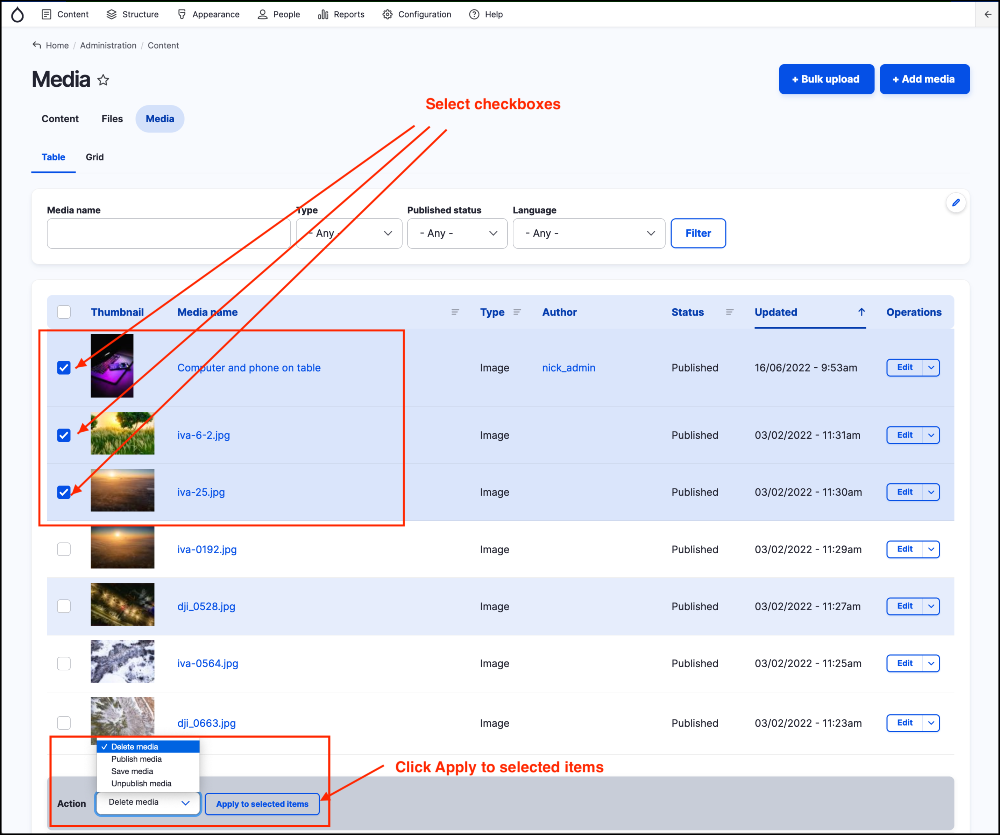

# Exercise 6.2 - Bulk upload and Manage media

In this exercise, you will add a few _Media entities_ using the _Bulk upload_ function and then learn how to use _Bulk actions_ operations.

To complete this exercise you may need a few files - such as images or PDFs. You can download some from your website, from [https://www.istockphoto.com/au/stock-photos](https://www.istockphoto.com/au/stock-photos) or use some files on your local machine.

## Part 1: Bulk upload images

1. Navigate to **Content** → **Media** from the _Admin menu_.
2.  Click the **Bulk upload** button at the top right of the page.

    
3. Click the **Select files** button to open a file browser
4.  Select at two to three files from your computer (try not to mix file extensions and don’t select too many files - 2 or 3 should be enough for the exercise). Once the files are uploaded, thumbails of the images are displayed. Click the **Continue** button.

    
5.  Follow the wizard form to fill out any required information for the Media entities.

    

**Notes:**

* The Name of the Image Media (1) has been prefilled with the file name from the uploaded file. You may change it to a more meaningful name if you want.
* Alternative text (2) helps vision-impaired people who use screen readers - the Alt text is read out for the file.
* Tags (3) helps you or other Content Editors to filter large Media Libraries. See how some tags have a number - such as “CBD (31)” - these are existing tags, where as “Rain” is a new tag that will be created when you hit the **Save** button.

## Part 2: Manage media - Bulk operations

Let’s learn how to use the Bulk operations functionality to manage Media.

1. Navigate to the **Content** → **Media** page from the _Admin menu_ and locate the Media entities uploaded in Part 1 of this exercise. They should be at the top of the list as they are the most recently added _Media_ assets.
2. Select the Media entities using the checkboxes to the left of the Thumbnails.
3. Select **Delete media** from the Action dropdown.
4.  Click the **Apply to selected items** button.

    
5. You will be directed to a page asking if you are sure you want to delete the items. Confirm the action by clicking the **Delete** button. This will remove all the selected _Media_ entities from your training site.
6.  Let’s now verify what happened to the file that was uploaded as part of that media item. Navigate to **Content** → **Files** from the _Admin menu_

    Locate the file you uploaded in previous steps, check the “Used in” column.\
    

**Hint:** Files not attached to a Media entity will show as Used in “0 places”.

**Tip:** Don’t link or embed files directly by modifying HTML in your pages. Always use GovCMS functionality to add or upload Media. This ensures that links or images stay valid if a file is deleted from your site.
