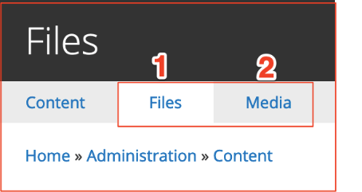
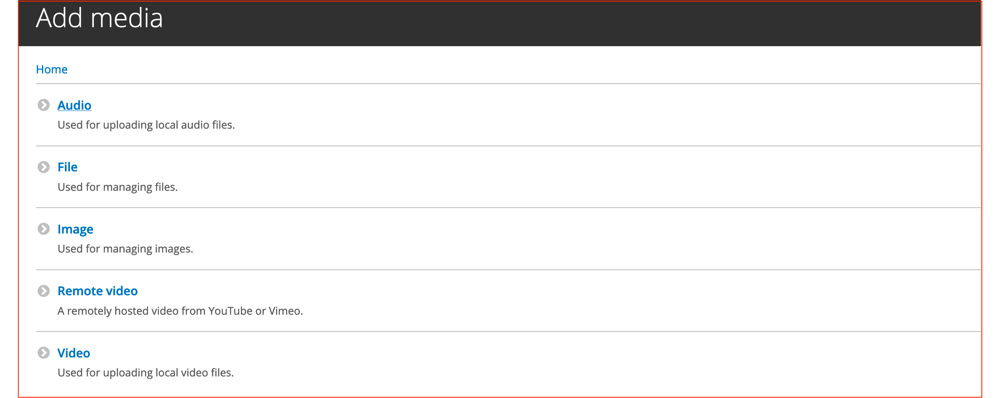
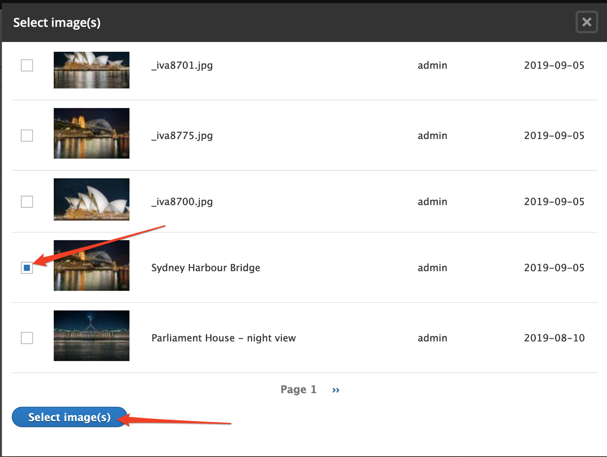
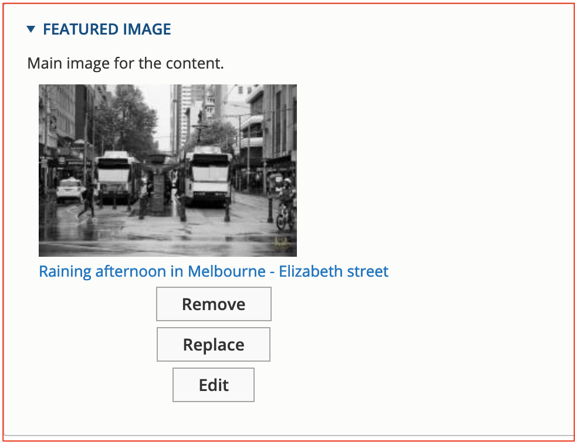
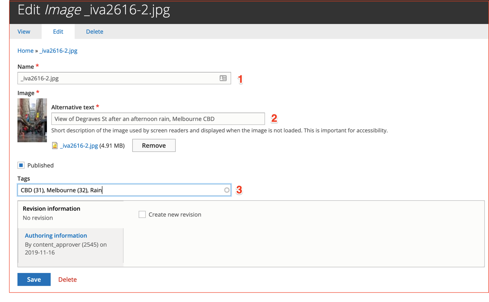

# Managing files and media assets in GovCMS

Files and Media are essentially the same as they both show you audio, files \(documents\), video and images.

The Files section shows you a list view of all media types and AND the location of where they're used. Example: This may be useful if you want to remove an image but need to see which content pages are utilising this image first.

The Media tabbed section shows you the same files, however this Media tabbed section also shows you the thumbnail, so for browsing images this is easier than via Files. It also gives you a Search Filter, where you can search by Media name and by Type \(if you're looking for an audio file, for example\).

Files in GovCMS are managed via the Content → Files link \(or /admin/content/files URL\). 

The Files page lists all physical files uploaded to the website. This page does not provide any configuration options and solely serves the purpose of locating files and tracking unused files.

The Media page can be accessed via Content → Media tab. It offers a rich media management interface, including locating media assets editing them, replacing them or deleting them.

While files are physical items that have been uploaded to the website and stored in the filesystem, the Media assets are content that links to a physical file, also providing the ability to store additional data about the file, such as a user-friendly name, Alt text \(for images\), tags and track revisions.

To manage Files and Media assets, go to Content → Files. The primary tabs allow you to switch between Files and Media.

### Files management interface

The File list page includes filters at the top to help you search for a file, as well as the list of actual files in order of last updated date.

Each file listing includes basic information such as the name, file type, size, status, etc. You can also see how many content items reference each file on the site in the _Used In_ column.

### Media management interface

GovCMS provides a central media library, where all media assets, such as images, documents and other files are stored.

Depending on the type of media asset, a corresponding type of media should be used.

By default, GovCMS provides the following Media types:

1. Audio
2. File
3. Image
4. Remote Video
5. Video

Each Media type can have various forms and display fields configured.

### Media library

To access the Media Library, go to Content → Media

Administrative actions available from the Media management area are:

1. Bulk media upload
2. Add single media
3. A filtering area so you can find related media entities by applying some preconfigured filters
4. A bulk operations area that allows you to apply actions to multiple media entities.
5. A Media listing table that displays the Media entities matching the filtering criteria, or lists all Media entities if no filters are applied.

You can see that the Media Library interface is similar to the content management interface. The **Add media** and **Bulk upload** buttons allow you to add new Media assets to the site.

The Filters allow you to search the media library for an existing media asset.

The Action selector allows you to implement bulk operations on multiple media assets. For example, you can delete all selected media assets at once.

### Adding Media

To add media to the Media Library, click **Content** → **Add media**.

This brings you to a page that lists all media types available on the site. Click the appropriate media type, such as Image.

Fill out all required fields. Providing some tags and a Revision log message can help manage large media libraries. Save the Media.

#### Reusing media

The main advantage of having the central media library is reusability - the same media asset can be included in multiple content pages.

Media assets that were uploaded to the site directly from content \(such as by uploading an image into the Rich Text Editor\) will appear in the central Media library and can be also reused.

#### Uploading media

When you create or edit content, the form includes an area to upload a thumbnail and a feature image. When you click on the **Browse image** button from the content form, it takes you to the media library. The media library makes it easier to find and reuse media, or upload new items.

_Screenshot: a Media browser opens in an overlay window, when adding a media asset from within the content add or edit form._

_Select images using checkboxes and then use the_ _**Select image\(s\)**_ _button._

#### Exercise 6.1: Uploading and using media

In this exercise you’ll upload an image directly to the media library \(part 1\) and then use that image when creating content \(part 2\).

**Part 1: Upload media file**

1. Go to Content → Media
2. Click **Add Media**
3. Click the **Image** button to upload an image file
4. Upload an image file
   1. Give it a short, descriptive name
   2. Choose a file from your computer, using the **File** button
   3. Click **Upload**
5. Add Alt text

Image alt text is required to enable screen readers and facilitate vision-impaired people.

1. Add Tags, which will help filter \(search\) this image in the Media Library
2. Click **Save**

  
_Screenshot: Add image dialogue in GovCMS_  

**Part 2: Create a new Standard Page and add the image**

1. Create a new Standard Page following the instructions in Exercise 3.1
2. Use the **Media** button to add the _Featured Image_
3. Click **Upload** to upload a new _Featured image_  
   __

   Once the image uploads, a set of fields will display below. Fill out all the required fields.

   Click the **Select image\(s\)** blue button when complete. This will close the Media Library popup window and bring you back to the page form.

1. Fill out any required fields for your _Standard page_ and publish it

   

2. Go to _Content → Files_ and find your two images. Note the name of the file.

   

3. Next, click on the **Media** tab and find the two Media entities that use the files you uploaded earlier

   

4. Discuss with the trainer, why the _Name_ of the file \(from the _Files_ tab\) is different to the _Media name_ \(from the _Media_ tab\).

**Tip**: The _Media_ entity allows you to enter a more user-friendly _Name_ \(and other metadata\) rather than using the name of the file.

#### Exercise 6.2: Manage media

In this exercise, we’ll add a few _Media entities_ using the _Bulk upload_ function and then learn how to use _Bulk actions_ operations.

To complete this exercise you may need a few files - such as images or PDFs. You can download some from your website, from [https://www.istockphoto.com/au/stock-photos](https://www.istockphoto.com/au/stock-photos) or use some of our images in the public Google Drive folder here: [http://tiny.cc/d863cz](http://tiny.cc/d863cz)

1. Go to **Content** → **Media**, and click the **Bulk upload** button
2. Select at least two files from your computer \(try not to mix file extensions and don’t select too many files - 2 or 3 should be enough for the exercise\). Once they upload, click **Continue**. 

1. Follow the wizard form to fill out any required information for the Media entities.

   

**Notes:**

* The Name of the Image Media \(1\) has been prefilled with the file name from the uploaded file. You may change it to a more meaningful name if you want.
* Alternative text \(2\) helps vision-impaired people who use screen readers - the Alt text is read out for the file.
* Tags \(3\) helps you or other Content Editors to filter large Media Libraries. See how some tags have a number - such as “CBD \(31\)” - these are existing tags, where as “Rain” is a new tag that will be created when you hit the **Save** button.

Let’s learn how to use the Bulk operations functionality to manage Media.

1. Navigate to the **Content** → **Media** page and locate the uploaded Media entities.
2. Select your Media entities using the checkboxes from the Bulk operations column \(the left column\).
3. Select **Delete media** from the Action dropdown.
4. Click the **Apply to selected items** button.

   

5. Confirm your action. This should remove all the selected media entities from your training site. 
6. As you removed the media item, let’s now verify what happened to the file that was uploaded as part of that media item.

   Navigate to Content → Files

   Locate the file you uploaded in previous steps, check the “Used in” column.  
   

**Hint:** Files not attached to a Media entity will show as Used in “0 places”.

**Tip:** Don’t link or embed files directly by modifying HTML in your pages. Always use GovCMS functionality to add or upload Media. This ensures that links or images stay valid if a file is deleted from your site.

## 

