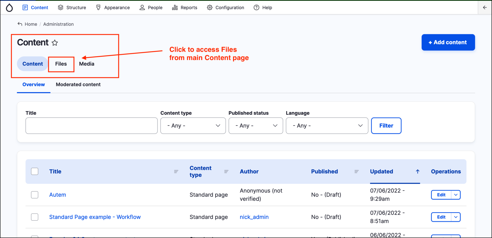
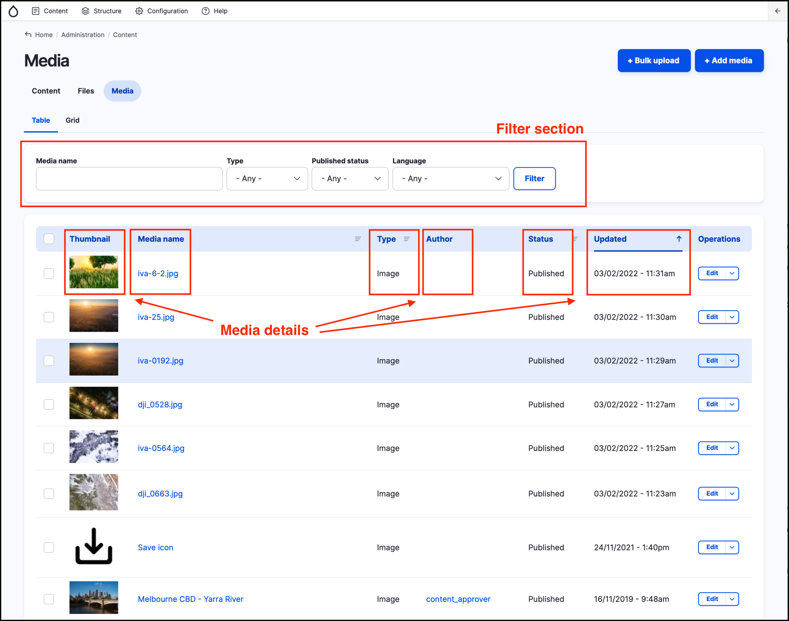

# Managing files and media assets in GovCMS









## Files and Media - overview

An important feature of any Content Management System is the ability to create and manage **media assets** such as images, videos, documents, PDFs and other files. GovCMS allows you to upload and manage media assets which can be **reused** throughout your content.

## Files and Media - what's the difference?

A **file** refers to a physical file stored on the file system of your site. Similar to files stored on a server (or local machine), files contain properties such as:

* File type (e.g. jpeg, png, pdf)
* File size
* Upload date and time (on a local machine this is similar to 'Created date/time')

**Media** assets are entries in a site's database which _reference_ or point to a file. Media assets are **content** that links to a physical **file**, providing the ability to store additional information (or properties) in fields _about the file_. These fields include:

* A user-friendly name
* Alt text for **images**
* Captions for **video** and **audio**
* Tags and revisions tracking.

## Files management interface

To access the **Files management interface**, click on **Content** then **Files** in the _Admin menu_.

The Files management interface (also known as the **Files list page**) presents a list view of all physical files uploaded to the website and an indicator of the number of places the file is used in the column **Used in**.&#x20;

<mark style="color:red;">**WARNING - the "Used in" column does NOT display an accurate number and should NOT be relied upon**</mark>. [This is a long and complicated Drupal core bug that is still being worked on](https://www.drupal.org/project/drupal/issues/2821423).

The File list page includes filters at the top allowing searching for a file by _Filename_, _MIME type_ (file extension)or _Status_ and below that the list of files. The default order when this page loads is in order of last updated date. Ordering can be changed by clicking on the small icons next to any column in the list.

Each file listing includes:

1. Name
2. MIME type (file type)
3. Size
4. Status (Permanent or Temporary)
5. Upload date (date and time)
6. Changed date (date and time)
7. Used in (not an accurate number, see warning above)

The **Files management interface** can also be accessed by clicking **Content** in the _Admin menu_ then clicking the **Files** tab in the tab area section highlighted in the screenshot below.

**Note** _The Files list page_ does not provide any configuration options for files. It is mainly used for the purpose of locating files and tracking unused files.

## Media management interface

The **Media management interface** can be accessed by clicking **Content** in the _Admin menu_ then clicking the **Media** tab in the tab area (highlighted in the previous screenshot).

The Media management interface (also known as the **Media tabbed section**) displays a listing of all _Media_ contained on the site and the following details about each item:

1. Thumbnail
2. Media name
3. Type
4. Author
5. Status (Published or Unpublished)
6. Updated (Last updated date/time)

It also includes a filter section allowing searching for a Media asset by Media name, Type (Audio, Image, Video etc.).

The default order when this page loads is in order of last updated date. Ordering can be changed by clicking on the small icons next to any column in the list.

The Media management interface provides a rich media management interface, including locating media assets editing them, replacing them or deleting them.
