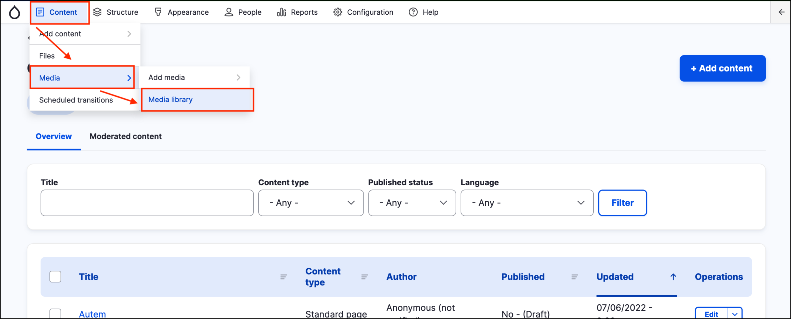
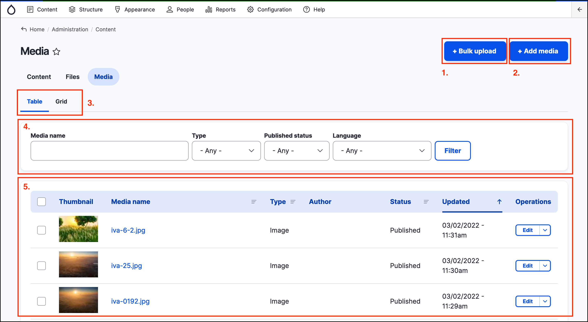
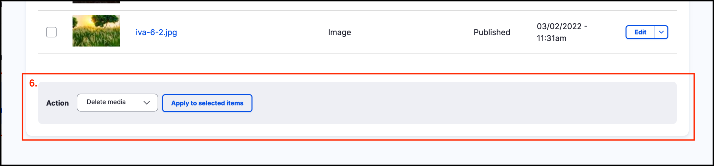
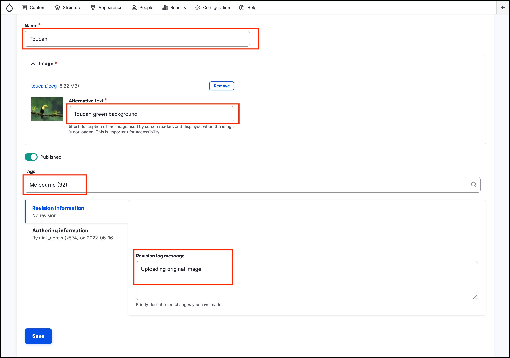
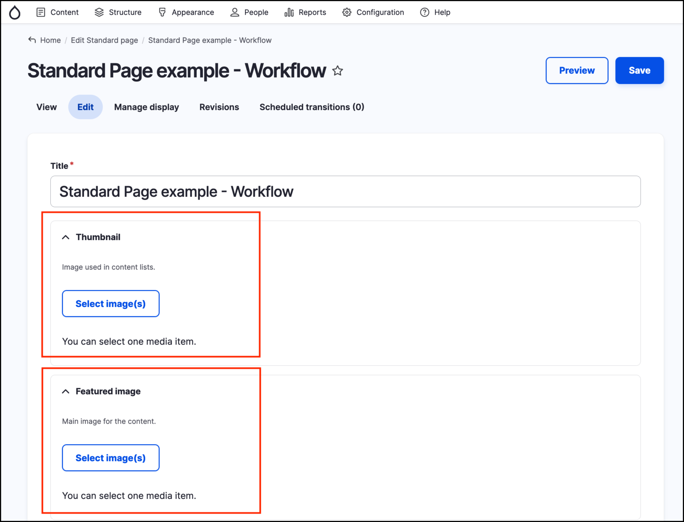
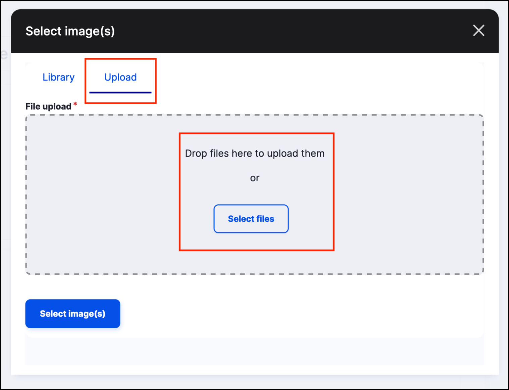

# Media library

GovCMS provides a central media library, where all media assets, such as images, documents and other files are stored.

Depending on the type of media asset, a corresponding type of media should be used.

## Media types

By default, GovCMS provides the following Media types:

1. Audio
2. File
3. Image
4. Remote Video
5. Video

Each Media type can have various forms and display fields configured.

## Media library overview

To access the Media Library, click on **Content** in the _Admin menu_ then hover over _Media_ and click on _Media Library_.

The main elements of the _Media Library_ page and their functions are: 

1. Bulk upload
2. Add media
3. Table and Grid tabs. These allow switching between views of Media
3. A search and filtering area 
4. A Media listing table that displays the Media entities matching the filtering criteria, or lists all Media entities if no filters are applied.
5. A bulk operations area that allows you to apply actions to multiple media entities.

These elements are highlighted and numbered on the screenshots below.

The **Add media** and **Bulk upload** buttons allow you to add new Media assets to the site. The **Filters** allow you to filter and search the media library for an existing media asset. The **Bulk operations area** allows you to implement bulk operations on multiple media assets. For example, you can use the checkboxes to select multiple media assets, then delete all selected media assets at by clicking the **Apply to selected items** button.

## Adding Media

To add media to the _Media Library_, click the **+Add media** button at the top right of the _Media Library_ page. 

**Note** This can also be performed by clicking **Content** → **Add media** when currently not on the _Media Library_ page.

This brings you to a page that lists all media types available on the site. Click the appropriate media type, for example Image.

Fill out all required fields. Providing some tags and a Revision log message can help manage large media libraries. Save the Media.

## Reusing media

The main advantage of having the central media library is reusability - the same media asset can be included in multiple content pages.

Media assets that were uploaded to the site directly from content \(such as by uploading an image into the Rich Text Editor\) will appear in the central Media library and can be also reused on other pages on the site.

## Uploading media - Content form

When creating or editing content via a content form \(e.g. the _Standard Page form_\) the form includes an area to upload a thumbnail and a feature image. 

When you click on the **Select image(s)** button from the content form, an overlay window opens showing a list of available media to select from the media library.

You can also click on the **Upload button**. Click on **Select files** to open a file browser, or drop files on the highlighted area.

**Note** The Files page is rarely used by users, and there is a proposal to remove this page from Drupal / GovCMS in future.
