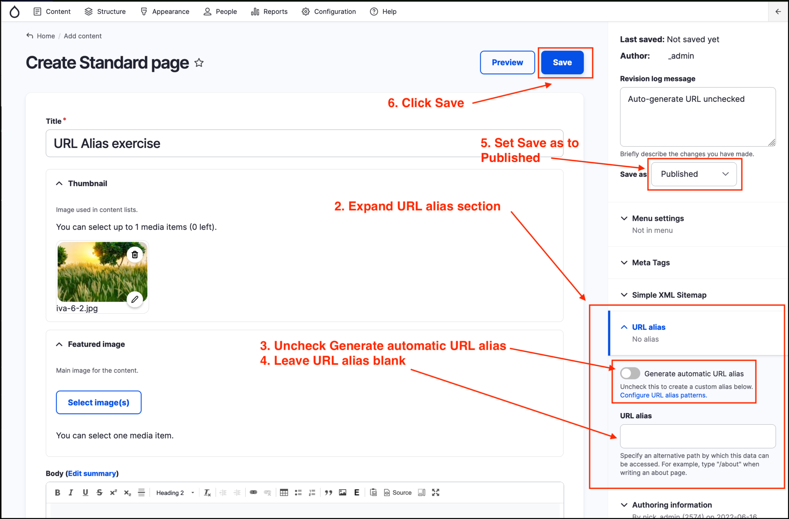

# Exercise 7.1: Updating a page’s URL alias

In this exercise you will learn how to **update** a page’s URL alias.

1. Add a Standard Page: From the _Admin menu_ click on _Content_ → _Add content_ → _Standard Page_.
2. Fill out the required fields, such as Title and Body, then in the right-hand side of the form, click to expand the _URL Alias_ section.
3. Uncheck _Generate automatic URL Alias_.

    

4. Make sure the 'URL alias' field is empty.
5. Set the _Save As_ dropdown to **Published**.
6. Click on the **Save** button at the top right of the page. 
7. Navigate to the page you saved - note the URL.

Your content should have a URL something like http://example.com/node/100. In this example “node/100” is the **Drupal path** for the page.

**_Note down this URL for the next exercise._**
