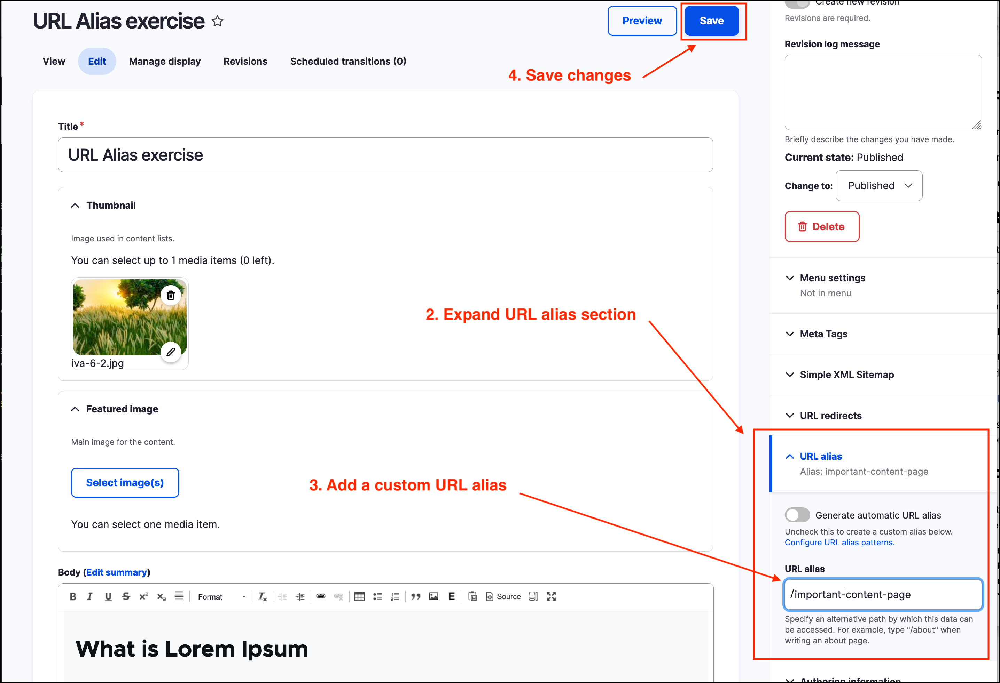

# Exercise 7.2 - Create a URL alias

In this exercise you’ll learn how to **create** a URL alias for a page.

1. Return to edit the page created in [**Exercise 7.1**](Exercise-7-1-update-page-url-alias.md). (From the _Admin menu_ click on **Content**, then click on your page from the list and click the **Edit** menu item).
2. Expand the URL alias section.
3. Set a custom URL alias, such as _**/important-content-page**_ (you may choose your own). **Note** The URL must begin with a backslash: '/'
4.  Click on the **Save** button at the top right of the page.

    
5. Note the new URL for the page.
6. Try navigating to the **/node/100** path noted down in the previous exercise, by pasting it into the address bar of your browser. (The node ID number - 100 - will differ for you).
7. Next, return to Edit the page from step 1.
8. Under the **URL Alias** section on the right-hand side, check the _Generate automatic URL alias box_.
9. **Save** the page - compare the results.
10. Check if the internal path (such as node/100) still works.
11. Check if the manually entered URL alias from step 2 is still functional.
12. Ask your trainer any questions.
