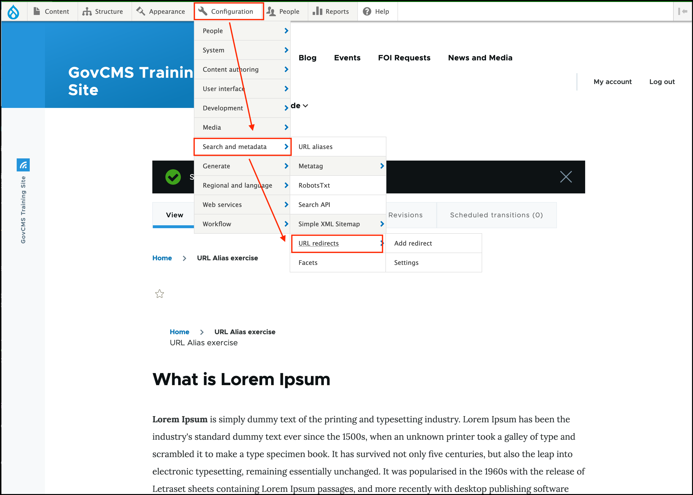
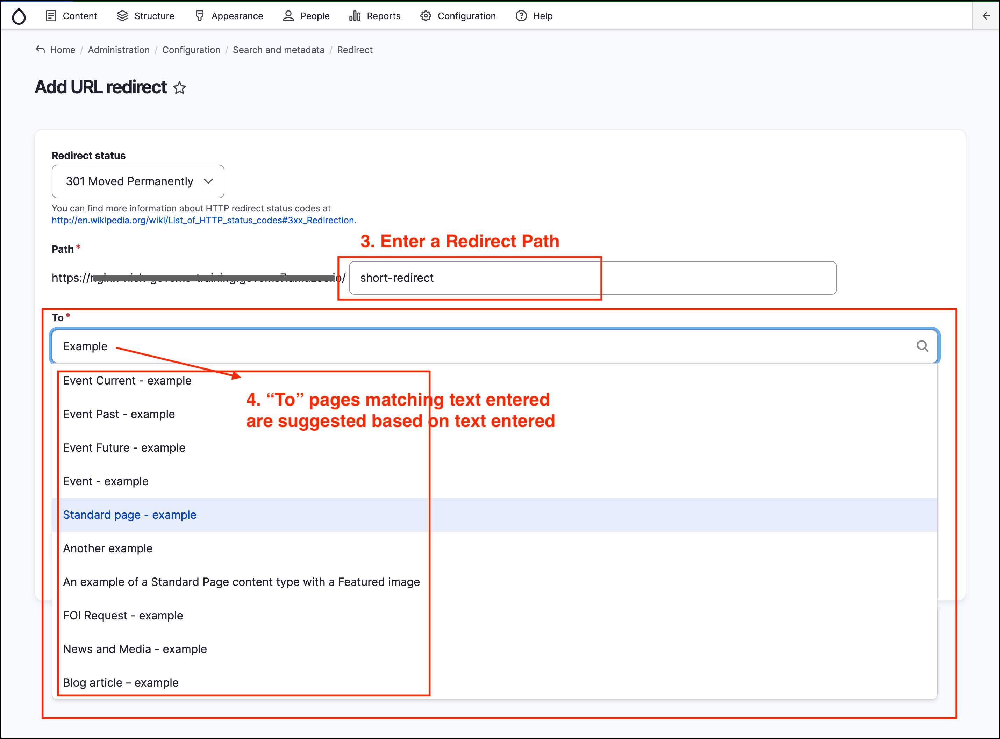
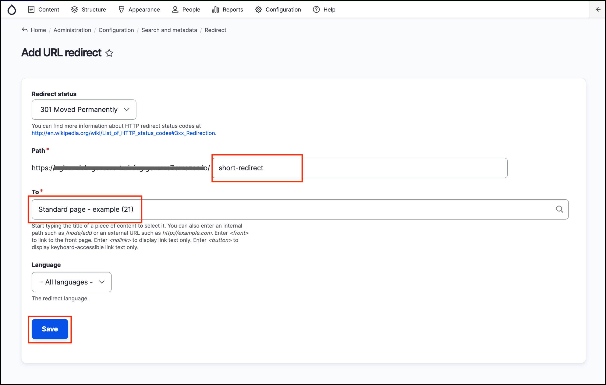

# Advanced Exercise 7.3: Create a Redirect

In this exercise you’ll learn how to create a **redirect**.

**Note**: Managing redirects on the site requires “privileged” role access, such as an Administrator. Although you have Administrator access for the training site, this may not be the case for your own GovCMS website.

In this exercise we’ll create a fully custom redirect from a short URL to a page of your preference.

1. In the _Admin Menu_, click on **Configuration**, hover over _Search and metadata_, then click **URL Redirects**.
    
    
    
2. Click the **Add Redirect** button at the top right of the page.
3. Enter _Path_ with your preferred redirect URL. This is the URL where your page, selected in the next step, will be redirected from. This should not be an existing alias or content URL in your site. In the screenshot below we use, as an example: **short-redirect** as the Path.

    

4. In the “To” field, type the title \(or part of the title\) of the page that you need to be redirected to. This autoselect field will locate the page, using your input. Select the page you want to redirect by clicking it.

   

   You can redirect to an external URL, by entering a full URL in the “To” field - for example, [https://salsadigital.com.au/](https://salsadigital.com.au/) \(make sure you enter the schema or full address, such as https://, or the redirect won’t function\).

5. Press the **Save** button.
6. Test your new redirect by going to the _Path_ you provided in step 3 \(including the full URL to this _Path_ and confirming that the page you selected in the _To_ field is displayed. What’s the page URL now? 
