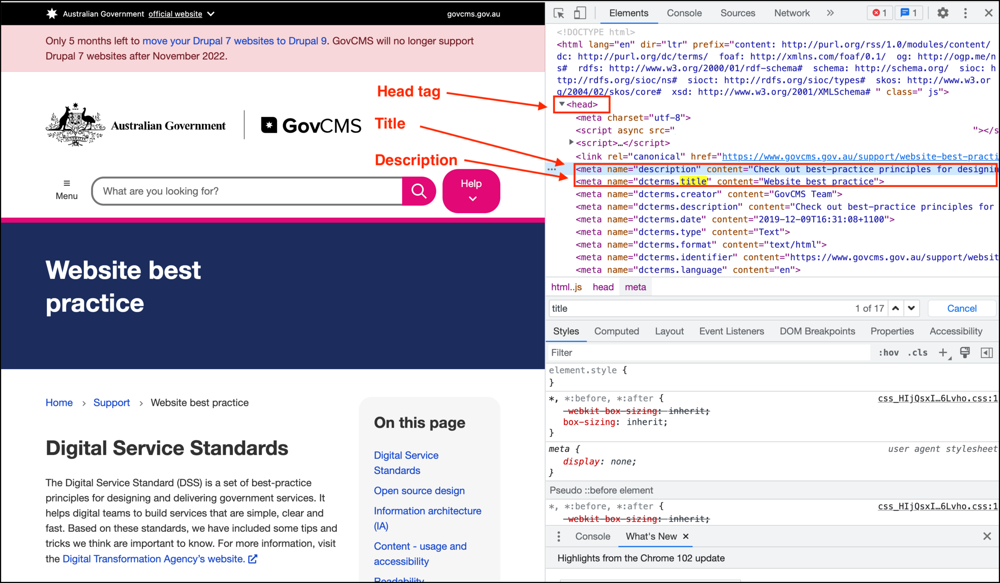
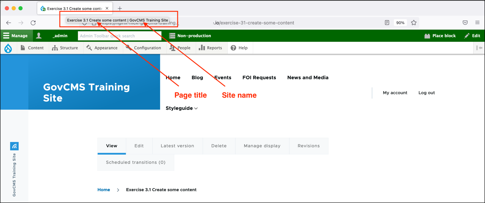

# Exercise 8.1 - Update meta tags of content

In this exercise you’ll learn how to update the meta tags for a _Page_.

1. Navigate to the _Page_ created in [**Exercise 3.1**](../unit-3-managing-content-in-govcms/Exercise-3-1-Create-some-content.md) by clicking on _Content_, clicking on your page then clicking the _Edit_ menu item.
2. Create some Basic page content in the _Body_ field (you should already have content here but you may wish to edit it). Do not modify the Meta Tags yet.
3. Publish your page by setting the _Change to_ field to 'Published' and clicking the **Save** button at the top right.
4. Using the browser inspector tool (usually right-click, then Inspect element), review the \<head> of your page. Locate and review the content of tags such as _title_ and _description_ - see the screenshot below. **Note** the screenshot below is using the GovCMS site as an example.\
   (NB - Some browsers are managed by your organisation and restricts you from viewing the source code.)
5.  Discuss any questions with your trainer.

    
6. Edit the page you created in step 1 and update values for the Meta Tags - the _Page title_ and _Description_ fields.
7. Review page source (as in step 3) and check how the values of those fields have changed.

**Hint:** The elements 1 and 2 from the search result screenshot can also be verified by hovering over the browser tab.

