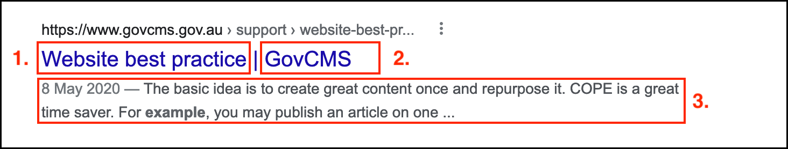

# Tokens and default meta tags

## What is a token

A _token_ is a formatted chunks of text that serves as a placeholder for a dynamically generated value. For example \[site:name\] serves as a placeholder for a site's name. 

## How tokens are used to populate default meta tags

The search result screenshot above outlines “tokens” that are automatically replaced by GovCMS when content is created or updated. The tokens in use are:

1. \[node:title\] - title of the page, taken from the page's _Title_ field.
2. \[site:name\] - the name of the site \(GovCMS in this case\).
3. \[node:summary\] - an automatically generated summary of the page contents. This can be edited by clicking on the **Edit summary** link above the _Body_ field of a page.
