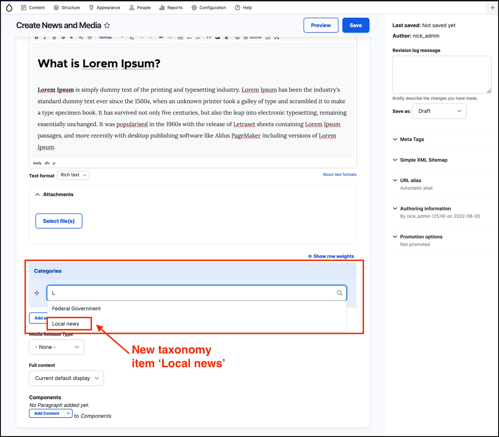

# Exercise 9.2: Apply taxonomy to an Event

In this exercise you’ll learn how to add a _News and media_ article and categorise it using the **News** vocaulary.

1. Create an _Event_ \(click on **Content**, then **Add content**, then select **News and media**\).
2. Add a _Title_ and some text to the _Body_ field.
3. Begin typing in the **Categories** field. Notice the field _Categories_ is auto-type and the available include only the _News categories_ taxonomy items. The new items added in the previous exercise should be available.
4. Select a value from existing _taxonomy_ terms in the _Categories_ field.

    
    
