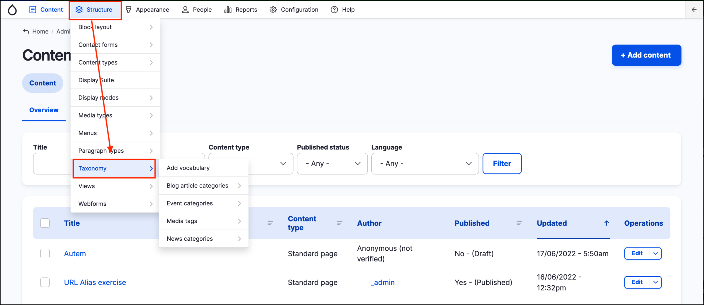
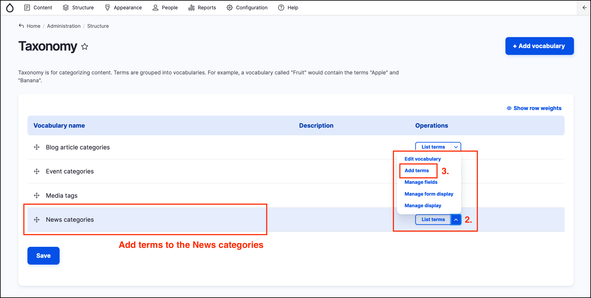
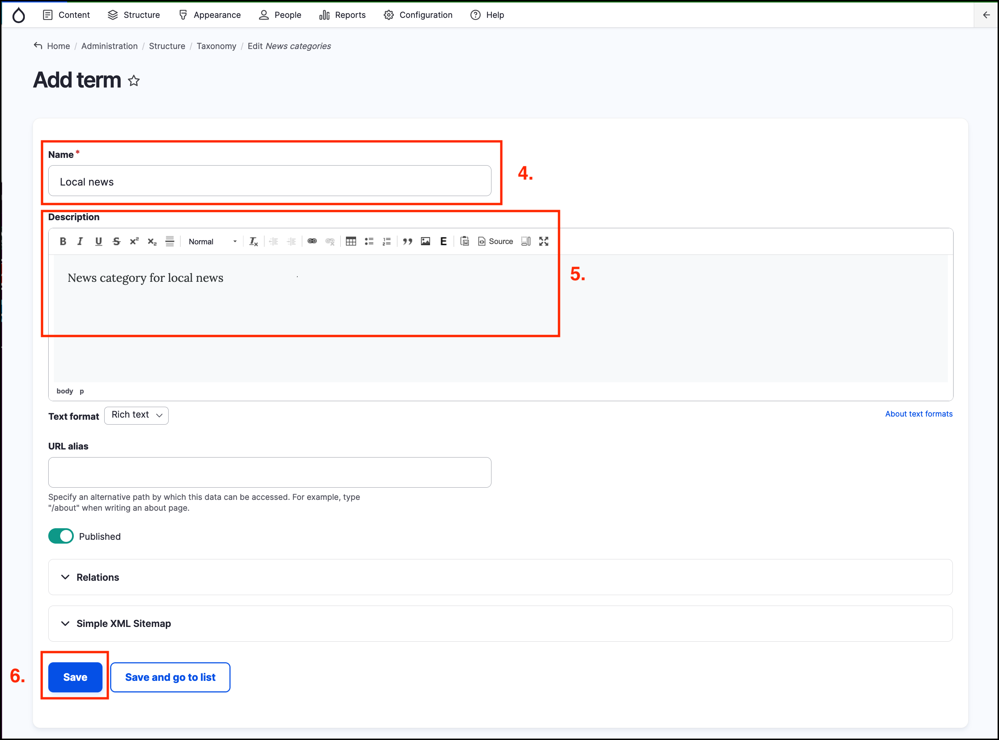
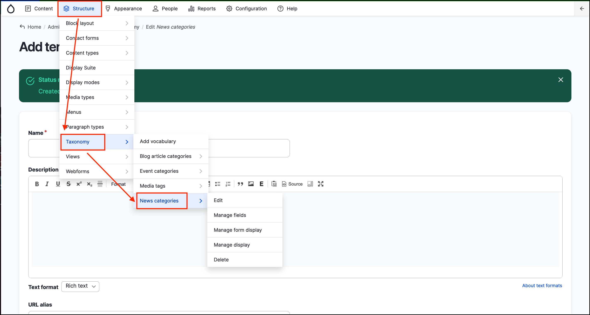

# Exercise 9.1: Add taxonomy terms

In this exercise you will learn how to add _taxonomy_ terms to an existing _vocabulary_.

1. Hover over __Structure_ on the _Admin menu_ then click on **Taxonomy**.

    

2. Click on the dropdown menu to the right hand side of the **News categories** _taxonomy_.
3. Click on **Add terms** from the list in the dropdown.

    

4. Enter a _Name_ for your new _taxonomy_ term, e.g. “Local news”.
5. Enter a _Description_ \(this field is optional\).
6. Click on the **Save** button at the bottom left of the page.
 
    

7. You willl now be back on the _Add term_ page.
8. Add a few more _taxonomy_ terms.
9. Go back to the **Event categories** vocabulary by hovering over  _Structure_, then _Taxonomy_ then clicking on **News categories** and add two more _taxonomy_ terms.

    
 
